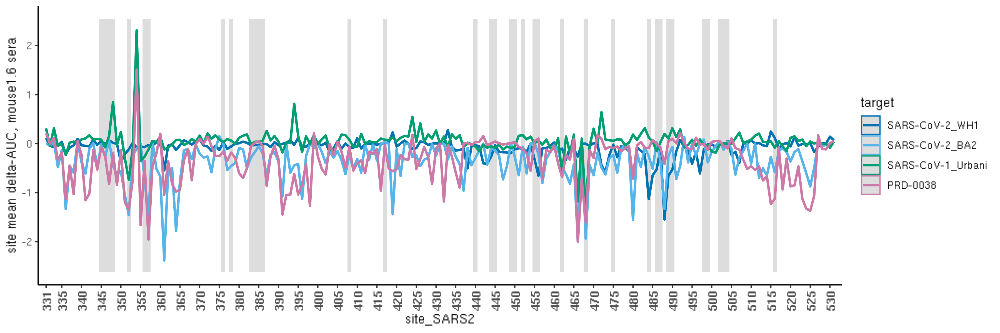
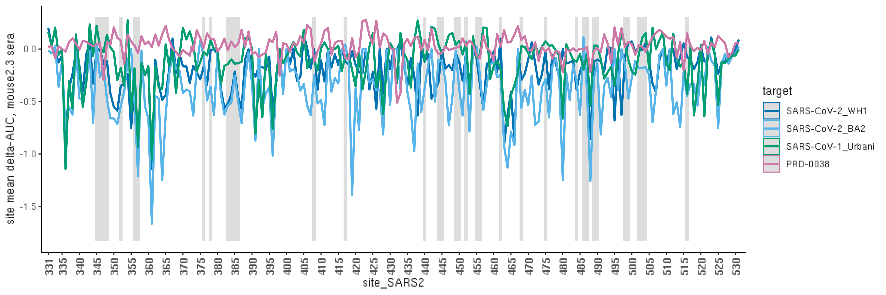
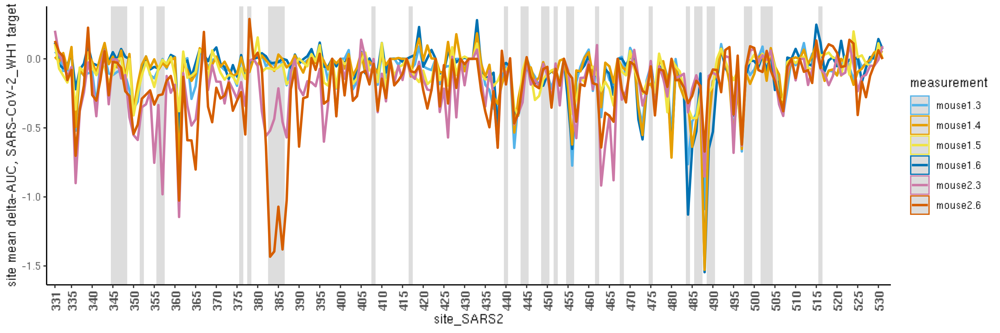
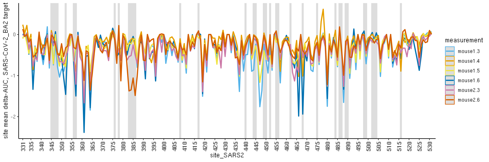
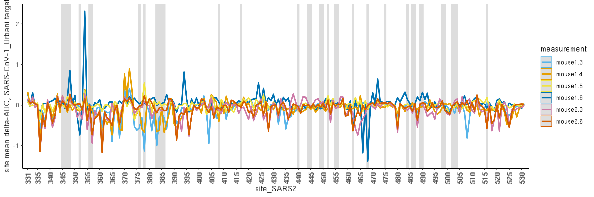
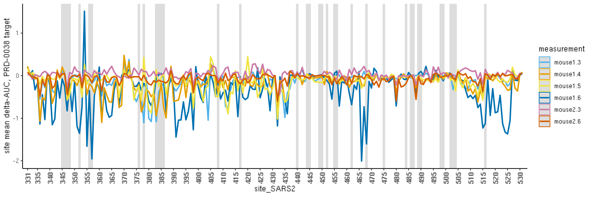

Analyze Epitopes
================
Tyler Starr
3/23/2023

-   [Setup](#setup)
-   [Calculate per-site summary
    metric](#calculate-per-site-summary-metric)
-   [Lineplots](#lineplots)
-   [Map to RBD structure](#map-to-rbd-structure)

This notebook reads in the per-mutation impacts on sera binding
(delta_normAUC), computes an average effect per site, and visualizes
epitope targeting in the various vaccine/background combinations.

``` r
require("knitr")
knitr::opts_chunk$set(echo = T)
knitr::opts_chunk$set(dev.args = list(png = list(type = "cairo")))

#list of packages to install/load
packages = c("yaml","data.table","tidyverse","gridExtra","bio3d")
#install any packages not already installed
installed_packages <- packages %in% rownames(installed.packages())
if(any(installed_packages == F)){
  install.packages(packages[!installed_packages])
}
#load packages
invisible(lapply(packages, library, character.only=T))

#read in config file
config <- read_yaml("config.yaml")

#make output directory
if(!file.exists(config$epitopes_dir)){
  dir.create(file.path(config$epitopes_dir))
}

#make pdb output directory
if(!file.exists(paste(config$epitopes_dir,"/pdbs/",sep=""))){
  dir.create(file.path(paste(config$epitopes_dir,"/pdbs/",sep="")))
}
```

Session info for reproducing environment:

``` r
sessionInfo()
```

    ## R version 4.1.2 (2021-11-01)
    ## Platform: x86_64-pc-linux-gnu (64-bit)
    ## Running under: Ubuntu 18.04.6 LTS
    ## 
    ## Matrix products: default
    ## BLAS/LAPACK: /app/software/FlexiBLAS/3.0.4-GCC-11.2.0/lib/libflexiblas.so.3.0
    ## 
    ## locale:
    ##  [1] LC_CTYPE=en_US.UTF-8       LC_NUMERIC=C              
    ##  [3] LC_TIME=en_US.UTF-8        LC_COLLATE=en_US.UTF-8    
    ##  [5] LC_MONETARY=en_US.UTF-8    LC_MESSAGES=en_US.UTF-8   
    ##  [7] LC_PAPER=en_US.UTF-8       LC_NAME=C                 
    ##  [9] LC_ADDRESS=C               LC_TELEPHONE=C            
    ## [11] LC_MEASUREMENT=en_US.UTF-8 LC_IDENTIFICATION=C       
    ## 
    ## attached base packages:
    ## [1] stats     graphics  grDevices utils     datasets  methods   base     
    ## 
    ## other attached packages:
    ##  [1] bio3d_2.4-2       gridExtra_2.3     forcats_0.5.1     stringr_1.4.0    
    ##  [5] dplyr_1.0.7       purrr_0.3.4       readr_2.0.2       tidyr_1.1.4      
    ##  [9] tibble_3.1.5      ggplot2_3.3.5     tidyverse_1.3.1   data.table_1.14.2
    ## [13] yaml_2.2.1        knitr_1.36       
    ## 
    ## loaded via a namespace (and not attached):
    ##  [1] tidyselect_1.1.1 xfun_0.27        haven_2.4.3      colorspace_2.0-2
    ##  [5] vctrs_0.3.8      generics_0.1.1   htmltools_0.5.2  utf8_1.2.2      
    ##  [9] rlang_0.4.12     pillar_1.6.4     glue_1.4.2       withr_2.4.2     
    ## [13] DBI_1.1.1        dbplyr_2.1.1     modelr_0.1.8     readxl_1.3.1    
    ## [17] lifecycle_1.0.1  munsell_0.5.0    gtable_0.3.0     cellranger_1.1.0
    ## [21] rvest_1.0.2      evaluate_0.14    tzdb_0.2.0       fastmap_1.1.0   
    ## [25] parallel_4.1.2   fansi_0.5.0      broom_0.7.10     Rcpp_1.0.7      
    ## [29] scales_1.1.1     backports_1.3.0  jsonlite_1.8.4   fs_1.5.0        
    ## [33] hms_1.1.1        digest_0.6.28    stringi_1.7.5    grid_4.1.2      
    ## [37] cli_3.1.0        tools_4.1.2      magrittr_2.0.1   crayon_1.4.2    
    ## [41] pkgconfig_2.0.3  ellipsis_0.3.2   xml2_1.3.3       reprex_2.0.1    
    ## [45] lubridate_1.8.0  rstudioapi_0.13  assertthat_0.2.1 rmarkdown_2.11  
    ## [49] httr_1.4.4       R6_2.5.1         compiler_4.1.2

Define colorblind-friendly palette

``` r
# The palette with grey:
cbPalette <- c("#999999", "#E69F00", "#56B4E9", "#009E73", "#F0E442", 
               "#0072B2", "#D55E00", "#CC79A7")
# The palette with black
cbbPalette <- c("#000000", "#E69F00", "#56B4E9", "#009E73", "#F0E442", 
                "#0072B2", "#D55E00", "#CC79A7")
```

## Setup

Read in tables of per-mutant sera AUC values, calculate SEM

``` r
dt <- data.table(read.csv(config$final_variant_scores_dms_file),stringsAsFactors=F)

#calculate SEMs
dt[,sem_mouse1.3_AUC := sd_mouse1.3_AUC / sqrt(n_bc_mouse1.3_AUC)]
dt[,sem_mouse1.4_AUC := sd_mouse1.4_AUC / sqrt(n_bc_mouse1.4_AUC)]
dt[,sem_mouse1.5_AUC := sd_mouse1.5_AUC / sqrt(n_bc_mouse1.5_AUC)]
dt[,sem_mouse1.6_AUC := sd_mouse1.6_AUC / sqrt(n_bc_mouse1.6_AUC)]
dt[,sem_mouse2.3_AUC := sd_mouse2.3_AUC / sqrt(n_bc_mouse2.3_AUC)]
dt[,sem_mouse2.6_AUC := sd_mouse2.6_AUC / sqrt(n_bc_mouse2.6_AUC)]
```

## Calculate per-site summary metric

Calculate a summary metric indicating the average mutant effect on
targeting by each serum. We will use this metric to make line plots
illustrating the changes in targeting between different sera for each
sarbecovirus target, and map to structure for epitope views.

``` r
dt_site <- copy(dt)

compute_site_avg <- function(auc_vec, sem_vec, sem_cutoff=0.4){
  index <- !is.na(sem_vec) & !is.na(auc_vec) & sem_vec <= sem_cutoff #elim missing values and values above sem cutoff
  if(sum(index) < 1){ #if no values
    return(as.numeric(NA))
  }else{
    auc_vec <- auc_vec[index]; sem_vec <- sem_vec[index] #elim missing/variable measurements
    return(mean(auc_vec)) #return mean AUC
  }
}

dt_site[,site_mean_mouse1.3 := compute_site_avg(auc_vec=delta_mouse1.3_normAUC, sem_vec=sem_mouse1.3_AUC),by=c("target","site")]
dt_site[,site_mean_mouse1.4 := compute_site_avg(auc_vec=delta_mouse1.4_normAUC, sem_vec=sem_mouse1.4_AUC),by=c("target","site")]
dt_site[,site_mean_mouse1.5 := compute_site_avg(auc_vec=delta_mouse1.5_normAUC, sem_vec=sem_mouse1.5_AUC),by=c("target","site")]
dt_site[,site_mean_mouse1.6 := compute_site_avg(auc_vec=delta_mouse1.6_normAUC, sem_vec=sem_mouse1.6_AUC),by=c("target","site")]
dt_site[,site_mean_mouse2.3 := compute_site_avg(auc_vec=delta_mouse2.3_normAUC, sem_vec=sem_mouse2.3_AUC),by=c("target","site")]
dt_site[,site_mean_mouse2.6 := compute_site_avg(auc_vec=delta_mouse2.6_normAUC, sem_vec=sem_mouse2.6_AUC),by=c("target","site")]

dt_site <- unique(dt_site[,.(target,wildtype,site,site_SARS2,
                            site_mean_mouse1.3,site_mean_mouse1.4,site_mean_mouse1.5,site_mean_mouse1.6,site_mean_mouse2.3,site_mean_mouse2.6)])
```

## Lineplots

Make lineplots showing mean AUC across sites for each serum/target
combination.

Also add gray shading for sites of escape from antibodies from our large
panel of antibodies we’ve profiled w.r.t. WH1 escape, downloaded from:
<https://raw.githubusercontent.com/jbloomlab/SARS2_RBD_Ab_escape_maps/main/processed_data/escape_data.csv>

First, define sites of substantial antibody escape

``` r
dt_mAb <- data.table(read.csv(file=config$WH1_mut_antibody_escape,stringsAsFactors = F))
dt_mAb <- unique(dt_mAb[condition_type=="antibody",.(condition, condition_type, condition_subtype, site, wildtype, site_total_escape)])
dt_mAb[,site_average_escape:=mean(site_total_escape,na.rm=T),by=c("site")]
site_escape <- unique(dt_mAb[,.(site, site_average_escape)])
#define sites for labeling as those with an average of 0.05 normalized site-wise escape across all mAbs
sig_mAb_sites <- site_escape[site_average_escape>0.1, site]
#define some epitope classes for adding highlights
label_df <- data.frame(xmin=sig_mAb_sites-0.5,
                       xmax=sig_mAb_sites+0.5)
```

Setup for lineplots

``` r
#define colors for each bg
group.colors <- c("SARS-CoV-2_WH1" = cbPalette[6], "SARS-CoV-2_BA2" = cbPalette[3], "SARS-CoV-1_Urbani" = cbPalette[4], "PRD-0038"=cbPalette[8])

#define colors for each serum
group.colors.sera <- c("mouse1.3" = cbPalette[3], "mouse1.4" = cbPalette[2], "mouse1.5" = cbPalette[5], "mouse1.6"=cbPalette[6], "mouse2.3"=cbPalette[8], "mouse2.6"=cbPalette[7])

#define order for plotting of bgs
dt_site$target <- factor(dt_site$target,levels=c("SARS-CoV-2_WH1","SARS-CoV-2_BA2","SARS-CoV-1_Urbani","PRD-0038"))

#make insertion site 372a a numeric value 372.5 and put site as a numeric value rather than character vector
dt_site[site_SARS2=="372a",site_SARS2:="372.5"]; dt_site$site_SARS2 <- as.numeric(dt_site$site_SARS2)
```

mouse1.3 sera, show all targets

``` r
ggplot(data=dt_site, aes(x=site_SARS2, y=site_mean_mouse1.3, color=target))+
  geom_rect(data=label_df, aes(x=NULL, y=NULL, color=NULL,xmin=xmin, xmax=xmax, 
                               ymin=1.1*min(dt_site$site_mean_mouse1.3,na.rm=T), 
                               ymax=1.1*max(dt_site$site_mean_mouse1.3,na.rm=T)), alpha=0.2)+
  geom_line(size=1)+
  scale_color_manual(values=group.colors)+
  theme_classic()+
  scale_x_continuous(expand=c(0.01,0.01),breaks=c(331,seq(335,530,by=5)))+
  theme(axis.text.x=element_text(angle=90,hjust=1,vjust=0.6,face="bold",size=10))+
  ylab("site mean delta-AUC, mouse1.3 sera")
```


``` r
invisible(dev.print(pdf, paste(config$epitopes_dir,"/lineplot_delta-AUC_mouse1.3.pdf",sep=""),useDingbats=F))
```

mouse1.4 sera, show all targets

``` r
ggplot(data=dt_site, aes(x=site_SARS2, y=site_mean_mouse1.4, color=target))+
  geom_rect(data=label_df, aes(x=NULL, y=NULL, color=NULL,xmin=xmin, xmax=xmax, 
                               ymin=1.1*min(dt_site$site_mean_mouse1.4,na.rm=T), 
                               ymax=1.1*max(dt_site$site_mean_mouse1.4,na.rm=T)), alpha=0.2)+
  geom_line(size=1)+
  scale_color_manual(values=group.colors)+
  theme_classic()+
  scale_x_continuous(expand=c(0.01,0.01),breaks=c(331,seq(335,530,by=5)))+
  theme(axis.text.x=element_text(angle=90,hjust=1,vjust=0.6,face="bold",size=10))+
  ylab("site mean delta-AUC, mouse1.4 sera")
```


``` r
invisible(dev.print(pdf, paste(config$epitopes_dir,"/lineplot_delta-AUC_mouse1.4.pdf",sep=""),useDingbats=F))
```

mouse1.5 sera, show all targets

``` r
ggplot(data=dt_site, aes(x=site_SARS2, y=site_mean_mouse1.5, color=target))+
  geom_rect(data=label_df, aes(x=NULL, y=NULL, color=NULL,xmin=xmin, xmax=xmax, 
                               ymin=1.1*min(dt_site$site_mean_mouse1.5,na.rm=T), 
                               ymax=1.1*max(dt_site$site_mean_mouse1.5,na.rm=T)), alpha=0.2)+
  geom_line(size=1)+
  scale_color_manual(values=group.colors)+
  theme_classic()+
  scale_x_continuous(expand=c(0.01,0.01),breaks=c(331,seq(335,530,by=5)))+
  theme(axis.text.x=element_text(angle=90,hjust=1,vjust=0.6,face="bold",size=10))+
  ylab("site mean delta-AUC, mouse1.5 sera")
```


``` r
invisible(dev.print(pdf, paste(config$epitopes_dir,"/lineplot_delta-AUC_mouse1.5.pdf",sep=""),useDingbats=F))
```

mouse1.6 sera, show all targets

``` r
ggplot(data=dt_site, aes(x=site_SARS2, y=site_mean_mouse1.6, color=target))+
  geom_rect(data=label_df, aes(x=NULL, y=NULL, color=NULL,xmin=xmin, xmax=xmax, 
                               ymin=1.1*min(dt_site$site_mean_mouse1.6,na.rm=T), 
                               ymax=1.1*max(dt_site$site_mean_mouse1.6,na.rm=T)), alpha=0.2)+
  geom_line(size=1)+
  scale_color_manual(values=group.colors)+
  theme_classic()+
  scale_x_continuous(expand=c(0.01,0.01),breaks=c(331,seq(335,530,by=5)))+
  theme(axis.text.x=element_text(angle=90,hjust=1,vjust=0.6,face="bold",size=10))+
  ylab("site mean delta-AUC, mouse1.6 sera")
```



``` r
invisible(dev.print(pdf, paste(config$epitopes_dir,"/lineplot_delta-AUC_mouse1.6.pdf",sep=""),useDingbats=F))
```

mouse2.3 sera, show all targets

``` r
ggplot(data=dt_site, aes(x=site_SARS2, y=site_mean_mouse2.3, color=target))+
  geom_rect(data=label_df, aes(x=NULL, y=NULL, color=NULL,xmin=xmin, xmax=xmax, 
                               ymin=1.1*min(dt_site$site_mean_mouse2.3,na.rm=T), 
                               ymax=1.1*max(dt_site$site_mean_mouse2.3,na.rm=T)), alpha=0.2)+
  geom_line(size=1)+
  scale_color_manual(values=group.colors)+
  theme_classic()+
  scale_x_continuous(expand=c(0.01,0.01),breaks=c(331,seq(335,530,by=5)))+
  theme(axis.text.x=element_text(angle=90,hjust=1,vjust=0.6,face="bold",size=10))+
  ylab("site mean delta-AUC, mouse2.3 sera")
```



``` r
invisible(dev.print(pdf, paste(config$epitopes_dir,"/lineplot_delta-AUC_mouse2.3.pdf",sep=""),useDingbats=F))
```

mouse2.6 sera, show all targets

``` r
ggplot(data=dt_site, aes(x=site_SARS2, y=site_mean_mouse2.6, color=target))+
  geom_rect(data=label_df, aes(x=NULL, y=NULL, color=NULL,xmin=xmin, xmax=xmax, 
                               ymin=1.1*min(dt_site$site_mean_mouse2.6,na.rm=T), 
                               ymax=1.1*max(dt_site$site_mean_mouse2.6,na.rm=T)), alpha=0.2)+
  geom_line(size=1)+
  scale_color_manual(values=group.colors)+
  theme_classic()+
  scale_x_continuous(expand=c(0.01,0.01),breaks=c(331,seq(335,530,by=5)))+
  theme(axis.text.x=element_text(angle=90,hjust=1,vjust=0.6,face="bold",size=10))+
  ylab("site mean delta-AUC, mouse2.6 sera")
```


``` r
invisible(dev.print(pdf, paste(config$epitopes_dir,"/lineplot_delta-AUC_mouse2.6.pdf",sep=""),useDingbats=F))
```

Also do lineplots by target comparing the six sera. First, setup
alternate temp data table

``` r
#define colors for each serum
group.colors.sera <- c("mouse1.3" = cbPalette[3], "mouse1.4" = cbPalette[2], "mouse1.5" = cbPalette[5], "mouse1.6"=cbPalette[6], "mouse2.3"=cbPalette[8], "mouse2.6"=cbPalette[7])

#melt to long
temp <- data.table::melt(dt_site[, .(target,site,site_SARS2,
                                     site_mean_mouse1.3, site_mean_mouse1.4,site_mean_mouse1.5,site_mean_mouse1.6,site_mean_mouse2.3,site_mean_mouse2.6)],
                         id.vars=c("target","site","site_SARS2"),
                         measure.vars=c("site_mean_mouse1.3","site_mean_mouse1.4","site_mean_mouse1.5","site_mean_mouse1.6","site_mean_mouse2.3","site_mean_mouse2.6"),
                         variable.name="measurement",value.name="value")

#rename
temp[measurement=="site_mean_mouse1.3",measurement:="mouse1.3"]
temp[measurement=="site_mean_mouse1.4",measurement:="mouse1.4"]
temp[measurement=="site_mean_mouse1.5",measurement:="mouse1.5"]
temp[measurement=="site_mean_mouse1.6",measurement:="mouse1.6"]
temp[measurement=="site_mean_mouse2.3",measurement:="mouse2.3"]
temp[measurement=="site_mean_mouse2.6",measurement:="mouse2.6"]

#define order for plotting of bgs
temp$measurement <- factor(temp$measurement,levels=c("mouse1.3","mouse1.6","mouse1.4","mouse1.5","mouse2.3","mouse2.6"))
```

Lineplots for SARS-CoV-2_WH1

``` r
ggplot(data=temp[target=="SARS-CoV-2_WH1"], aes(x=site_SARS2, y=value, color=measurement))+
  geom_rect(data=label_df, aes(x=NULL, y=NULL, color=NULL,xmin=xmin, xmax=xmax, 
                               ymin=1.1*min(dt_site$value,na.rm=T), 
                               ymax=1.1*max(dt_site$value,na.rm=T)), alpha=0.2)+
  geom_line(size=1)+
  scale_color_manual(values=group.colors.sera)+
  theme_classic()+
  scale_x_continuous(expand=c(0.01,0.01),breaks=c(331,seq(335,530,by=5)))+
  theme(axis.text.x=element_text(angle=90,hjust=1,vjust=0.6,face="bold",size=10))+
  ylab("site mean delta-AUC, SARS-CoV-2_WH1 target")
```

    ## Warning in min(dt_site$value, na.rm = T): no non-missing arguments to min;
    ## returning Inf

    ## Warning in max(dt_site$value, na.rm = T): no non-missing arguments to max;
    ## returning -Inf



``` r
invisible(dev.print(pdf, paste(config$epitopes_dir,"/lineplot_delta-AUC_SARS-CoV-2_WH1.pdf",sep=""),useDingbats=F))
```

Lineplots for SARS_CoV-2_BA2

``` r
ggplot(data=temp[target=="SARS-CoV-2_BA2"], aes(x=site_SARS2, y=value, color=measurement))+
  geom_rect(data=label_df, aes(x=NULL, y=NULL, color=NULL,xmin=xmin, xmax=xmax, 
                               ymin=1.1*min(dt_site$value,na.rm=T), 
                               ymax=1.1*max(dt_site$value,na.rm=T)), alpha=0.2)+
  geom_line(size=1)+
  scale_color_manual(values=group.colors.sera)+
  theme_classic()+
  scale_x_continuous(expand=c(0.01,0.01),breaks=c(331,seq(335,530,by=5)))+
  theme(axis.text.x=element_text(angle=90,hjust=1,vjust=0.6,face="bold",size=10))+
  ylab("site mean delta-AUC, SARS-CoV-2_BA2 target")
```

    ## Warning in min(dt_site$value, na.rm = T): no non-missing arguments to min;
    ## returning Inf

    ## Warning in max(dt_site$value, na.rm = T): no non-missing arguments to max;
    ## returning -Inf



``` r
invisible(dev.print(pdf, paste(config$epitopes_dir,"/lineplot_delta-AUC_SARS-CoV-2_BA2.pdf",sep=""),useDingbats=F))
```

Lineplots for SARS-CoV-1_Urbani

``` r
ggplot(data=temp[target=="SARS-CoV-1_Urbani"], aes(x=site_SARS2, y=value, color=measurement))+
  geom_rect(data=label_df, aes(x=NULL, y=NULL, color=NULL,xmin=xmin, xmax=xmax, 
                               ymin=1.1*min(dt_site$value,na.rm=T), 
                               ymax=1.1*max(dt_site$value,na.rm=T)), alpha=0.2)+
  geom_line(size=1)+
  scale_color_manual(values=group.colors.sera)+
  theme_classic()+
  scale_x_continuous(expand=c(0.01,0.01),breaks=c(331,seq(335,530,by=5)))+
  theme(axis.text.x=element_text(angle=90,hjust=1,vjust=0.6,face="bold",size=10))+
  ylab("site mean delta-AUC, SARS-CoV-1_Urbani target")
```

    ## Warning in min(dt_site$value, na.rm = T): no non-missing arguments to min;
    ## returning Inf

    ## Warning in max(dt_site$value, na.rm = T): no non-missing arguments to max;
    ## returning -Inf



``` r
invisible(dev.print(pdf, paste(config$epitopes_dir,"/lineplot_delta-AUC_SARS-CoV-1_Urbani.pdf",sep=""),useDingbats=F))
```

Lineplots for PRD-0038

``` r
ggplot(data=temp[target=="PRD-0038"], aes(x=site_SARS2, y=value, color=measurement))+
  geom_rect(data=label_df, aes(x=NULL, y=NULL, color=NULL,xmin=xmin, xmax=xmax, 
                               ymin=1.1*min(dt_site$value,na.rm=T), 
                               ymax=1.1*max(dt_site$value,na.rm=T)), alpha=0.2)+
  geom_line(size=1)+
  scale_color_manual(values=group.colors.sera)+
  theme_classic()+
  scale_x_continuous(expand=c(0.01,0.01),breaks=c(331,seq(335,530,by=5)))+
  theme(axis.text.x=element_text(angle=90,hjust=1,vjust=0.6,face="bold",size=10))+
  ylab("site mean delta-AUC, PRD-0038 target")
```

    ## Warning in min(dt_site$value, na.rm = T): no non-missing arguments to min;
    ## returning Inf

    ## Warning in max(dt_site$value, na.rm = T): no non-missing arguments to max;
    ## returning -Inf



``` r
invisible(dev.print(pdf, paste(config$epitopes_dir,"/lineplot_delta-AUC_PRD-0038.pdf",sep=""),useDingbats=F))
```

## Map to RBD structure

To visualize epitope surfaces, map site-mean AUC to pdbs for
visualization in PyMol.

``` r
pdb_wh1 <- read.pdb(file=config$pdb_6m0j)
```

    ##    PDB has ALT records, taking A only, rm.alt=TRUE

``` r
#iterate through backgrounds and metrics, output a pdb mapping the mean serum AUC to structure
for(bg in c("SARS-CoV-2_WH1","SARS-CoV-2_BA2","SARS-CoV-1_Urbani","PRD-0038")){
  for(serum in c("mouse1.3","mouse1.4","mouse1.5","mouse1.6","mouse2.3","mouse2.6")){
    b <- rep(0, length(pdb_wh1$atom$b))
    for(i in 1:nrow(pdb_wh1$atom)){
      if(pdb_wh1$atom$chain[i]=="E"){
        res <- pdb_wh1$atom$resno[i]
        score <- dt_site[target==bg & site_SARS2==res, get(paste("site_mean_",serum,sep=""))]
        if(length(score)>0){
          b[i] <- score
        }
      }
    }
    write.pdb(pdb=pdb_wh1, file=paste(config$epitopes_dir,"/pdbs/",bg,"_",serum,".pdb",sep=""), b=b)
  }
}
```
