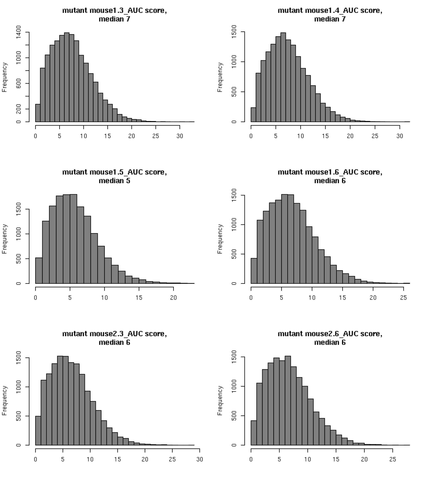
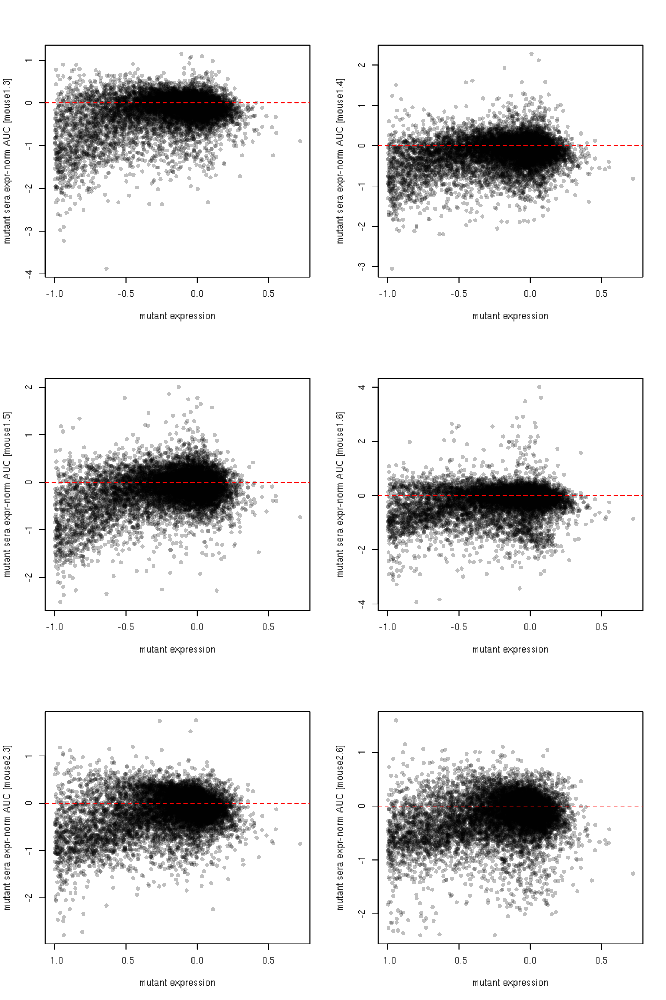

Collapse barcodes to final per-RBD/mutant phenotype scores
================
Tyler Starr
03/22/2023

-   [Setup](#setup)
-   [Calculate per-variant mean
    scores](#calculate-per-variant-mean-scores)
-   [Expression effects](#expression-effects)
-   [Heatmaps!](#heatmaps)

This notebook reads in the per-barcode sera binding AUCs and collapses
barcodes to final mean binding for each variant, and generates some
coverage and QC analyses. It also makes some heatmaps and other
visualizations of these data.

``` r
require("knitr")
knitr::opts_chunk$set(echo = T)
knitr::opts_chunk$set(dev.args = list(png = list(type = "cairo")))

#list of packages to install/load
packages = c("yaml","data.table","tidyverse","gridExtra")
#install any packages not already installed
installed_packages <- packages %in% rownames(installed.packages())
if(any(installed_packages == F)){
  install.packages(packages[!installed_packages])
}
#load packages
invisible(lapply(packages, library, character.only=T))

#read in config file
config <- read_yaml("config.yaml")

#make output directory
if(!file.exists(config$final_variant_scores_dir)){
  dir.create(file.path(config$final_variant_scores_dir))
}

#read in file giving spike/RBD indexing concordance between backgrounds
RBD_sites <- read.csv(file=config$RBD_annotation_file,stringsAsFactors=F)
```

Session info for reproducing environment:

``` r
sessionInfo()
```

    ## R version 4.1.2 (2021-11-01)
    ## Platform: x86_64-pc-linux-gnu (64-bit)
    ## Running under: Ubuntu 18.04.6 LTS
    ## 
    ## Matrix products: default
    ## BLAS/LAPACK: /app/software/FlexiBLAS/3.0.4-GCC-11.2.0/lib/libflexiblas.so.3.0
    ## 
    ## locale:
    ##  [1] LC_CTYPE=en_US.UTF-8       LC_NUMERIC=C              
    ##  [3] LC_TIME=en_US.UTF-8        LC_COLLATE=en_US.UTF-8    
    ##  [5] LC_MONETARY=en_US.UTF-8    LC_MESSAGES=en_US.UTF-8   
    ##  [7] LC_PAPER=en_US.UTF-8       LC_NAME=C                 
    ##  [9] LC_ADDRESS=C               LC_TELEPHONE=C            
    ## [11] LC_MEASUREMENT=en_US.UTF-8 LC_IDENTIFICATION=C       
    ## 
    ## attached base packages:
    ## [1] stats     graphics  grDevices utils     datasets  methods   base     
    ## 
    ## other attached packages:
    ##  [1] gridExtra_2.3     forcats_0.5.1     stringr_1.4.0     dplyr_1.0.7      
    ##  [5] purrr_0.3.4       readr_2.0.2       tidyr_1.1.4       tibble_3.1.5     
    ##  [9] ggplot2_3.3.5     tidyverse_1.3.1   data.table_1.14.2 yaml_2.2.1       
    ## [13] knitr_1.36       
    ## 
    ## loaded via a namespace (and not attached):
    ##  [1] tidyselect_1.1.1 xfun_0.27        haven_2.4.3      colorspace_2.0-2
    ##  [5] vctrs_0.3.8      generics_0.1.1   htmltools_0.5.2  utf8_1.2.2      
    ##  [9] rlang_0.4.12     pillar_1.6.4     glue_1.4.2       withr_2.4.2     
    ## [13] DBI_1.1.1        dbplyr_2.1.1     modelr_0.1.8     readxl_1.3.1    
    ## [17] lifecycle_1.0.1  munsell_0.5.0    gtable_0.3.0     cellranger_1.1.0
    ## [21] rvest_1.0.2      evaluate_0.14    tzdb_0.2.0       fastmap_1.1.0   
    ## [25] fansi_0.5.0      broom_0.7.10     Rcpp_1.0.7       scales_1.1.1    
    ## [29] backports_1.3.0  jsonlite_1.8.4   fs_1.5.0         hms_1.1.1       
    ## [33] digest_0.6.28    stringi_1.7.5    grid_4.1.2       cli_3.1.0       
    ## [37] tools_4.1.2      magrittr_2.0.1   crayon_1.4.2     pkgconfig_2.0.3 
    ## [41] ellipsis_0.3.2   xml2_1.3.3       reprex_2.0.1     lubridate_1.8.0 
    ## [45] rstudioapi_0.13  assertthat_0.2.1 rmarkdown_2.11   httr_1.4.4      
    ## [49] R6_2.5.1         compiler_4.1.2

## Setup

Read in tables of per-barcode sera AUC values, as well as the prior
SARSr DMS data with expression effects of mutations.

``` r
dt <- data.table(read.csv(config$sera_delta_AUC_file),stringsAsFactors=F)[sublibrary!="lib47_SARSr-wts",]

dt_expr1 <- data.table(read.csv(config$SARSr_lib40_mut_bind_expr),stringsAsFactors=F)[,.(target,wildtype,site,site_SARS2,mutant,mutation,mutation_SARS2,expression,expression_delta,n_bc_expression)]

dt_expr2 <- data.table(read.csv(config$SARS2_WH1_BA2_mut_bind_expr),stringsAsFactors=F)[,.(target,wildtype,position,mutant,mutation,expr,delta_expr,n_bc_expr)]
  
#rename columns to merge
dt_expr2[,site:=position]
dt_expr2[,site_SARS2:=position]
dt_expr2[,mutation_SARS2:=mutation]

dt_expr1[,expr:=expression]
dt_expr1[,delta_expr:=expression_delta]
dt_expr1[,n_bc_expr:=n_bc_expression]

#merge, using the Omi-associated WH1 expr measurements
dt_expr <- rbind(dt_expr1[target %in% c("PRD-0038","SARS-CoV-1_Urbani"),.(target,wildtype,site,site_SARS2,mutant,mutation,mutation_SARS2,expr,delta_expr,n_bc_expr)],
                 dt_expr2[target %in% c("Wuhan-Hu-1_v2","Omicron_BA2"),.(target,wildtype,site,site_SARS2,mutant,mutation,mutation_SARS2,expr,delta_expr,n_bc_expr)])
rm(dt_expr1);rm(dt_expr2)

#rename targets to match this repo
dt_expr[target=="Wuhan-Hu-1_v2",target:="SARS-CoV-2_WH1"]
dt_expr[target=="Omicron_BA2",target:="SARS-CoV-2_BA2"]
```

## Calculate per-variant mean scores

Calculate the mean binding score collapsed by genotype. Also output the
number of barcodes across which a variant score was determined in each
library.

``` r
dt[,mean_mouse1.3_AUC:=mean(mouse1.3_AUC,na.rm=T),by=c("library","target","aa_substitutions")]
dt[,sd_mouse1.3_AUC:=sd(mouse1.3_AUC,na.rm=T),by=c("library","target","aa_substitutions")]
dt[,n_bc_mouse1.3_AUC:=sum(!is.na(mouse1.3_AUC)),by=c("library","target","aa_substitutions")]

dt[,mean_mouse1.4_AUC:=mean(mouse1.4_AUC,na.rm=T),by=c("library","target","aa_substitutions")]
dt[,sd_mouse1.4_AUC:=sd(mouse1.4_AUC,na.rm=T),by=c("library","target","aa_substitutions")]
dt[,n_bc_mouse1.4_AUC:=sum(!is.na(mouse1.4_AUC)),by=c("library","target","aa_substitutions")]

dt[,mean_mouse1.5_AUC:=mean(mouse1.5_AUC,na.rm=T),by=c("library","target","aa_substitutions")]
dt[,sd_mouse1.5_AUC:=sd(mouse1.5_AUC,na.rm=T),by=c("library","target","aa_substitutions")]
dt[,n_bc_mouse1.5_AUC:=sum(!is.na(mouse1.5_AUC)),by=c("library","target","aa_substitutions")]

dt[,mean_mouse1.6_AUC:=mean(mouse1.6_AUC,na.rm=T),by=c("library","target","aa_substitutions")]
dt[,sd_mouse1.6_AUC:=sd(mouse1.6_AUC,na.rm=T),by=c("library","target","aa_substitutions")]
dt[,n_bc_mouse1.6_AUC:=sum(!is.na(mouse1.6_AUC)),by=c("library","target","aa_substitutions")]

dt[,mean_mouse2.3_AUC:=mean(mouse2.3_AUC,na.rm=T),by=c("library","target","aa_substitutions")]
dt[,sd_mouse2.3_AUC:=sd(mouse2.3_AUC,na.rm=T),by=c("library","target","aa_substitutions")]
dt[,n_bc_mouse2.3_AUC:=sum(!is.na(mouse2.3_AUC)),by=c("library","target","aa_substitutions")]

dt[,mean_mouse2.6_AUC:=mean(mouse2.6_AUC,na.rm=T),by=c("library","target","aa_substitutions")]
dt[,sd_mouse2.6_AUC:=sd(mouse2.6_AUC,na.rm=T),by=c("library","target","aa_substitutions")]
dt[,n_bc_mouse2.6_AUC:=sum(!is.na(mouse2.6_AUC)),by=c("library","target","aa_substitutions")]


dt <- unique(dt[,.(library,target,variant_class,aa_substitutions,n_aa_substitutions,
                   mean_mouse1.3_AUC, sd_mouse1.3_AUC, n_bc_mouse1.3_AUC,
                  mean_mouse1.4_AUC, sd_mouse1.4_AUC, n_bc_mouse1.4_AUC,
                  mean_mouse1.5_AUC, sd_mouse1.5_AUC, n_bc_mouse1.5_AUC,
                  mean_mouse1.6_AUC, sd_mouse1.6_AUC, n_bc_mouse1.6_AUC,
                  mean_mouse2.3_AUC, sd_mouse2.3_AUC, n_bc_mouse2.3_AUC,
                  mean_mouse2.6_AUC, sd_mouse2.6_AUC, n_bc_mouse2.6_AUC)])
```

Some QC plots. First, look at distribution of number barcodes for single
mutant detemrinations. These are ‘left-justified’ histograms, so the
leftmost bar represents the number of genotypes for which no barcodes
were collapsed to final measurement in a pool.

``` r
par(mfrow=c(3,2))
hist(dt[variant_class=="1 nonsynonymous",n_bc_mouse1.3_AUC],main="mouse1.3 sera",right=F,breaks=max(dt[variant_class=="1 nonsynonymous",n_bc_mouse1.3_AUC],na.rm=T),xlab="")
hist(dt[variant_class=="1 nonsynonymous",n_bc_mouse1.4_AUC],main="mouse1.4 sera",right=F,breaks=max(dt[variant_class=="1 nonsynonymous",n_bc_mouse1.4_AUC],na.rm=T),xlab="")
hist(dt[variant_class=="1 nonsynonymous",n_bc_mouse1.5_AUC],main="mouse1.5 sera",right=F,breaks=max(dt[variant_class=="1 nonsynonymous",n_bc_mouse1.5_AUC],na.rm=T),xlab="")
hist(dt[variant_class=="1 nonsynonymous",n_bc_mouse1.6_AUC],main="mouse1.6 sera",right=F,breaks=max(dt[variant_class=="1 nonsynonymous",n_bc_mouse1.6_AUC],na.rm=T),xlab="")
hist(dt[variant_class=="1 nonsynonymous",n_bc_mouse2.3_AUC],main="mouse2.3 sera",right=F,breaks=max(dt[variant_class=="1 nonsynonymous",n_bc_mouse2.3_AUC],na.rm=T),xlab="")
hist(dt[variant_class=="1 nonsynonymous",n_bc_mouse2.6_AUC],main="mouse2.6 sera",right=F,breaks=max(dt[variant_class=="1 nonsynonymous",n_bc_mouse2.6_AUC],na.rm=T),xlab="")
```


What about how SEM tracks with number of barcodes collapsed? This could
help for choosing a minimum number of barcodes to use or an SEM cutoff.
List fraction above SEM 0.5 on each plot.

``` r
par(mfrow=c(3,2))
plot(dt[variant_class=="1 nonsynonymous",n_bc_mouse1.3_AUC],
     dt[variant_class=="1 nonsynonymous",sd_mouse1.3_AUC/sqrt(n_bc_mouse1.3_AUC)],
     pch=16,col="#00000005",main="mouse1.3 sera",ylab="SEM",xlab="number barcodes collapsed")
abline(h=0.5,col="red",lty=2)
legend("topleft",bty="n",cex=1,legend=paste(format(100*nrow(dt[variant_class=="1 nonsynonymous" & sd_mouse1.3_AUC/sqrt(n_bc_mouse1.3_AUC) > 0.5 & !is.na(mean_mouse1.3_AUC),])/nrow(dt[variant_class=="1 nonsynonymous" & !is.na(mean_mouse1.3_AUC),]),digits=3),"%"))

plot(dt[variant_class=="1 nonsynonymous",n_bc_mouse1.4_AUC],
     dt[variant_class=="1 nonsynonymous",sd_mouse1.4_AUC/sqrt(n_bc_mouse1.4_AUC)],
     pch=16,col="#00000005",main="mouse1.4 sera",ylab="SEM",xlab="number barcodes collapsed")
abline(h=0.5,col="red",lty=2)
legend("topleft",bty="n",cex=1,legend=paste(format(100*nrow(dt[variant_class=="1 nonsynonymous" & sd_mouse1.4_AUC/sqrt(n_bc_mouse1.4_AUC) > 0.5 & !is.na(mean_mouse1.4_AUC),])/nrow(dt[variant_class=="1 nonsynonymous" & !is.na(mean_mouse1.4_AUC),]),digits=3),"%"))

plot(dt[variant_class=="1 nonsynonymous",n_bc_mouse1.5_AUC],
     dt[variant_class=="1 nonsynonymous",sd_mouse1.5_AUC/sqrt(n_bc_mouse1.5_AUC)],
     pch=16,col="#00000005",main="mouse1.5 sera",ylab="SEM",xlab="number barcodes collapsed")
abline(h=0.5,col="red",lty=2)
legend("topleft",bty="n",cex=1,legend=paste(format(100*nrow(dt[variant_class=="1 nonsynonymous" & sd_mouse1.5_AUC/sqrt(n_bc_mouse1.5_AUC) > 0.5 & !is.na(mean_mouse1.5_AUC),])/nrow(dt[variant_class=="1 nonsynonymous" & !is.na(mean_mouse1.5_AUC),]),digits=3),"%"))

plot(dt[variant_class=="1 nonsynonymous",n_bc_mouse1.6_AUC],
     dt[variant_class=="1 nonsynonymous",sd_mouse1.6_AUC/sqrt(n_bc_mouse1.6_AUC)],
     pch=16,col="#00000005",main="mouse1.6 sera",ylab="SEM",xlab="number barcodes collapsed")
abline(h=0.5,col="red",lty=2)
legend("topleft",bty="n",cex=1,legend=paste(format(100*nrow(dt[variant_class=="1 nonsynonymous" & sd_mouse1.6_AUC/sqrt(n_bc_mouse1.6_AUC) > 0.5 & !is.na(mean_mouse1.6_AUC),])/nrow(dt[variant_class=="1 nonsynonymous" & !is.na(mean_mouse1.6_AUC),]),digits=3),"%"))

plot(dt[variant_class=="1 nonsynonymous",n_bc_mouse2.3_AUC],
     dt[variant_class=="1 nonsynonymous",sd_mouse2.3_AUC/sqrt(n_bc_mouse2.3_AUC)],
     pch=16,col="#00000005",main="mouse2.3 sera",ylab="SEM",xlab="number barcodes collapsed")
abline(h=0.5,col="red",lty=2)
legend("topleft",bty="n",cex=1,legend=paste(format(100*nrow(dt[variant_class=="1 nonsynonymous" & sd_mouse2.3_AUC/sqrt(n_bc_mouse2.3_AUC) > 0.5 & !is.na(mean_mouse2.3_AUC),])/nrow(dt[variant_class=="1 nonsynonymous" & !is.na(mean_mouse2.3_AUC),]),digits=3),"%"))

plot(dt[variant_class=="1 nonsynonymous",n_bc_mouse2.6_AUC],
     dt[variant_class=="1 nonsynonymous",sd_mouse2.6_AUC/sqrt(n_bc_mouse2.6_AUC)],
     pch=16,col="#00000005",main="mouse2.6 sera",ylab="SEM",xlab="number barcodes collapsed")
abline(h=0.5,col="red",lty=2)
legend("topleft",bty="n",cex=1,legend=paste(format(100*nrow(dt[variant_class=="1 nonsynonymous" & sd_mouse2.6_AUC/sqrt(n_bc_mouse2.6_AUC) > 0.5 & !is.na(mean_mouse2.6_AUC),])/nrow(dt[variant_class=="1 nonsynonymous" & !is.na(mean_mouse2.6_AUC),]),digits=3),"%"))
```


``` r
invisible(dev.print(pdf, paste(config$final_variant_scores_dir,"/lib40_sem_v_n-bc.pdf",sep=""),useDingbats=F))
```

Format into a ‘mutation lookup table’, where we focus just on the single
mutants (and wildtype), breakup the string of mutations, and fill in the
table to also include any missing mutants. We also provide indexing of
sites according to SARS2 numbering and my alignment and according to
“self” numbering

``` r
dt_mutant <- dt[variant_class %in% "1 nonsynonymous",]

#split mutation string
#define function to apply
split_mut <- function(x){
  split <- strsplit(x,split="")[[1]]
  return(list(split[1],as.numeric(paste(split[2:(length(split)-1)],collapse="")),split[length(split)]))
}
dt_mutant[,c("wildtype","position","mutant"):=split_mut(as.character(aa_substitutions)),by=aa_substitutions]

dt_mutant <- dt_mutant[,.(library,target,wildtype,position,mutant,
                          mean_mouse1.3_AUC,sd_mouse1.3_AUC,n_bc_mouse1.3_AUC,
                          mean_mouse1.4_AUC,sd_mouse1.4_AUC,n_bc_mouse1.4_AUC,
                          mean_mouse1.5_AUC,sd_mouse1.5_AUC,n_bc_mouse1.5_AUC,
                          mean_mouse1.6_AUC,sd_mouse1.6_AUC,n_bc_mouse1.6_AUC,
                          mean_mouse2.3_AUC,sd_mouse2.3_AUC,n_bc_mouse2.3_AUC,
                          mean_mouse2.6_AUC,sd_mouse2.6_AUC,n_bc_mouse2.6_AUC)]

aas <- c("A","C","D","E","F","G","H","I","K","L","M","N","P","Q","R","S","T","V","W","Y")
#fill out missing values in table with a hideous loop, so the table is complete for all mutaitons (including those that are missing). If you are somebody who is reading this code, I apologize.
for(lib in as.character(unique(dt_mutant$lib))){
  for(bg in as.character(unique(dt_mutant$target))){
    for(pos in 1:max(dt_mutant$position)){
      for(aa in aas){
        if(!(aa %in% as.character(dt_mutant[library==lib & target==bg & position==pos,mutant]))){
          dt_mutant <- rbind(dt_mutant,list(lib, bg, dt_mutant[target==bg & position==pos,wildtype][1],pos,aa),fill=T)
        }
      }
    }
  }
}
setkey(dt_mutant,library,target,position,mutant)

#fill in wildtype values -- should vectorize in data table but being so stupid so just going to write for loop
for(lib in as.character(unique(dt_mutant$lib))){
  for(bg in as.character(unique(dt_mutant$target))){
    dt_mutant[library==lib & target==bg & wildtype==mutant, 
              c("mean_mouse1.3_AUC","sd_mouse1.3_AUC","n_bc_mouse1.3_AUC",
                "mean_mouse1.4_AUC","sd_mouse1.4_AUC","n_bc_mouse1.4_AUC",
                "mean_mouse1.5_AUC","sd_mouse1.5_AUC","n_bc_mouse1.5_AUC",
                "mean_mouse1.6_AUC","sd_mouse1.6_AUC","n_bc_mouse1.6_AUC",
                "mean_mouse2.3_AUC","sd_mouse2.3_AUC","n_bc_mouse2.3_AUC",
                "mean_mouse2.6_AUC","sd_mouse2.6_AUC","n_bc_mouse2.6_AUC") := 
                dt[library==lib & target==bg & variant_class=="wildtype",
                   .(mean_mouse1.3_AUC,sd_mouse1.3_AUC,n_bc_mouse1.3_AUC,
                     mean_mouse1.4_AUC,sd_mouse1.4_AUC,n_bc_mouse1.4_AUC,
                     mean_mouse1.5_AUC,sd_mouse1.5_AUC,n_bc_mouse1.5_AUC,
                     mean_mouse1.6_AUC,sd_mouse1.6_AUC,n_bc_mouse1.6_AUC,
                     mean_mouse2.3_AUC,sd_mouse2.3_AUC,n_bc_mouse2.3_AUC,
                     mean_mouse2.6_AUC,sd_mouse2.6_AUC,n_bc_mouse2.6_AUC)]]
  }
}

#add delta bind measures relative to respective wildtypes
for(lib in as.character(unique(dt_mutant$lib))){
  for(bg in as.character(unique(dt_mutant$target))){
    ref_mouse1.3_AUC <- dt[library==lib & target==bg & variant_class=="wildtype",mean_mouse1.3_AUC]
    dt_mutant[library==lib & target==bg,delta_mouse1.3_AUC := mean_mouse1.3_AUC - ref_mouse1.3_AUC]
    ref_mouse1.4_AUC <- dt[library==lib & target==bg & variant_class=="wildtype",mean_mouse1.4_AUC]
    dt_mutant[library==lib & target==bg,delta_mouse1.4_AUC := mean_mouse1.4_AUC - ref_mouse1.4_AUC]
    ref_mouse1.5_AUC <- dt[library==lib & target==bg & variant_class=="wildtype",mean_mouse1.5_AUC]
    dt_mutant[library==lib & target==bg,delta_mouse1.5_AUC := mean_mouse1.5_AUC - ref_mouse1.5_AUC]
    ref_mouse1.6_AUC <- dt[library==lib & target==bg & variant_class=="wildtype",mean_mouse1.6_AUC]
    dt_mutant[library==lib & target==bg,delta_mouse1.6_AUC := mean_mouse1.6_AUC - ref_mouse1.6_AUC]
    ref_mouse2.3_AUC <- dt[library==lib & target==bg & variant_class=="wildtype",mean_mouse2.3_AUC]
    dt_mutant[library==lib & target==bg,delta_mouse2.3_AUC := mean_mouse2.3_AUC - ref_mouse2.3_AUC]
    ref_mouse2.6_AUC <- dt[library==lib & target==bg & variant_class=="wildtype",mean_mouse2.6_AUC]
    dt_mutant[library==lib & target==bg,delta_mouse2.6_AUC := mean_mouse2.6_AUC - ref_mouse2.6_AUC]
  }
}

#reindex sites for each background according to alignment. I will keep two columns: one gives each mutation in the "SARS2" spike indexing, one that gives that spike's indexing

#remove positions past the last index (no wildtype position). Could also fix this above when we fill out this table
dt_mutant <- dt_mutant[!is.na(wildtype)]

#set empty columns to fill with indexed sites
dt_mutant$site <- as.character(NA)
dt_mutant$site_SARS2 <- as.character(NA)

#do by bg with if/else looping
for(i in 1:nrow(dt_mutant)){
  if(dt_mutant[i,target]=="SARS-CoV-2_WH1"){
    dt_mutant[i,site := as.character(RBD_sites[RBD_sites$site_SARS2_RBD==dt_mutant[i,position] & !is.na(RBD_sites$site_SARS2_RBD),"site_SARS2_spike"])]
    dt_mutant[i,site_SARS2 := as.character(RBD_sites[RBD_sites$site_SARS2_RBD==dt_mutant[i,position] & !is.na(RBD_sites$site_SARS2_RBD),"site_SARS2_spike"])]
  }else if(dt_mutant[i,target]=="PRD-0038"){
    dt_mutant[i,site:=as.character(RBD_sites[RBD_sites$site_PRD0038_RBD==dt_mutant[i,position] & !is.na(RBD_sites$site_PRD0038_RBD),"site_PRD0038_spike"])]
    dt_mutant[i,site_SARS2 := as.character(RBD_sites[RBD_sites$site_PRD0038_RBD==dt_mutant[i,position] & !is.na(RBD_sites$site_PRD0038_RBD),"site_SARS2_spike"])]
  }else if(dt_mutant[i,target]=="SARS-CoV-1_Urbani"){
    dt_mutant[i,site := as.character(RBD_sites[RBD_sites$site_SARS1_RBD==dt_mutant[i,position] & !is.na(RBD_sites$site_SARS1_RBD),"site_SARS1_spike"])]
    dt_mutant[i,site_SARS2 := as.character(RBD_sites[RBD_sites$site_SARS1_RBD==dt_mutant[i,position] & !is.na(RBD_sites$site_SARS1_RBD),"site_SARS2_spike"])]
  }else if(dt_mutant[i,target]=="SARS-CoV-2_BA2"){
    dt_mutant[i,site := as.character(RBD_sites[RBD_sites$site_SARS2_RBD==dt_mutant[i,position] & !is.na(RBD_sites$site_SARS2_RBD),"site_SARS2_spike"])]
    dt_mutant[i,site_SARS2 := as.character(RBD_sites[RBD_sites$site_SARS2_RBD==dt_mutant[i,position] & !is.na(RBD_sites$site_SARS2_RBD),"site_SARS2_spike"])]
  }
}

#add single mutation string indicators
dt_mutant[,mutation:=paste(wildtype,site,mutant,sep=""),by=c("wildtype","site","mutant")]
dt_mutant[,mutation_SARS2:=paste(wildtype,site_SARS2,mutant,sep=""),by=c("wildtype","site_SARS2","mutant")]

dt_mutant <- unique(dt_mutant[,.(target,wildtype,site,site_SARS2,mutant,mutation,mutation_SARS2,
                               mean_mouse1.3_AUC,sd_mouse1.3_AUC,delta_mouse1.3_AUC,n_bc_mouse1.3_AUC,
                               mean_mouse1.4_AUC,sd_mouse1.4_AUC,delta_mouse1.4_AUC,n_bc_mouse1.4_AUC,
                               mean_mouse1.5_AUC,sd_mouse1.5_AUC,delta_mouse1.5_AUC,n_bc_mouse1.5_AUC,
                               mean_mouse1.6_AUC,sd_mouse1.6_AUC,delta_mouse1.6_AUC,n_bc_mouse1.6_AUC,
                               mean_mouse2.3_AUC,sd_mouse2.3_AUC,delta_mouse2.3_AUC,n_bc_mouse2.3_AUC,
                               mean_mouse2.6_AUC,sd_mouse2.6_AUC,delta_mouse2.6_AUC,n_bc_mouse2.6_AUC)])

#rename some of the columns
setnames(dt_mutant,"mean_mouse1.3_AUC","mouse1.3_AUC")
setnames(dt_mutant,"mean_mouse1.4_AUC","mouse1.4_AUC")
setnames(dt_mutant,"mean_mouse1.5_AUC","mouse1.5_AUC")
setnames(dt_mutant,"mean_mouse1.6_AUC","mouse1.6_AUC")
setnames(dt_mutant,"mean_mouse2.3_AUC","mouse2.3_AUC")
setnames(dt_mutant,"mean_mouse2.6_AUC","mouse2.6_AUC")
```

Censor any measurements that are from a single bc and/or below a certain
SEM? don’t do this for now, let’s visualize first, do this when
collapsing summary metric per site.

``` r
# min_bc <- 2
# min_lib <- 2
#  
# dt_mutant[n_bc_bind < min_bc, c("bind","delta_bind","n_bc_bind","n_libs_bind") := list(NA,NA,NA,NA)]
# dt_mutant[n_bc_expr < min_bc, c("expr","delta_expr","n_bc_expr","n_libs_expr") := list(NA,NA,NA,NA)]
```

Coverage stats on n_barcodes for different measurements in the final
pooled measurements.

``` r
par(mfrow=c(3,2))
hist(dt_mutant[wildtype!=mutant, n_bc_mouse1.3_AUC],col="gray50",main=paste("mutant mouse1.3_AUC score,\nmedian ",median(dt_mutant[wildtype!=mutant, n_bc_mouse1.3_AUC],na.rm=T),sep=""),right=F,breaks=max(dt_mutant[wildtype!=mutant, n_bc_mouse1.3_AUC],na.rm=T),xlab="")

hist(dt_mutant[wildtype!=mutant, n_bc_mouse1.4_AUC],col="gray50",main=paste("mutant mouse1.4_AUC score,\nmedian ",median(dt_mutant[wildtype!=mutant, n_bc_mouse1.4_AUC],na.rm=T),sep=""),right=F,breaks=max(dt_mutant[wildtype!=mutant, n_bc_mouse1.4_AUC],na.rm=T),xlab="")

hist(dt_mutant[wildtype!=mutant, n_bc_mouse1.5_AUC],col="gray50",main=paste("mutant mouse1.5_AUC score,\nmedian ",median(dt_mutant[wildtype!=mutant, n_bc_mouse1.5_AUC],na.rm=T),sep=""),right=F,breaks=max(dt_mutant[wildtype!=mutant, n_bc_mouse1.5_AUC],na.rm=T),xlab="")

hist(dt_mutant[wildtype!=mutant, n_bc_mouse1.6_AUC],col="gray50",main=paste("mutant mouse1.6_AUC score,\nmedian ",median(dt_mutant[wildtype!=mutant, n_bc_mouse1.6_AUC],na.rm=T),sep=""),right=F,breaks=max(dt_mutant[wildtype!=mutant, n_bc_mouse1.6_AUC],na.rm=T),xlab="")

hist(dt_mutant[wildtype!=mutant, n_bc_mouse2.3_AUC],col="gray50",main=paste("mutant mouse2.3_AUC score,\nmedian ",median(dt_mutant[wildtype!=mutant, n_bc_mouse2.3_AUC],na.rm=T),sep=""),right=F,breaks=max(dt_mutant[wildtype!=mutant, n_bc_mouse2.3_AUC],na.rm=T),xlab="")

hist(dt_mutant[wildtype!=mutant, n_bc_mouse2.6_AUC],col="gray50",main=paste("mutant mouse2.6_AUC score,\nmedian ",median(dt_mutant[wildtype!=mutant, n_bc_mouse2.6_AUC],na.rm=T),sep=""),right=F,breaks=max(dt_mutant[wildtype!=mutant, n_bc_mouse2.6_AUC],na.rm=T),xlab="")
```



``` r
invisible(dev.print(pdf, paste(config$final_variant_scores_dir,"/lib40_histogram_n_bc_per_geno_pooled-libs.pdf",sep="")))
```

## Expression effects

Integrate the previously measured impacts of mutations on expression,
look at applying a correction or a cutoff based on expression?

``` r
dt_mutant[,c("expr","delta_expr"):=as.numeric(NA)]
for(i in 1:nrow(dt_mutant)){
  bg <- as.character(dt_mutant[i,target]) #have to define these b/c data.table sometimes is weird with in situ referneces when colnames are shared...
  pos <- as.character(dt_mutant[i,site])
  aa <- as.character(dt_mutant[i,mutant])
  dt_mutant[i, c("expr","delta_expr") := dt_expr[as.character(target)==bg & as.character(site)==pos & as.character(mutant)==aa,.(expr,delta_expr)]] 
}
```

Serum binding values really drop off below delta_expr values of \~-1.
But even zoomed in on the \~-1, we can see there is a correlation. I
wonder if we could do something like a spline or linear model and apply
correction?

``` r
par(mfrow=c(6,2))
plot(dt_mutant[wildtype!=mutant,delta_expr],dt_mutant[wildtype!=mutant,delta_mouse1.3_AUC],pch=16,col="#00000040",xlab="mutant expression",ylab="mutant sera AUC [mouse1.3]");abline(v=-1,lty=2,col="red",main="mouse1.3")

plot(dt_mutant[wildtype!=mutant & delta_expr > -1,delta_expr],dt_mutant[wildtype!=mutant & delta_expr > -1,delta_mouse1.3_AUC],pch=16,col="#00000040",xlab="mutant expression",ylab="mutant sera AUC [mouse1.3]"); abline(lm(dt_mutant[wildtype!=mutant & delta_expr > -1,delta_mouse1.3_AUC] ~ dt_mutant[wildtype!=mutant & delta_expr > -1,delta_expr]),lty=2,col="red")

plot(dt_mutant[wildtype!=mutant,delta_expr],dt_mutant[wildtype!=mutant,delta_mouse1.4_AUC],pch=16,col="#00000040",xlab="mutant expression",ylab="mutant sera AUC [mouse1.4]");abline(v=-1,lty=2,col="red",main="mouse1.4")

plot(dt_mutant[wildtype!=mutant & delta_expr > -1,delta_expr],dt_mutant[wildtype!=mutant & delta_expr > -1,delta_mouse1.4_AUC],pch=16,col="#00000040",xlab="mutant expression",ylab="mutant sera AUC [mouse1.4]"); abline(lm(dt_mutant[wildtype!=mutant & delta_expr > -1,delta_mouse1.4_AUC] ~ dt_mutant[wildtype!=mutant & delta_expr > -1,delta_expr]),lty=2,col="red")

plot(dt_mutant[wildtype!=mutant,delta_expr],dt_mutant[wildtype!=mutant,delta_mouse1.5_AUC],pch=16,col="#00000040",xlab="mutant expression",ylab="mutant sera AUC [mouse1.5]");abline(v=-1,lty=2,col="red",main="mouse1.5")

plot(dt_mutant[wildtype!=mutant & delta_expr > -1,delta_expr],dt_mutant[wildtype!=mutant & delta_expr > -1,delta_mouse1.5_AUC],pch=16,col="#00000040",xlab="mutant expression",ylab="mutant sera AUC [mouse1.5]");  abline(lm(dt_mutant[wildtype!=mutant & delta_expr > -1,delta_mouse1.5_AUC] ~ dt_mutant[wildtype!=mutant & delta_expr > -1,delta_expr]),lty=2,col="red")

plot(dt_mutant[wildtype!=mutant,delta_expr],dt_mutant[wildtype!=mutant,delta_mouse1.6_AUC],pch=16,col="#00000040",xlab="mutant expression",ylab="mutant sera AUC [mouse1.6]");abline(v=-1,lty=2,col="red",main="mouse1.6")

plot(dt_mutant[wildtype!=mutant & delta_expr > -1,delta_expr],dt_mutant[wildtype!=mutant & delta_expr > -1,delta_mouse1.6_AUC],pch=16,col="#00000040",xlab="mutant expression",ylab="mutant sera AUC [mouse1.6]");  abline(lm(dt_mutant[wildtype!=mutant & delta_expr > -1,delta_mouse1.6_AUC] ~ dt_mutant[wildtype!=mutant & delta_expr > -1,delta_expr]),lty=2,col="red")

plot(dt_mutant[wildtype!=mutant,delta_expr],dt_mutant[wildtype!=mutant,delta_mouse2.3_AUC],pch=16,col="#00000040",xlab="mutant expression",ylab="mutant sera AUC [mouse2.3]");abline(v=-1,lty=2,col="red",main="mouse2.3")

plot(dt_mutant[wildtype!=mutant & delta_expr > -1,delta_expr],dt_mutant[wildtype!=mutant & delta_expr > -1,delta_mouse2.3_AUC],pch=16,col="#00000040",xlab="mutant expression",ylab="mutant sera AUC [mouse2.3]"); abline(lm(dt_mutant[wildtype!=mutant & delta_expr > -1,delta_mouse2.3_AUC] ~ dt_mutant[wildtype!=mutant & delta_expr > -1,delta_expr]),lty=2,col="red")

plot(dt_mutant[wildtype!=mutant,delta_expr],dt_mutant[wildtype!=mutant,delta_mouse2.6_AUC],pch=16,col="#00000040",xlab="mutant expression",ylab="mutant sera AUC [mouse2.6]");abline(v=-1,lty=2,col="red",main="mouse2.6")

plot(dt_mutant[wildtype!=mutant & delta_expr > -1,delta_expr],dt_mutant[wildtype!=mutant & delta_expr > -1,delta_mouse2.6_AUC],pch=16,col="#00000040",xlab="mutant expression",ylab="mutant sera AUC [mouse2.6]");  abline(lm(dt_mutant[wildtype!=mutant & delta_expr > -1,delta_mouse2.6_AUC] ~ dt_mutant[wildtype!=mutant & delta_expr > -1,delta_expr]),lty=2,col="red")
```


Derive a normalized AUC metric that (i) filters out variants with
delta_expr \<-1 up to 0 and (ii) normalizes by the linear trend between
delta-AUC and delta-expr in this window (normalize by linear line from
-0.5 and up to avoid creep-in of some unfolded muts). Let’s leave like
this, but makign note I might want to push stringent filter to remove
things with delta_expr \< -0.75 instead of -1

``` r
dt_mutant[,c("delta_mouse1.3_normAUC","delta_mouse1.4_normAUC","delta_mouse1.5_normAUC","delta_mouse1.6_normAUC","delta_mouse2.3_normAUC","delta_mouse2.6_normAUC"):=as.numeric(NA)]

lm_mouse1.3 <- lm(dt_mutant[wildtype != mutant & delta_expr > -0.5,delta_mouse1.3_AUC] ~ dt_mutant[wildtype != mutant & delta_expr > -0.5,delta_expr]) #0.8602862
dt_mutant[delta_expr > -1, delta_mouse1.3_normAUC := delta_mouse1.3_AUC - (lm_mouse1.3$coefficients[2] * delta_expr)]

lm_mouse1.4 <- lm(dt_mutant[wildtype != mutant & delta_expr > -0.5,delta_mouse1.4_AUC] ~ dt_mutant[wildtype != mutant & delta_expr > -0.5,delta_expr]) #0.8374225 
dt_mutant[delta_expr > -1, delta_mouse1.4_normAUC := delta_mouse1.4_AUC - (lm_mouse1.4$coefficients[2] * delta_expr)]

lm_mouse1.5 <- lm(dt_mutant[wildtype != mutant & delta_expr > -0.5,delta_mouse1.5_AUC] ~ dt_mutant[wildtype != mutant & delta_expr > -0.5,delta_expr]) #0.6649518
dt_mutant[delta_expr > -1, delta_mouse1.5_normAUC := delta_mouse1.5_AUC - (lm_mouse1.5$coefficients[2] * delta_expr)]

lm_mouse1.6 <- lm(dt_mutant[wildtype != mutant & delta_expr > -0.5,delta_mouse1.6_AUC] ~ dt_mutant[wildtype != mutant & delta_expr > -0.5,delta_expr]) #1.000988
dt_mutant[delta_expr > -1, delta_mouse1.6_normAUC := delta_mouse1.6_AUC - (lm_mouse1.6$coefficients[2] * delta_expr)]

lm_mouse2.3 <- lm(dt_mutant[wildtype != mutant & delta_expr > -0.5,delta_mouse2.3_AUC] ~ dt_mutant[wildtype != mutant & delta_expr > -0.5,delta_expr]) #0.9867039
dt_mutant[delta_expr > -1, delta_mouse2.3_normAUC := delta_mouse2.3_AUC - (lm_mouse2.3$coefficients[2] * delta_expr)]

lm_mouse2.6 <- lm(dt_mutant[wildtype != mutant & delta_expr > -0.5,delta_mouse2.6_AUC] ~ dt_mutant[wildtype != mutant & delta_expr > -0.5,delta_expr]) #1.149761
dt_mutant[delta_expr > -1, delta_mouse2.6_normAUC := delta_mouse2.6_AUC - (lm_mouse2.6$coefficients[2] * delta_expr)]

par(mfrow=c(3,2))

plot(dt_mutant[delta_expr > -1,delta_expr],dt_mutant[delta_expr > -1,delta_mouse1.3_normAUC],pch=16,col="#00000040",xlab="mutant expression",ylab="mutant sera expr-norm AUC [mouse1.3]"); abline(h=0,lty=2,col="red")

plot(dt_mutant[delta_expr > -1,delta_expr],dt_mutant[delta_expr > -1,delta_mouse1.4_normAUC],pch=16,col="#00000040",xlab="mutant expression",ylab="mutant sera expr-norm AUC [mouse1.4]"); abline(h=0,lty=2,col="red")

plot(dt_mutant[delta_expr > -1,delta_expr],dt_mutant[delta_expr > -1,delta_mouse1.5_normAUC],pch=16,col="#00000040",xlab="mutant expression",ylab="mutant sera expr-norm AUC [mouse1.5]");  abline(h=0,lty=2,col="red")

plot(dt_mutant[delta_expr > -1,delta_expr],dt_mutant[delta_expr > -1,delta_mouse1.6_normAUC],pch=16,col="#00000040",xlab="mutant expression",ylab="mutant sera expr-norm AUC [mouse1.6]");  abline(h=0,lty=2,col="red")

plot(dt_mutant[delta_expr > -1,delta_expr],dt_mutant[delta_expr > -1,delta_mouse2.3_normAUC],pch=16,col="#00000040",xlab="mutant expression",ylab="mutant sera expr-norm AUC [mouse2.3]"); abline(h=0,lty=2,col="red")

plot(dt_mutant[delta_expr > -1,delta_expr],dt_mutant[delta_expr > -1,delta_mouse2.6_normAUC],pch=16,col="#00000040",xlab="mutant expression",ylab="mutant sera expr-norm AUC [mouse2.6]");  abline(h=0,lty=2,col="red")
```


Normalization coefficients were: mouse1.3 0.8602862, mouse1.4 0.8374225,
mouse1.5 0.6649518, mouse1.6 1.0009877, mouse2.3 0.9867039, and mouse2.6
1.0879969,

## Heatmaps!

Make heatmaps of raw AUC as well as delta-AUC *expression-normalized*
(and expression-censored).

Order factor variables for plotting.

``` r
#order targets for plotting
dt_mutant$target <- factor(dt_mutant$target,levels=c("SARS-CoV-2_WH1","SARS-CoV-2_BA2","SARS-CoV-1_Urbani","PRD-0038"))
#order mutant as a factor for grouping by rough biochemical grouping
dt_mutant$mutant <- factor(dt_mutant$mutant, levels=c("C","P","G","V","M","L","I","A","F","W","Y","T","S","N","Q","E","D","H","K","R"))
#order the sites character vector (becuase of 372a number for the PRD0038 insertion)
dt_mutant$site_SARS2 <-factor(dt_mutant$site_SARS2,levels=sort(unique(dt_mutant$site_SARS2)))
dt_mutant$site <-factor(dt_mutant$site,levels=sort(unique(dt_mutant$site)))

#add character vector indicating wildtype to use as plotting symbols for wt
dt_mutant[,wildtype_indicator := ""]
dt_mutant[as.character(mutant)==as.character(wildtype),wildtype_indicator := "x"]

#make temp long-form data frame
temp <- data.table::melt(dt_mutant[, .(target,site,site_SARS2,mutant,wildtype_indicator,
                                      mouse1.3_AUC,delta_mouse1.3_AUC,delta_mouse1.3_normAUC,
                                      mouse1.4_AUC,delta_mouse1.4_AUC,delta_mouse1.4_normAUC,
                                      mouse1.5_AUC,delta_mouse1.5_AUC,delta_mouse1.5_normAUC,
                                      mouse1.6_AUC,delta_mouse1.6_AUC,delta_mouse1.6_normAUC,
                                      mouse2.3_AUC,delta_mouse2.3_AUC,delta_mouse2.3_normAUC,
                                      mouse2.6_AUC,delta_mouse2.6_AUC,delta_mouse2.6_normAUC)],
                         id.vars=c("target","site","site_SARS2","mutant","wildtype_indicator"),
                         measure.vars=c("mouse1.3_AUC","delta_mouse1.3_AUC","delta_mouse1.3_normAUC",
                                        "mouse1.4_AUC","delta_mouse1.4_AUC","delta_mouse1.4_normAUC",
                                        "mouse1.5_AUC","delta_mouse1.5_AUC","delta_mouse1.5_normAUC",
                                        "mouse1.6_AUC","delta_mouse1.6_AUC","delta_mouse1.6_normAUC",
                                        "mouse2.3_AUC","delta_mouse2.3_AUC","delta_mouse2.3_normAUC",
                                        "mouse2.6_AUC","delta_mouse2.6_AUC","delta_mouse2.6_normAUC"),
                         variable.name="measurement",value.name="value")

#for method to duplicate aa labels on right side of plot https://github.com/tidyverse/ggplot2/issues/3171
guide_axis_label_trans <- function(label_trans = identity, ...) {
  axis_guide <- guide_axis(...)
  axis_guide$label_trans <- rlang::as_function(label_trans)
  class(axis_guide) <- c("guide_axis_trans", class(axis_guide))
  axis_guide
}

guide_train.guide_axis_trans <- function(x, ...) {
  trained <- NextMethod()
  trained$key$.label <- x$label_trans(trained$key$.label)
  trained
}
```

Make heatmaps faceted by target, showing raw AUC and delta-AUC of muts
relative to respective wildtype

First, mouse1.3 sera

``` r
p1 <- ggplot(temp[measurement=="mouse1.3_AUC",],aes(site_SARS2,mutant))+geom_tile(aes(fill=value),color="black",lwd=0.1)+
  scale_fill_gradientn(colours=c("#FFFFFF","#FFFFFF","#003366"),limits=c(0,8.505),values=c(0,2/8.505,8.505/8.505),na.value="gray40")+ #effective range 2 to 8.5(8.505)
  #scale_fill_gradientn(colours=c("#FFFFFF","#FFFFFF","#003366"),limits=c(5,12),values=c(0,1/7,7/7),na.value="yellow")+ #three notches in case I want to 'censor' closer to the 5 boundary condition
  #scale_x_continuous(expand=c(0,0),breaks=c(331,seq(335,530,by=5)))+
  labs(x="",y="")+theme_classic(base_size=9)+
  coord_equal()+theme(axis.text.x=element_text(angle=90,hjust=1,vjust=0.6,face="bold",size=10),axis.text.y=element_text(face="bold",size=10))+
  facet_wrap(~target,nrow=6)+
  guides(y.sec=guide_axis_label_trans())+
  geom_text(aes(label=wildtype_indicator),size=2,color="gray10")+
  theme(strip.text.x = element_text(size = 18))

p1
```


``` r
invisible(dev.print(pdf, paste(config$final_variant_scores_dir,"/lib40_heatmap_SSM_AUC-by-target_mouse1.3.pdf",sep="")))
```

Same but illustrating delta_AUC by target (each delta noramlized to its
wt background), for mouse1.3 sera.

``` r
p1 <- ggplot(temp[measurement=="delta_mouse1.3_AUC",],aes(site_SARS2,mutant))+geom_tile(aes(fill=value),color="black",lwd=0.1)+
  scale_fill_gradientn(colours=c("#A94E35","#A94E35","#F48365","#FFFFFF","#7378B9","#383C6C","#383C6C"),
                       limits=c(-8.5,4.5),
                       values=c(0/13,2.5/13,5.5/13,8.5/13,9.5/13,10.5/13, 13/13),
                       na.value="gray70")+
  #scale_x_continuous(expand=c(0,0),breaks=c(331,seq(335,530,by=5)))+
  labs(x="",y="")+theme_classic(base_size=9)+
  coord_equal()+theme(axis.text.x=element_text(angle=90,hjust=1,vjust=0.6,face="bold",size=10),axis.text.y=element_text(face="bold",size=10))+
  facet_wrap(~target,nrow=6)+
  guides(y.sec=guide_axis_label_trans())+
  geom_text(aes(label=wildtype_indicator),size=2,color="gray10")+
  theme(strip.text.x = element_text(size = 18))

p1
```


``` r
invisible(dev.print(pdf, paste(config$final_variant_scores_dir,"/lib40_heatmap_SSM_delta-AUC-by-target_mouse1.3.pdf",sep="")))
```

Same but illustrating delta_normAUC (expression-normalized+censored) by
target (each delta noramlized to its wt background), for mouse1.3 sera.

``` r
p1 <- ggplot(temp[measurement=="delta_mouse1.3_normAUC",],
             aes(site_SARS2,mutant))+geom_tile(aes(fill=value),color="black",lwd=0.1)+
  scale_fill_gradientn(colours=c("#A94E35","#A94E35","#F48365","#FFFFFF","#7378B9","#383C6C","#383C6C"), #if showing blue color
                       limits=c(-5,5),
                       values=c(0/10,2/10,3.5/10,5/10,6.5/10,8/10,10/10),
                       na.value="gray70")+
  # scale_fill_gradientn(colours=c("#A94E35","#A94E35","#F48365","#FFFFFF","#FFFFFF","#FFFFFF","#FFFFFF"), #if censoring >0 blue
  #                      limits=c(-5,2),
  #                      values=c(0/7,3/7,4/7,5/7,5.5/7,6/7, 7/7),
  #                      na.value="gray70")+
  #scale_x_continuous(expand=c(0,0),breaks=c(331,seq(335,530,by=5)))+
  labs(x="",y="")+theme_classic(base_size=9)+
  coord_equal()+theme(axis.text.x=element_text(angle=90,hjust=1,vjust=0.6,face="bold",size=10),axis.text.y=element_text(face="bold",size=10))+
  facet_wrap(~target,nrow=6)+
  guides(y.sec=guide_axis_label_trans())+
  geom_text(aes(label=wildtype_indicator),size=2,color="gray10")+
  theme(strip.text.x = element_text(size = 18))

p1
```


``` r
invisible(dev.print(pdf, paste(config$final_variant_scores_dir,"/lib40_heatmap_SSM_delta-normAUC-by-target_mouse1.3.pdf",sep="")))
```

Next, mouse1.4 sera

``` r
p1 <- ggplot(temp[measurement=="mouse1.4_AUC",],aes(site_SARS2,mutant))+geom_tile(aes(fill=value),color="black",lwd=0.1)+
  scale_fill_gradientn(colours=c("#FFFFFF","#FFFFFF","#003366"),limits=c(0,8.505),values=c(0,2/8.505,8.505/8.505),na.value="gray40")+ #effective range 2 to 8.5(8.505)
  #scale_fill_gradientn(colours=c("#FFFFFF","#FFFFFF","#003366"),limits=c(5,12),values=c(0,1/7,7/7),na.value="yellow")+ #three notches in case I want to 'censor' closer to the 5 boundary condition
  #scale_x_continuous(expand=c(0,0),breaks=c(331,seq(335,530,by=5)))+
  labs(x="",y="")+theme_classic(base_size=9)+
  coord_equal()+theme(axis.text.x=element_text(angle=90,hjust=1,vjust=0.6,face="bold",size=10),axis.text.y=element_text(face="bold",size=10))+
  facet_wrap(~target,nrow=6)+
  guides(y.sec=guide_axis_label_trans())+
  geom_text(aes(label=wildtype_indicator),size=2,color="gray10")+
  theme(strip.text.x = element_text(size = 18))

p1
```


``` r
invisible(dev.print(pdf, paste(config$final_variant_scores_dir,"/lib40_heatmap_SSM_AUC-by-target_mouse1.4.pdf",sep="")))
```

Same but illustrating delta_AUC by target (each delta noramlized to its
wt background), for mouse1.4 sera.

``` r
p1 <- ggplot(temp[measurement=="delta_mouse1.4_AUC",],aes(site_SARS2,mutant))+geom_tile(aes(fill=value),color="black",lwd=0.1)+
  scale_fill_gradientn(colours=c("#A94E35","#A94E35","#F48365","#FFFFFF","#7378B9","#383C6C","#383C6C"),
                       limits=c(-8.5,4.5),
                       values=c(0/13,2.5/13,5.5/13,8.5/13,9.5/13,10.5/13, 13/13),
                       na.value="gray70")+
  #scale_x_continuous(expand=c(0,0),breaks=c(331,seq(335,530,by=5)))+
  labs(x="",y="")+theme_classic(base_size=9)+
  coord_equal()+theme(axis.text.x=element_text(angle=90,hjust=1,vjust=0.6,face="bold",size=10),axis.text.y=element_text(face="bold",size=10))+
  facet_wrap(~target,nrow=6)+
  guides(y.sec=guide_axis_label_trans())+
  geom_text(aes(label=wildtype_indicator),size=2,color="gray10")+
  theme(strip.text.x = element_text(size = 18))

p1
```


``` r
invisible(dev.print(pdf, paste(config$final_variant_scores_dir,"/lib40_heatmap_SSM_delta-AUC-by-target_mouse1.4.pdf",sep="")))
```

Same but illustrating delta_normAUC (expression-normalized+censored) by
target (each delta noramlized to its wt background), for mouse1.4 sera.

``` r
p1 <- ggplot(temp[measurement=="delta_mouse1.4_normAUC",],
             aes(site_SARS2,mutant))+geom_tile(aes(fill=value),color="black",lwd=0.1)+
  scale_fill_gradientn(colours=c("#A94E35","#A94E35","#F48365","#FFFFFF","#7378B9","#383C6C","#383C6C"), #if showing blue color
                       limits=c(-5,5),
                       values=c(0/10,2/10,3.5/10,5/10,6.5/10,8/10,10/10),
                       na.value="gray70")+
  # scale_fill_gradientn(colours=c("#A94E35","#A94E35","#F48365","#FFFFFF","#FFFFFF","#FFFFFF","#FFFFFF"), #if censoring >0 blue
  #                      limits=c(-5,2),
  #                      values=c(0/7,3/7,4/7,5/7,5.5/7,6/7, 7/7),
  #                      na.value="gray70")+
  #scale_x_continuous(expand=c(0,0),breaks=c(331,seq(335,530,by=5)))+
  labs(x="",y="")+theme_classic(base_size=9)+
  coord_equal()+theme(axis.text.x=element_text(angle=90,hjust=1,vjust=0.6,face="bold",size=10),axis.text.y=element_text(face="bold",size=10))+
  facet_wrap(~target,nrow=6)+
  guides(y.sec=guide_axis_label_trans())+
  geom_text(aes(label=wildtype_indicator),size=2,color="gray10")+
  theme(strip.text.x = element_text(size = 18))

p1
```


``` r
invisible(dev.print(pdf, paste(config$final_variant_scores_dir,"/lib40_heatmap_SSM_delta-normAUC-by-target_mouse1.4.pdf",sep="")))
```

Next, mouse1.5 sera

``` r
p1 <- ggplot(temp[measurement=="mouse1.5_AUC",],aes(site_SARS2,mutant))+geom_tile(aes(fill=value),color="black",lwd=0.1)+
  scale_fill_gradientn(colours=c("#FFFFFF","#FFFFFF","#003366"),limits=c(0,8.505),values=c(0,2/8.505,8.505/8.505),na.value="gray40")+ #effective range 2 to 8.5(8.505)
  #scale_fill_gradientn(colours=c("#FFFFFF","#FFFFFF","#003366"),limits=c(5,12),values=c(0,1/7,7/7),na.value="yellow")+ #three notches in case I want to 'censor' closer to the 5 boundary condition
  #scale_x_continuous(expand=c(0,0),breaks=c(331,seq(335,530,by=5)))+
  labs(x="",y="")+theme_classic(base_size=9)+
  coord_equal()+theme(axis.text.x=element_text(angle=90,hjust=1,vjust=0.6,face="bold",size=10),axis.text.y=element_text(face="bold",size=10))+
  facet_wrap(~target,nrow=6)+
  guides(y.sec=guide_axis_label_trans())+
  geom_text(aes(label=wildtype_indicator),size=2,color="gray10")+
  theme(strip.text.x = element_text(size = 18))

p1
```


``` r
invisible(dev.print(pdf, paste(config$final_variant_scores_dir,"/lib40_heatmap_SSM_AUC-by-target_mouse1.5.pdf",sep="")))
```

Same but illustrating delta_AUC by target (each delta noramlized to its
wt background), for mouse1.5 sera.

``` r
p1 <- ggplot(temp[measurement=="delta_mouse1.5_AUC",],aes(site_SARS2,mutant))+geom_tile(aes(fill=value),color="black",lwd=0.1)+
  scale_fill_gradientn(colours=c("#A94E35","#A94E35","#F48365","#FFFFFF","#7378B9","#383C6C","#383C6C"),
                       limits=c(-8.5,4.5),
                       values=c(0/13,2.5/13,5.5/13,8.5/13,9.5/13,10.5/13, 13/13),
                       na.value="gray70")+
  #scale_x_continuous(expand=c(0,0),breaks=c(331,seq(335,530,by=5)))+
  labs(x="",y="")+theme_classic(base_size=9)+
  coord_equal()+theme(axis.text.x=element_text(angle=90,hjust=1,vjust=0.6,face="bold",size=10),axis.text.y=element_text(face="bold",size=10))+
  facet_wrap(~target,nrow=6)+
  guides(y.sec=guide_axis_label_trans())+
  geom_text(aes(label=wildtype_indicator),size=2,color="gray10")+
  theme(strip.text.x = element_text(size = 18))

p1
```


``` r
invisible(dev.print(pdf, paste(config$final_variant_scores_dir,"/lib40_heatmap_SSM_delta-AUC-by-target_mouse1.5.pdf",sep="")))
```

Same but illustrating delta_normAUC (expression-normalized+censored) by
target (each delta noramlized to its wt background), for mouse1.5 sera.

``` r
p1 <- ggplot(temp[measurement=="delta_mouse1.5_normAUC",],
             aes(site_SARS2,mutant))+geom_tile(aes(fill=value),color="black",lwd=0.1)+
  scale_fill_gradientn(colours=c("#A94E35","#A94E35","#F48365","#FFFFFF","#7378B9","#383C6C","#383C6C"), #if showing blue color
                       limits=c(-5,5),
                       values=c(0/10,2/10,3.5/10,5/10,6.5/10,8/10,10/10),
                       na.value="gray70")+
  # scale_fill_gradientn(colours=c("#A94E35","#A94E35","#F48365","#FFFFFF","#FFFFFF","#FFFFFF","#FFFFFF"), #if censoring >0 blue
  #                      limits=c(-5,2),
  #                      values=c(0/7,3/7,4/7,5/7,5.5/7,6/7, 7/7),
  #                      na.value="gray70")+
  #scale_x_continuous(expand=c(0,0),breaks=c(331,seq(335,530,by=5)))+
  labs(x="",y="")+theme_classic(base_size=9)+
  coord_equal()+theme(axis.text.x=element_text(angle=90,hjust=1,vjust=0.6,face="bold",size=10),axis.text.y=element_text(face="bold",size=10))+
  facet_wrap(~target,nrow=6)+
  guides(y.sec=guide_axis_label_trans())+
  geom_text(aes(label=wildtype_indicator),size=2,color="gray10")+
  theme(strip.text.x = element_text(size = 18))

p1
```


``` r
invisible(dev.print(pdf, paste(config$final_variant_scores_dir,"/lib40_heatmap_SSM_delta-normAUC-by-target_mouse1.5.pdf",sep="")))
```

Next, mouse1.6 sera

``` r
p1 <- ggplot(temp[measurement=="mouse1.6_AUC",],aes(site_SARS2,mutant))+geom_tile(aes(fill=value),color="black",lwd=0.1)+
  scale_fill_gradientn(colours=c("#FFFFFF","#FFFFFF","#003366"),limits=c(0,8.505),values=c(0,2/8.505,8.505/8.505),na.value="gray40")+ #effective range 2 to 8.5(8.505)
  #scale_fill_gradientn(colours=c("#FFFFFF","#FFFFFF","#003366"),limits=c(5,12),values=c(0,1/7,7/7),na.value="yellow")+ #three notches in case I want to 'censor' closer to the 5 boundary condition
  #scale_x_continuous(expand=c(0,0),breaks=c(331,seq(335,530,by=5)))+
  labs(x="",y="")+theme_classic(base_size=9)+
  coord_equal()+theme(axis.text.x=element_text(angle=90,hjust=1,vjust=0.6,face="bold",size=10),axis.text.y=element_text(face="bold",size=10))+
  facet_wrap(~target,nrow=6)+
  guides(y.sec=guide_axis_label_trans())+
  geom_text(aes(label=wildtype_indicator),size=2,color="gray10")+
  theme(strip.text.x = element_text(size = 18))

p1
```


``` r
invisible(dev.print(pdf, paste(config$final_variant_scores_dir,"/lib40_heatmap_SSM_AUC-by-target_mouse1.6.pdf",sep="")))
```

Same but illustrating delta_AUC by target (each delta noramlized to its
wt background), for mouse1.6 sera.

``` r
p1 <- ggplot(temp[measurement=="delta_mouse1.6_AUC",],aes(site_SARS2,mutant))+geom_tile(aes(fill=value),color="black",lwd=0.1)+
  scale_fill_gradientn(colours=c("#A94E35","#A94E35","#F48365","#FFFFFF","#7378B9","#383C6C","#383C6C"),
                       limits=c(-8.5,4.5),
                       values=c(0/13,2.5/13,5.5/13,8.5/13,9.5/13,10.5/13, 13/13),
                       na.value="gray70")+
  #scale_x_continuous(expand=c(0,0),breaks=c(331,seq(335,530,by=5)))+
  labs(x="",y="")+theme_classic(base_size=9)+
  coord_equal()+theme(axis.text.x=element_text(angle=90,hjust=1,vjust=0.6,face="bold",size=10),axis.text.y=element_text(face="bold",size=10))+
  facet_wrap(~target,nrow=6)+
  guides(y.sec=guide_axis_label_trans())+
  geom_text(aes(label=wildtype_indicator),size=2,color="gray10")+
  theme(strip.text.x = element_text(size = 18))

p1
```


``` r
invisible(dev.print(pdf, paste(config$final_variant_scores_dir,"/lib40_heatmap_SSM_delta-AUC-by-target_mouse1.6.pdf",sep="")))
```

Same but illustrating delta_normAUC (expression-normalized+censored) by
target (each delta noramlized to its wt background), for mouse1.6 sera.

``` r
p1 <- ggplot(temp[measurement=="delta_mouse1.6_normAUC",],
             aes(site_SARS2,mutant))+geom_tile(aes(fill=value),color="black",lwd=0.1)+
  scale_fill_gradientn(colours=c("#A94E35","#A94E35","#F48365","#FFFFFF","#7378B9","#383C6C","#383C6C"), #if showing blue color
                       limits=c(-5,5),
                       values=c(0/10,2/10,3.5/10,5/10,6.5/10,8/10,10/10),
                       na.value="gray70")+
  # scale_fill_gradientn(colours=c("#A94E35","#A94E35","#F48365","#FFFFFF","#FFFFFF","#FFFFFF","#FFFFFF"), #if censoring >0 blue
  #                      limits=c(-5,2),
  #                      values=c(0/7,3/7,4/7,5/7,5.5/7,6/7, 7/7),
  #                      na.value="gray70")+
  #scale_x_continuous(expand=c(0,0),breaks=c(331,seq(335,530,by=5)))+
  labs(x="",y="")+theme_classic(base_size=9)+
  coord_equal()+theme(axis.text.x=element_text(angle=90,hjust=1,vjust=0.6,face="bold",size=10),axis.text.y=element_text(face="bold",size=10))+
  facet_wrap(~target,nrow=6)+
  guides(y.sec=guide_axis_label_trans())+
  geom_text(aes(label=wildtype_indicator),size=2,color="gray10")+
  theme(strip.text.x = element_text(size = 18))

p1
```


``` r
invisible(dev.print(pdf, paste(config$final_variant_scores_dir,"/lib40_heatmap_SSM_delta-normAUC-by-target_mouse1.6.pdf",sep="")))
```

Next, mouse2.3 sera

``` r
p1 <- ggplot(temp[measurement=="mouse2.3_AUC",],aes(site_SARS2,mutant))+geom_tile(aes(fill=value),color="black",lwd=0.1)+
  scale_fill_gradientn(colours=c("#FFFFFF","#FFFFFF","#003366"),limits=c(0,8.505),values=c(0,2/8.505,8.505/8.505),na.value="gray40")+ #effective range 2 to 8.5(8.505)
  #scale_fill_gradientn(colours=c("#FFFFFF","#FFFFFF","#003366"),limits=c(5,12),values=c(0,1/7,7/7),na.value="yellow")+ #three notches in case I want to 'censor' closer to the 5 boundary condition
  #scale_x_continuous(expand=c(0,0),breaks=c(331,seq(335,530,by=5)))+
  labs(x="",y="")+theme_classic(base_size=9)+
  coord_equal()+theme(axis.text.x=element_text(angle=90,hjust=1,vjust=0.6,face="bold",size=10),axis.text.y=element_text(face="bold",size=10))+
  facet_wrap(~target,nrow=6)+
  guides(y.sec=guide_axis_label_trans())+
  geom_text(aes(label=wildtype_indicator),size=2,color="gray10")+
  theme(strip.text.x = element_text(size = 18))

p1
```


``` r
invisible(dev.print(pdf, paste(config$final_variant_scores_dir,"/lib40_heatmap_SSM_AUC-by-target_mouse2.3.pdf",sep="")))
```

Same but illustrating delta_AUC by target (each delta noramlized to its
wt background), for mouse2.3 sera.

``` r
p1 <- ggplot(temp[measurement=="delta_mouse2.3_AUC",],aes(site_SARS2,mutant))+geom_tile(aes(fill=value),color="black",lwd=0.1)+
  scale_fill_gradientn(colours=c("#A94E35","#A94E35","#F48365","#FFFFFF","#7378B9","#383C6C","#383C6C"),
                       limits=c(-8.5,4.5),
                       values=c(0/13,2.5/13,5.5/13,8.5/13,9.5/13,10.5/13, 13/13),
                       na.value="gray70")+
  #scale_x_continuous(expand=c(0,0),breaks=c(331,seq(335,530,by=5)))+
  labs(x="",y="")+theme_classic(base_size=9)+
  coord_equal()+theme(axis.text.x=element_text(angle=90,hjust=1,vjust=0.6,face="bold",size=10),axis.text.y=element_text(face="bold",size=10))+
  facet_wrap(~target,nrow=6)+
  guides(y.sec=guide_axis_label_trans())+
  geom_text(aes(label=wildtype_indicator),size=2,color="gray10")+
  theme(strip.text.x = element_text(size = 18))

p1
```


``` r
invisible(dev.print(pdf, paste(config$final_variant_scores_dir,"/lib40_heatmap_SSM_delta-AUC-by-target_mouse2.3.pdf",sep="")))
```

Same but illustrating delta_normAUC (expression-normalized+censored) by
target (each delta noramlized to its wt background), for mouse2.3 sera.

``` r
p1 <- ggplot(temp[measurement=="delta_mouse2.3_normAUC",],
             aes(site_SARS2,mutant))+geom_tile(aes(fill=value),color="black",lwd=0.1)+
  scale_fill_gradientn(colours=c("#A94E35","#A94E35","#F48365","#FFFFFF","#7378B9","#383C6C","#383C6C"), #if showing blue color
                       limits=c(-5,5),
                       values=c(0/10,2/10,3.5/10,5/10,6.5/10,8/10,10/10),
                       na.value="gray70")+
  # scale_fill_gradientn(colours=c("#A94E35","#A94E35","#F48365","#FFFFFF","#FFFFFF","#FFFFFF","#FFFFFF"), #if censoring >0 blue
  #                      limits=c(-5,2),
  #                      values=c(0/7,3/7,4/7,5/7,5.5/7,6/7, 7/7),
  #                      na.value="gray70")+
  #scale_x_continuous(expand=c(0,0),breaks=c(331,seq(335,530,by=5)))+
  labs(x="",y="")+theme_classic(base_size=9)+
  coord_equal()+theme(axis.text.x=element_text(angle=90,hjust=1,vjust=0.6,face="bold",size=10),axis.text.y=element_text(face="bold",size=10))+
  facet_wrap(~target,nrow=6)+
  guides(y.sec=guide_axis_label_trans())+
  geom_text(aes(label=wildtype_indicator),size=2,color="gray10")+
  theme(strip.text.x = element_text(size = 18))

p1
```


``` r
invisible(dev.print(pdf, paste(config$final_variant_scores_dir,"/lib40_heatmap_SSM_delta-normAUC-by-target_mouse2.3.pdf",sep="")))
```

Next, mouse2.6 sera

``` r
p1 <- ggplot(temp[measurement=="mouse2.6_AUC",],aes(site_SARS2,mutant))+geom_tile(aes(fill=value),color="black",lwd=0.1)+
  scale_fill_gradientn(colours=c("#FFFFFF","#FFFFFF","#003366"),limits=c(0,8.505),values=c(0,2/8.505,8.505/8.505),na.value="gray40")+ #effective range 2 to 8.5(8.505)
  #scale_fill_gradientn(colours=c("#FFFFFF","#FFFFFF","#003366"),limits=c(5,12),values=c(0,1/7,7/7),na.value="yellow")+ #three notches in case I want to 'censor' closer to the 5 boundary condition
  #scale_x_continuous(expand=c(0,0),breaks=c(331,seq(335,530,by=5)))+
  labs(x="",y="")+theme_classic(base_size=9)+
  coord_equal()+theme(axis.text.x=element_text(angle=90,hjust=1,vjust=0.6,face="bold",size=10),axis.text.y=element_text(face="bold",size=10))+
  facet_wrap(~target,nrow=6)+
  guides(y.sec=guide_axis_label_trans())+
  geom_text(aes(label=wildtype_indicator),size=2,color="gray10")+
  theme(strip.text.x = element_text(size = 18))

p1
```


``` r
invisible(dev.print(pdf, paste(config$final_variant_scores_dir,"/lib40_heatmap_SSM_AUC-by-target_mouse2.6.pdf",sep="")))
```

Same but illustrating delta_AUC by target (each delta noramlized to its
wt background), for mouse2.6 sera.

``` r
p1 <- ggplot(temp[measurement=="delta_mouse2.6_AUC",],aes(site_SARS2,mutant))+geom_tile(aes(fill=value),color="black",lwd=0.1)+
  scale_fill_gradientn(colours=c("#A94E35","#A94E35","#F48365","#FFFFFF","#7378B9","#383C6C","#383C6C"),
                       limits=c(-8.5,4.5),
                       values=c(0/13,2.5/13,5.5/13,8.5/13,9.5/13,10.5/13, 13/13),
                       na.value="gray70")+
  #scale_x_continuous(expand=c(0,0),breaks=c(331,seq(335,530,by=5)))+
  labs(x="",y="")+theme_classic(base_size=9)+
  coord_equal()+theme(axis.text.x=element_text(angle=90,hjust=1,vjust=0.6,face="bold",size=10),axis.text.y=element_text(face="bold",size=10))+
  facet_wrap(~target,nrow=6)+
  guides(y.sec=guide_axis_label_trans())+
  geom_text(aes(label=wildtype_indicator),size=2,color="gray10")+
  theme(strip.text.x = element_text(size = 18))

p1
```


``` r
invisible(dev.print(pdf, paste(config$final_variant_scores_dir,"/lib40_heatmap_SSM_delta-AUC-by-target_mouse2.6.pdf",sep="")))
```

Same but illustrating delta_normAUC (expression-normalized+censored) by
target (each delta noramlized to its wt background), for mouse2.6 sera.

``` r
p1 <- ggplot(temp[measurement=="delta_mouse2.6_normAUC",],
             aes(site_SARS2,mutant))+geom_tile(aes(fill=value),color="black",lwd=0.1)+
  scale_fill_gradientn(colours=c("#A94E35","#A94E35","#F48365","#FFFFFF","#7378B9","#383C6C","#383C6C"), #if showing blue color
                       limits=c(-5,5),
                       values=c(0/10,2/10,3.5/10,5/10,6.5/10,8/10,10/10),
                       na.value="gray70")+
  # scale_fill_gradientn(colours=c("#A94E35","#A94E35","#F48365","#FFFFFF","#FFFFFF","#FFFFFF","#FFFFFF"), #if censoring >0 blue
  #                      limits=c(-5,2),
  #                      values=c(0/7,3/7,4/7,5/7,5.5/7,6/7, 7/7),
  #                      na.value="gray70")+
  #scale_x_continuous(expand=c(0,0),breaks=c(331,seq(335,530,by=5)))+
  labs(x="",y="")+theme_classic(base_size=9)+
  coord_equal()+theme(axis.text.x=element_text(angle=90,hjust=1,vjust=0.6,face="bold",size=10),axis.text.y=element_text(face="bold",size=10))+
  facet_wrap(~target,nrow=6)+
  guides(y.sec=guide_axis_label_trans())+
  geom_text(aes(label=wildtype_indicator),size=2,color="gray10")+
  theme(strip.text.x = element_text(size = 18))

p1
```


``` r
invisible(dev.print(pdf, paste(config$final_variant_scores_dir,"/lib40_heatmap_SSM_delta-normAUC-by-target_mouse2.6.pdf",sep="")))
```

Let’s also output heatmaps by background, comparing the six vaccine
formulations.

For SARS-CoV-2_WH1:

``` r
temp1 <- temp[measurement %in% c("mouse1.3_AUC","mouse1.4_AUC","mouse1.5_AUC","mouse1.6_AUC","mouse2.3_AUC","mouse2.6_AUC")]
temp1$measurement <- factor(temp1$measurement,levels=c("mouse1.4_AUC","mouse1.6_AUC","mouse1.3_AUC","mouse1.5_AUC","mouse2.3_AUC","mouse2.6_AUC"))

p1 <- ggplot(temp1[target=="SARS-CoV-2_WH1",], 
             aes(site_SARS2,mutant))+geom_tile(aes(fill=value),color="black",lwd=0.1)+
  scale_fill_gradientn(colours=c("#FFFFFF","#FFFFFF","#003366"),limits=c(0,8.505),values=c(0,2/8.505,8.505/8.505),na.value="gray40")+ #effective range 2 to 8.5(8.505)
  #scale_fill_gradientn(colours=c("#FFFFFF","#FFFFFF","#003366"),limits=c(5,12),values=c(0,1/7,7/7),na.value="yellow")+ #three notches in case I want to 'censor' closer to the 5 boundary condition
  #scale_x_continuous(expand=c(0,0),breaks=c(331,seq(335,530,by=5)))+
  labs(x="",y="")+theme_classic(base_size=9)+
  coord_equal()+theme(axis.text.x=element_text(angle=90,hjust=1,vjust=0.6,face="bold",size=10),axis.text.y=element_text(face="bold",size=10))+
  facet_wrap(~measurement,nrow=6)+
  guides(y.sec=guide_axis_label_trans())+
  geom_text(aes(label=wildtype_indicator),size=2,color="gray10")+
  theme(strip.text.x = element_text(size = 18))

p1
```


``` r
invisible(dev.print(pdf, paste(config$final_variant_scores_dir,"/lib40_heatmap_SSM_AUC-by-sera_SARS-CoV-2_WH1.pdf",sep="")))
```

Same but illustrating delta_AUC by sera (each delta noramlized to its wt
background), for SARS-CoV-2_WH1

``` r
temp2 <- temp[measurement %in% c("delta_mouse1.3_AUC","delta_mouse1.4_AUC","delta_mouse1.5_AUC","delta_mouse1.6_AUC","delta_mouse2.3_AUC","delta_mouse2.6_AUC")]
temp2$measurement <- factor(temp2$measurement,levels=c("delta_mouse1.4_AUC","delta_mouse1.6_AUC","delta_mouse1.3_AUC","delta_mouse1.5_AUC","delta_mouse2.3_AUC","delta_mouse2.6_AUC"))

p1 <- ggplot(temp2[target=="SARS-CoV-2_WH1",], 
             aes(site_SARS2,mutant))+geom_tile(aes(fill=value),color="black",lwd=0.1)+
  scale_fill_gradientn(colours=c("#A94E35","#A94E35","#F48365","#FFFFFF","#7378B9","#383C6C","#383C6C"),
                       limits=c(-8.5,4.5),
                       values=c(0/13,2.5/13,5.5/13,8.5/13,9.5/13,10.5/13, 13/13),
                       na.value="gray70")+
  #scale_x_continuous(expand=c(0,0),breaks=c(331,seq(335,530,by=5)))+
  labs(x="",y="")+theme_classic(base_size=9)+
  coord_equal()+theme(axis.text.x=element_text(angle=90,hjust=1,vjust=0.6,face="bold",size=10),axis.text.y=element_text(face="bold",size=10))+
  facet_wrap(~measurement,nrow=6)+
  guides(y.sec=guide_axis_label_trans())+
  geom_text(aes(label=wildtype_indicator),size=2,color="gray10")+
  theme(strip.text.x = element_text(size = 18))

p1
```


``` r
invisible(dev.print(pdf, paste(config$final_variant_scores_dir,"/lib40_heatmap_SSM_delta-AUC-by-sera_SARS-CoV-2_WH1.pdf",sep="")))
```

Same but illustrating delta_normAUC by sera (expresion-norm/cens, each
delta noramlized to its wt background), for SARS-CoV-2_WH1

``` r
temp3 <- temp[measurement %in% c("delta_mouse1.3_normAUC","delta_mouse1.4_normAUC","delta_mouse1.5_normAUC","delta_mouse1.6_normAUC","delta_mouse2.3_normAUC","delta_mouse2.6_normAUC")]
temp3$measurement <- factor(temp3$measurement,levels=c("delta_mouse1.4_normAUC","delta_mouse1.6_normAUC","delta_mouse1.3_normAUC","delta_mouse1.5_normAUC","delta_mouse2.3_normAUC","delta_mouse2.6_normAUC"))


p1 <- ggplot(temp3[target=="SARS-CoV-2_WH1",], 
             aes(site_SARS2,mutant))+geom_tile(aes(fill=value),color="black",lwd=0.1)+
  scale_fill_gradientn(colours=c("#A94E35","#A94E35","#F48365","#FFFFFF","#7378B9","#383C6C","#383C6C"), #if showing blue color
                       limits=c(-5,5),
                       values=c(0/10,2/10,3.5/10,5/10,6.5/10,8/10,10/10),
                       na.value="gray70")+
  # scale_fill_gradientn(colours=c("#A94E35","#A94E35","#F48365","#FFFFFF","#FFFFFF","#FFFFFF","#FFFFFF"), #if censoring >0 blue
  #                      limits=c(-5,2),
  #                      values=c(0/7,3/7,4/7,5/7,5.5/7,6/7, 7/7),
  #                      na.value="gray70")+
  #scale_x_continuous(expand=c(0,0),breaks=c(331,seq(335,530,by=5)))+
  labs(x="",y="")+theme_classic(base_size=9)+
  coord_equal()+theme(axis.text.x=element_text(angle=90,hjust=1,vjust=0.6,face="bold",size=10),axis.text.y=element_text(face="bold",size=10))+
  facet_wrap(~measurement,nrow=6)+
  guides(y.sec=guide_axis_label_trans())+
  geom_text(aes(label=wildtype_indicator),size=2,color="gray10")+
  theme(strip.text.x = element_text(size = 18))

p1
```


``` r
invisible(dev.print(pdf, paste(config$final_variant_scores_dir,"/lib40_heatmap_SSM_delta-normAUC-by-sera_SARS-CoV-2_WH1.pdf",sep="")))
```

For SARS-CoV-2_BA2:

``` r
temp1 <- temp[measurement %in% c("mouse1.3_AUC","mouse1.4_AUC","mouse1.5_AUC","mouse1.6_AUC","mouse2.3_AUC","mouse2.6_AUC")]
temp1$measurement <- factor(temp1$measurement,levels=c("mouse1.4_AUC","mouse1.6_AUC","mouse1.3_AUC","mouse1.5_AUC","mouse2.3_AUC","mouse2.6_AUC"))

p1 <- ggplot(temp1[target=="SARS-CoV-2_BA2",], 
             aes(site_SARS2,mutant))+geom_tile(aes(fill=value),color="black",lwd=0.1)+
  scale_fill_gradientn(colours=c("#FFFFFF","#FFFFFF","#003366"),limits=c(0,8.505),values=c(0,2/8.505,8.505/8.505),na.value="gray40")+ #effective range 2 to 8.5(8.505)
  #scale_fill_gradientn(colours=c("#FFFFFF","#FFFFFF","#003366"),limits=c(5,12),values=c(0,1/7,7/7),na.value="yellow")+ #three notches in case I want to 'censor' closer to the 5 boundary condition
  #scale_x_continuous(expand=c(0,0),breaks=c(331,seq(335,530,by=5)))+
  labs(x="",y="")+theme_classic(base_size=9)+
  coord_equal()+theme(axis.text.x=element_text(angle=90,hjust=1,vjust=0.6,face="bold",size=10),axis.text.y=element_text(face="bold",size=10))+
  facet_wrap(~measurement,nrow=6)+
  guides(y.sec=guide_axis_label_trans())+
  geom_text(aes(label=wildtype_indicator),size=2,color="gray10")+
  theme(strip.text.x = element_text(size = 18))

p1
```


``` r
invisible(dev.print(pdf, paste(config$final_variant_scores_dir,"/lib40_heatmap_SSM_AUC-by-sera_SARS-CoV-2_BA2.pdf",sep="")))
```

Same but illustrating delta_AUC by sera (each delta noramlized to its wt
background), for SARS-CoV-2_BA2

``` r
temp2 <- temp[measurement %in% c("delta_mouse1.3_AUC","delta_mouse1.4_AUC","delta_mouse1.5_AUC","delta_mouse1.6_AUC","delta_mouse2.3_AUC","delta_mouse2.6_AUC")]
temp2$measurement <- factor(temp2$measurement,levels=c("delta_mouse1.4_AUC","delta_mouse1.6_AUC","delta_mouse1.3_AUC","delta_mouse1.5_AUC","delta_mouse2.3_AUC","delta_mouse2.6_AUC"))

p1 <- ggplot(temp2[target=="SARS-CoV-2_BA2",], 
             aes(site_SARS2,mutant))+geom_tile(aes(fill=value),color="black",lwd=0.1)+
  scale_fill_gradientn(colours=c("#A94E35","#A94E35","#F48365","#FFFFFF","#7378B9","#383C6C","#383C6C"),
                       limits=c(-8.5,4.5),
                       values=c(0/13,2.5/13,5.5/13,8.5/13,9.5/13,10.5/13, 13/13),
                       na.value="gray70")+
  #scale_x_continuous(expand=c(0,0),breaks=c(331,seq(335,530,by=5)))+
  labs(x="",y="")+theme_classic(base_size=9)+
  coord_equal()+theme(axis.text.x=element_text(angle=90,hjust=1,vjust=0.6,face="bold",size=10),axis.text.y=element_text(face="bold",size=10))+
  facet_wrap(~measurement,nrow=6)+
  guides(y.sec=guide_axis_label_trans())+
  geom_text(aes(label=wildtype_indicator),size=2,color="gray10")+
  theme(strip.text.x = element_text(size = 18))

p1
```


``` r
invisible(dev.print(pdf, paste(config$final_variant_scores_dir,"/lib40_heatmap_SSM_delta-AUC-by-sera_SARS-CoV-2_BA2.pdf",sep="")))
```

Same but illustrating delta_normAUC by sera (expresion-norm/cens, each
delta noramlized to its wt background), for SARS-CoV-2_BA2

``` r
temp3 <- temp[measurement %in% c("delta_mouse1.3_normAUC","delta_mouse1.4_normAUC","delta_mouse1.5_normAUC","delta_mouse1.6_normAUC","delta_mouse2.3_normAUC","delta_mouse2.6_normAUC")]
temp3$measurement <- factor(temp3$measurement,levels=c("delta_mouse1.4_normAUC","delta_mouse1.6_normAUC","delta_mouse1.3_normAUC","delta_mouse1.5_normAUC","delta_mouse2.3_normAUC","delta_mouse2.6_normAUC"))


p1 <- ggplot(temp3[target=="SARS-CoV-2_BA2",], 
             aes(site_SARS2,mutant))+geom_tile(aes(fill=value),color="black",lwd=0.1)+
  scale_fill_gradientn(colours=c("#A94E35","#A94E35","#F48365","#FFFFFF","#7378B9","#383C6C","#383C6C"), #if showing blue color
                       limits=c(-5,5),
                       values=c(0/10,2/10,3.5/10,5/10,6.5/10,8/10,10/10),
                       na.value="gray70")+
  # scale_fill_gradientn(colours=c("#A94E35","#A94E35","#F48365","#FFFFFF","#FFFFFF","#FFFFFF","#FFFFFF"), #if censoring >0 blue
  #                      limits=c(-5,2),
  #                      values=c(0/7,3/7,4/7,5/7,5.5/7,6/7, 7/7),
  #                      na.value="gray70")+
  #scale_x_continuous(expand=c(0,0),breaks=c(331,seq(335,530,by=5)))+
  labs(x="",y="")+theme_classic(base_size=9)+
  coord_equal()+theme(axis.text.x=element_text(angle=90,hjust=1,vjust=0.6,face="bold",size=10),axis.text.y=element_text(face="bold",size=10))+
  facet_wrap(~measurement,nrow=6)+
  guides(y.sec=guide_axis_label_trans())+
  geom_text(aes(label=wildtype_indicator),size=2,color="gray10")+
  theme(strip.text.x = element_text(size = 18))

p1
```


``` r
invisible(dev.print(pdf, paste(config$final_variant_scores_dir,"/lib40_heatmap_SSM_delta-normAUC-by-sera_SARS-CoV-2_BA2.pdf",sep="")))
```

For SARS-CoV-1_Urbani:

``` r
temp1 <- temp[measurement %in% c("mouse1.3_AUC","mouse1.4_AUC","mouse1.5_AUC","mouse1.6_AUC","mouse2.3_AUC","mouse2.6_AUC")]
temp1$measurement <- factor(temp1$measurement,levels=c("mouse1.4_AUC","mouse1.6_AUC","mouse1.3_AUC","mouse1.5_AUC","mouse2.3_AUC","mouse2.6_AUC"))

p1 <- ggplot(temp1[target=="SARS-CoV-1_Urbani",], 
             aes(site_SARS2,mutant))+geom_tile(aes(fill=value),color="black",lwd=0.1)+
  scale_fill_gradientn(colours=c("#FFFFFF","#FFFFFF","#003366"),limits=c(0,8.505),values=c(0,2/8.505,8.505/8.505),na.value="gray40")+ #effective range 2 to 8.5(8.505)
  #scale_fill_gradientn(colours=c("#FFFFFF","#FFFFFF","#003366"),limits=c(5,12),values=c(0,1/7,7/7),na.value="yellow")+ #three notches in case I want to 'censor' closer to the 5 boundary condition
  #scale_x_continuous(expand=c(0,0),breaks=c(331,seq(335,530,by=5)))+
  labs(x="",y="")+theme_classic(base_size=9)+
  coord_equal()+theme(axis.text.x=element_text(angle=90,hjust=1,vjust=0.6,face="bold",size=10),axis.text.y=element_text(face="bold",size=10))+
  facet_wrap(~measurement,nrow=6)+
  guides(y.sec=guide_axis_label_trans())+
  geom_text(aes(label=wildtype_indicator),size=2,color="gray10")+
  theme(strip.text.x = element_text(size = 18))

p1
```


``` r
invisible(dev.print(pdf, paste(config$final_variant_scores_dir,"/lib40_heatmap_SSM_AUC-by-sera_SARS-CoV-1_Urbani.pdf",sep="")))
```

Same but illustrating delta_AUC by sera (each delta noramlized to its wt
background), for SARS-CoV-1_Urbani

``` r
temp2 <- temp[measurement %in% c("delta_mouse1.3_AUC","delta_mouse1.4_AUC","delta_mouse1.5_AUC","delta_mouse1.6_AUC","delta_mouse2.3_AUC","delta_mouse2.6_AUC")]
temp2$measurement <- factor(temp2$measurement,levels=c("delta_mouse1.4_AUC","delta_mouse1.6_AUC","delta_mouse1.3_AUC","delta_mouse1.5_AUC","delta_mouse2.3_AUC","delta_mouse2.6_AUC"))

p1 <- ggplot(temp2[target=="SARS-CoV-1_Urbani",], 
             aes(site_SARS2,mutant))+geom_tile(aes(fill=value),color="black",lwd=0.1)+
  scale_fill_gradientn(colours=c("#A94E35","#A94E35","#F48365","#FFFFFF","#7378B9","#383C6C","#383C6C"),
                       limits=c(-8.5,4.5),
                       values=c(0/13,2.5/13,5.5/13,8.5/13,9.5/13,10.5/13, 13/13),
                       na.value="gray70")+
  #scale_x_continuous(expand=c(0,0),breaks=c(331,seq(335,530,by=5)))+
  labs(x="",y="")+theme_classic(base_size=9)+
  coord_equal()+theme(axis.text.x=element_text(angle=90,hjust=1,vjust=0.6,face="bold",size=10),axis.text.y=element_text(face="bold",size=10))+
  facet_wrap(~measurement,nrow=6)+
  guides(y.sec=guide_axis_label_trans())+
  geom_text(aes(label=wildtype_indicator),size=2,color="gray10")+
  theme(strip.text.x = element_text(size = 18))

p1
```


``` r
invisible(dev.print(pdf, paste(config$final_variant_scores_dir,"/lib40_heatmap_SSM_delta-AUC-by-sera_SARS-CoV-1_Urbani.pdf",sep="")))
```

Same but illustrating delta_normAUC by sera (expresion-norm/cens, each
delta noramlized to its wt background), for SARS-CoV-1_Urbani

``` r
temp3 <- temp[measurement %in% c("delta_mouse1.3_normAUC","delta_mouse1.4_normAUC","delta_mouse1.5_normAUC","delta_mouse1.6_normAUC","delta_mouse2.3_normAUC","delta_mouse2.6_normAUC")]
temp3$measurement <- factor(temp3$measurement,levels=c("delta_mouse1.4_normAUC","delta_mouse1.6_normAUC","delta_mouse1.3_normAUC","delta_mouse1.5_normAUC","delta_mouse2.3_normAUC","delta_mouse2.6_normAUC"))


p1 <- ggplot(temp3[target=="SARS-CoV-1_Urbani",], 
             aes(site_SARS2,mutant))+geom_tile(aes(fill=value),color="black",lwd=0.1)+
  scale_fill_gradientn(colours=c("#A94E35","#A94E35","#F48365","#FFFFFF","#7378B9","#383C6C","#383C6C"), #if showing blue color
                       limits=c(-5,5),
                       values=c(0/10,2/10,3.5/10,5/10,6.5/10,8/10,10/10),
                       na.value="gray70")+
  # scale_fill_gradientn(colours=c("#A94E35","#A94E35","#F48365","#FFFFFF","#FFFFFF","#FFFFFF","#FFFFFF"), #if censoring >0 blue
  #                      limits=c(-5,2),
  #                      values=c(0/7,3/7,4/7,5/7,5.5/7,6/7, 7/7),
  #                      na.value="gray70")+
  #scale_x_continuous(expand=c(0,0),breaks=c(331,seq(335,530,by=5)))+
  labs(x="",y="")+theme_classic(base_size=9)+
  coord_equal()+theme(axis.text.x=element_text(angle=90,hjust=1,vjust=0.6,face="bold",size=10),axis.text.y=element_text(face="bold",size=10))+
  facet_wrap(~measurement,nrow=6)+
  guides(y.sec=guide_axis_label_trans())+
  geom_text(aes(label=wildtype_indicator),size=2,color="gray10")+
  theme(strip.text.x = element_text(size = 18))

p1
```


``` r
invisible(dev.print(pdf, paste(config$final_variant_scores_dir,"/lib40_heatmap_SSM_delta-normAUC-by-sera_SARS-CoV-1_Urbani.pdf",sep="")))
```

For PRD-0038:

``` r
temp1 <- temp[measurement %in% c("mouse1.3_AUC","mouse1.4_AUC","mouse1.5_AUC","mouse1.6_AUC","mouse2.3_AUC","mouse2.6_AUC")]
temp1$measurement <- factor(temp1$measurement,levels=c("mouse1.4_AUC","mouse1.6_AUC","mouse1.3_AUC","mouse1.5_AUC","mouse2.3_AUC","mouse2.6_AUC"))

p1 <- ggplot(temp1[target=="PRD-0038",], 
             aes(site_SARS2,mutant))+geom_tile(aes(fill=value),color="black",lwd=0.1)+
  scale_fill_gradientn(colours=c("#FFFFFF","#FFFFFF","#003366"),limits=c(0,8.505),values=c(0,2/8.505,8.505/8.505),na.value="gray40")+ #effective range 2 to 8.5(8.505)
  #scale_fill_gradientn(colours=c("#FFFFFF","#FFFFFF","#003366"),limits=c(5,12),values=c(0,1/7,7/7),na.value="yellow")+ #three notches in case I want to 'censor' closer to the 5 boundary condition
  #scale_x_continuous(expand=c(0,0),breaks=c(331,seq(335,530,by=5)))+
  labs(x="",y="")+theme_classic(base_size=9)+
  coord_equal()+theme(axis.text.x=element_text(angle=90,hjust=1,vjust=0.6,face="bold",size=10),axis.text.y=element_text(face="bold",size=10))+
  facet_wrap(~measurement,nrow=6)+
  guides(y.sec=guide_axis_label_trans())+
  geom_text(aes(label=wildtype_indicator),size=2,color="gray10")+
  theme(strip.text.x = element_text(size = 18))

p1
```


``` r
invisible(dev.print(pdf, paste(config$final_variant_scores_dir,"/lib40_heatmap_SSM_AUC-by-sera_PRD-0038.pdf",sep="")))
```

Same but illustrating delta_AUC by sera (each delta noramlized to its wt
background), for PRD-0038

``` r
temp2 <- temp[measurement %in% c("delta_mouse1.3_AUC","delta_mouse1.4_AUC","delta_mouse1.5_AUC","delta_mouse1.6_AUC","delta_mouse2.3_AUC","delta_mouse2.6_AUC")]
temp2$measurement <- factor(temp2$measurement,levels=c("delta_mouse1.4_AUC","delta_mouse1.6_AUC","delta_mouse1.3_AUC","delta_mouse1.5_AUC","delta_mouse2.3_AUC","delta_mouse2.6_AUC"))

p1 <- ggplot(temp2[target=="PRD-0038",], 
             aes(site_SARS2,mutant))+geom_tile(aes(fill=value),color="black",lwd=0.1)+
  scale_fill_gradientn(colours=c("#A94E35","#A94E35","#F48365","#FFFFFF","#7378B9","#383C6C","#383C6C"),
                       limits=c(-8.5,4.5),
                       values=c(0/13,2.5/13,5.5/13,8.5/13,9.5/13,10.5/13, 13/13),
                       na.value="gray70")+
  #scale_x_continuous(expand=c(0,0),breaks=c(331,seq(335,530,by=5)))+
  labs(x="",y="")+theme_classic(base_size=9)+
  coord_equal()+theme(axis.text.x=element_text(angle=90,hjust=1,vjust=0.6,face="bold",size=10),axis.text.y=element_text(face="bold",size=10))+
  facet_wrap(~measurement,nrow=6)+
  guides(y.sec=guide_axis_label_trans())+
  geom_text(aes(label=wildtype_indicator),size=2,color="gray10")+
  theme(strip.text.x = element_text(size = 18))

p1
```


``` r
invisible(dev.print(pdf, paste(config$final_variant_scores_dir,"/lib40_heatmap_SSM_delta-AUC-by-sera_PRD-0038.pdf",sep="")))
```

Same but illustrating delta_normAUC by sera (expresion-norm/cens, each
delta noramlized to its wt background), for PRD-0038

``` r
temp3 <- temp[measurement %in% c("delta_mouse1.3_normAUC","delta_mouse1.4_normAUC","delta_mouse1.5_normAUC","delta_mouse1.6_normAUC","delta_mouse2.3_normAUC","delta_mouse2.6_normAUC")]
temp3$measurement <- factor(temp3$measurement,levels=c("delta_mouse1.4_normAUC","delta_mouse1.6_normAUC","delta_mouse1.3_normAUC","delta_mouse1.5_normAUC","delta_mouse2.3_normAUC","delta_mouse2.6_normAUC"))


p1 <- ggplot(temp3[target=="PRD-0038",], 
             aes(site_SARS2,mutant))+geom_tile(aes(fill=value),color="black",lwd=0.1)+
  scale_fill_gradientn(colours=c("#A94E35","#A94E35","#F48365","#FFFFFF","#7378B9","#383C6C","#383C6C"), #if showing blue color
                       limits=c(-5,5),
                       values=c(0/10,2/10,3.5/10,5/10,6.5/10,8/10,10/10),
                       na.value="gray70")+
  # scale_fill_gradientn(colours=c("#A94E35","#A94E35","#F48365","#FFFFFF","#FFFFFF","#FFFFFF","#FFFFFF"), #if censoring >0 blue
  #                      limits=c(-5,2),
  #                      values=c(0/7,3/7,4/7,5/7,5.5/7,6/7, 7/7),
  #                      na.value="gray70")+
  #scale_x_continuous(expand=c(0,0),breaks=c(331,seq(335,530,by=5)))+
  labs(x="",y="")+theme_classic(base_size=9)+
  coord_equal()+theme(axis.text.x=element_text(angle=90,hjust=1,vjust=0.6,face="bold",size=10),axis.text.y=element_text(face="bold",size=10))+
  facet_wrap(~measurement,nrow=6)+
  guides(y.sec=guide_axis_label_trans())+
  geom_text(aes(label=wildtype_indicator),size=2,color="gray10")+
  theme(strip.text.x = element_text(size = 18))

p1
```


``` r
invisible(dev.print(pdf, paste(config$final_variant_scores_dir,"/lib40_heatmap_SSM_delta-normAUC-by-sera_PRD-0038.pdf",sep="")))
```

Save output files.

``` r
dt_mutant[,.(target,wildtype,site,site_SARS2,mutant,mutation,mutation_SARS2,
            mouse1.3_AUC,sd_mouse1.3_AUC,delta_mouse1.3_AUC,delta_mouse1.3_normAUC,n_bc_mouse1.3_AUC,
            mouse1.4_AUC,sd_mouse1.4_AUC,delta_mouse1.4_AUC,delta_mouse1.4_normAUC,n_bc_mouse1.4_AUC,
            mouse1.5_AUC,sd_mouse1.5_AUC,delta_mouse1.5_AUC,delta_mouse1.5_normAUC,n_bc_mouse1.5_AUC,
            mouse1.6_AUC,sd_mouse1.6_AUC,delta_mouse1.6_AUC,delta_mouse1.6_normAUC,n_bc_mouse1.6_AUC,
            mouse2.3_AUC,sd_mouse2.3_AUC,delta_mouse2.3_AUC,delta_mouse2.3_normAUC,n_bc_mouse2.3_AUC,
            mouse2.6_AUC,sd_mouse2.6_AUC,delta_mouse2.6_AUC,delta_mouse2.6_normAUC,n_bc_mouse2.6_AUC,
            expr,delta_expr)] %>%
  mutate_if(is.numeric, round, digits=5) %>%
  write.csv(file=config$final_variant_scores_dms_file, row.names=F,quote=F)
```
