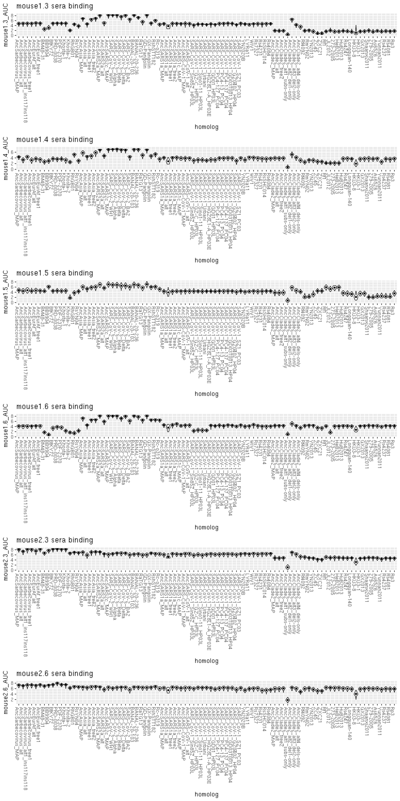
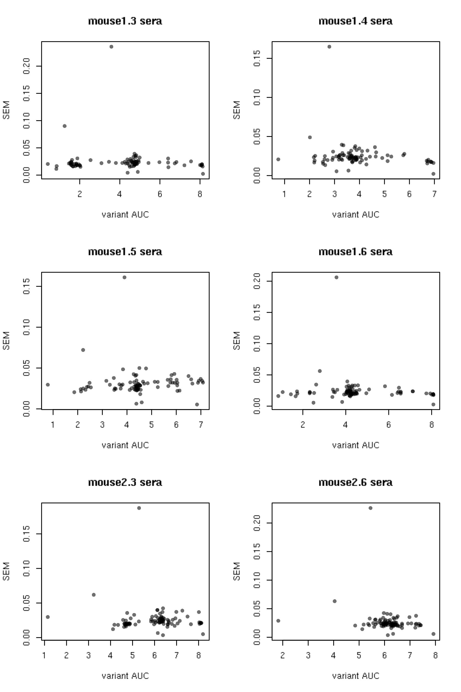
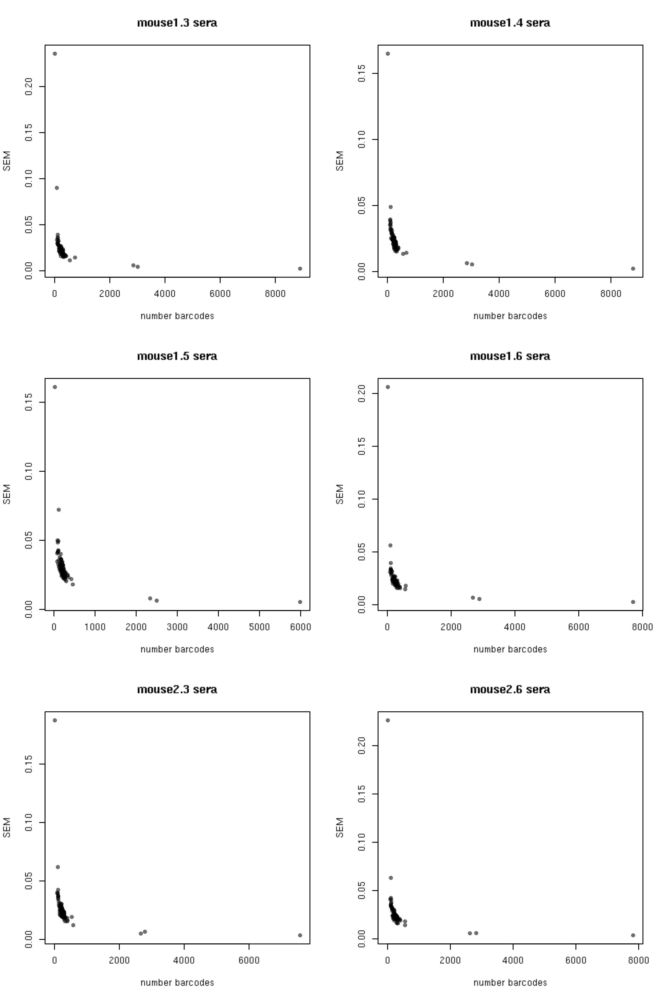
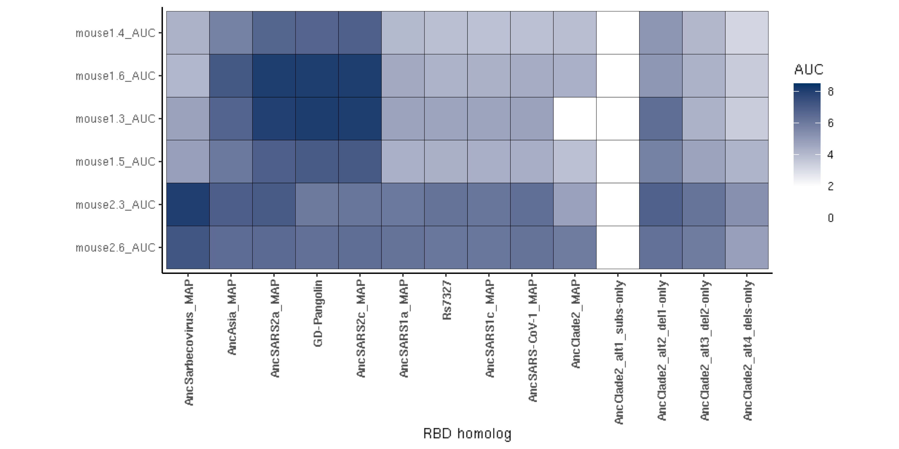

Collapse barcodes to final per-RBD/mutant phenotype scores for the
wildtype sarbecoviruses pool
================
Tyler Starr
03/22/2023

-   [Setup](#setup)
-   [Calculate per-variant mean
    scores](#calculate-per-variant-mean-scores)
-   [Heatmaps!](#heatmaps)

This notebook reads in the per-barcode sera binding values and
previously measured expression for sarbecovirus homologs pool. It
synthesizes these two sets of results and calculates the final ‘mean’
phenotypes for each variant, and generates some coverage and QC
analyses.

``` r
require("knitr")
knitr::opts_chunk$set(echo = T)
knitr::opts_chunk$set(dev.args = list(png = list(type = "cairo")))

#list of packages to install/load
packages = c("yaml","data.table","tidyverse","gridExtra")
#install any packages not already installed
installed_packages <- packages %in% rownames(installed.packages())
if(any(installed_packages == F)){
  install.packages(packages[!installed_packages])
}
#load packages
invisible(lapply(packages, library, character.only=T))

#read in config file
config <- read_yaml("config.yaml")

#make output directory
if(!file.exists(config$final_variant_scores_dir)){
  dir.create(file.path(config$final_variant_scores_dir))
}
```

Session info for reproducing environment:

``` r
sessionInfo()
```

    ## R version 4.1.2 (2021-11-01)
    ## Platform: x86_64-pc-linux-gnu (64-bit)
    ## Running under: Ubuntu 18.04.6 LTS
    ## 
    ## Matrix products: default
    ## BLAS/LAPACK: /app/software/FlexiBLAS/3.0.4-GCC-11.2.0/lib/libflexiblas.so.3.0
    ## 
    ## locale:
    ##  [1] LC_CTYPE=en_US.UTF-8       LC_NUMERIC=C              
    ##  [3] LC_TIME=en_US.UTF-8        LC_COLLATE=en_US.UTF-8    
    ##  [5] LC_MONETARY=en_US.UTF-8    LC_MESSAGES=en_US.UTF-8   
    ##  [7] LC_PAPER=en_US.UTF-8       LC_NAME=C                 
    ##  [9] LC_ADDRESS=C               LC_TELEPHONE=C            
    ## [11] LC_MEASUREMENT=en_US.UTF-8 LC_IDENTIFICATION=C       
    ## 
    ## attached base packages:
    ## [1] stats     graphics  grDevices utils     datasets  methods   base     
    ## 
    ## other attached packages:
    ##  [1] gridExtra_2.3     forcats_0.5.1     stringr_1.4.0     dplyr_1.0.7      
    ##  [5] purrr_0.3.4       readr_2.0.2       tidyr_1.1.4       tibble_3.1.5     
    ##  [9] ggplot2_3.3.5     tidyverse_1.3.1   data.table_1.14.2 yaml_2.2.1       
    ## [13] knitr_1.36       
    ## 
    ## loaded via a namespace (and not attached):
    ##  [1] tidyselect_1.1.1 xfun_0.27        haven_2.4.3      colorspace_2.0-2
    ##  [5] vctrs_0.3.8      generics_0.1.1   htmltools_0.5.2  utf8_1.2.2      
    ##  [9] rlang_0.4.12     pillar_1.6.4     glue_1.4.2       withr_2.4.2     
    ## [13] DBI_1.1.1        dbplyr_2.1.1     modelr_0.1.8     readxl_1.3.1    
    ## [17] lifecycle_1.0.1  munsell_0.5.0    gtable_0.3.0     cellranger_1.1.0
    ## [21] rvest_1.0.2      evaluate_0.14    tzdb_0.2.0       fastmap_1.1.0   
    ## [25] fansi_0.5.0      broom_0.7.10     Rcpp_1.0.7       scales_1.1.1    
    ## [29] backports_1.3.0  jsonlite_1.8.4   fs_1.5.0         hms_1.1.1       
    ## [33] digest_0.6.28    stringi_1.7.5    grid_4.1.2       cli_3.1.0       
    ## [37] tools_4.1.2      magrittr_2.0.1   crayon_1.4.2     pkgconfig_2.0.3 
    ## [41] ellipsis_0.3.2   xml2_1.3.3       reprex_2.0.1     lubridate_1.8.0 
    ## [45] rstudioapi_0.13  assertthat_0.2.1 rmarkdown_2.11   httr_1.4.4      
    ## [49] R6_2.5.1         compiler_4.1.2

## Setup

Read in tables of per-barcode AUC

``` r
#read in data, keep just the wildtypes (which should be lib47, but also Omicron_BA2 and the other wt barcodes in the mutant DMS pools)
dt <- data.table(read.csv(config$sera_delta_AUC_file),stringsAsFactors=F)[variant_class=="wildtype",]

#check all targets are in the targets_ordered config list
unique(dt$target) %in% config$targets_ordered
```

    ##  [1] TRUE TRUE TRUE TRUE TRUE TRUE TRUE TRUE TRUE TRUE TRUE TRUE TRUE TRUE TRUE
    ## [16] TRUE TRUE TRUE TRUE TRUE TRUE TRUE TRUE TRUE TRUE TRUE TRUE TRUE TRUE TRUE
    ## [31] TRUE TRUE TRUE TRUE TRUE TRUE TRUE TRUE TRUE TRUE TRUE TRUE TRUE TRUE TRUE
    ## [46] TRUE TRUE TRUE TRUE TRUE TRUE TRUE TRUE TRUE TRUE TRUE TRUE TRUE TRUE TRUE
    ## [61] TRUE TRUE TRUE TRUE TRUE TRUE TRUE TRUE TRUE TRUE TRUE TRUE TRUE TRUE TRUE
    ## [76] TRUE TRUE TRUE TRUE TRUE TRUE TRUE TRUE TRUE TRUE TRUE TRUE TRUE TRUE

``` r
#assign target as a factor in my desired overall plotting order
dt[,target := factor(dt$target,levels=config$targets_ordered)]

#remove substitutiosn columns as these are all widltype
dt[,c("aa_substitutions","n_aa_substitutions") := NULL]

#read in previously measured expression measurements for these variants? Note, don't have this metric for the pool7 additions to this v2 pool
dt_expr <- data.table(read.csv(config$SARSr_lib47_mut_bind_expr),stringsAsFactors=F)
dt_expr[target=="SARS-CoV-2",target:="SARS-CoV-2_WH1"]
dt_expr[target=="SARS-CoV-1_Urbani_HP03L",target:="SARS-CoV-1_Urbani"]
```

## Calculate per-variant mean scores

Unfiltered, look at distribution of AUC scores

``` r
p1 <- ggplot(dt[!is.na(mouse1.3_AUC),],aes(x=target,y=mouse1.3_AUC))+
  geom_violin(scale="width")+stat_summary(fun=median,geom="point",size=1)+
  ggtitle("mouse1.3 sera binding")+xlab("homolog")+theme(axis.text.x=element_text(angle=-90,hjust=0))

p2 <- ggplot(dt[!is.na(mouse1.4_AUC),],aes(x=target,y=mouse1.4_AUC))+
  geom_violin(scale="width")+stat_summary(fun=median,geom="point",size=1)+
  ggtitle("mouse1.4 sera binding")+xlab("homolog")+theme(axis.text.x=element_text(angle=-90,hjust=0))

p3 <- ggplot(dt[!is.na(mouse1.5_AUC),],aes(x=target,y=mouse1.5_AUC))+
  geom_violin(scale="width")+stat_summary(fun=median,geom="point",size=1)+
  ggtitle("mouse1.5 sera binding")+xlab("homolog")+theme(axis.text.x=element_text(angle=-90,hjust=0))

p4 <- ggplot(dt[!is.na(mouse1.6_AUC),],aes(x=target,y=mouse1.6_AUC))+
  geom_violin(scale="width")+stat_summary(fun=median,geom="point",size=1)+
  ggtitle("mouse1.6 sera binding")+xlab("homolog")+theme(axis.text.x=element_text(angle=-90,hjust=0))

p5 <- ggplot(dt[!is.na(mouse2.3_AUC),],aes(x=target,y=mouse2.3_AUC))+
  geom_violin(scale="width")+stat_summary(fun=median,geom="point",size=1)+
  ggtitle("mouse2.3 sera binding")+xlab("homolog")+theme(axis.text.x=element_text(angle=-90,hjust=0))

p6 <- ggplot(dt[!is.na(mouse2.6_AUC),],aes(x=target,y=mouse2.6_AUC))+
  geom_violin(scale="width")+stat_summary(fun=median,geom="point",size=1)+
  ggtitle("mouse2.6 sera binding")+xlab("homolog")+theme(axis.text.x=element_text(angle=-90,hjust=0))
grid.arrange(p1,p2,p3,p4,p5,p6,ncol=1)
```


Let’s add a variable that flags the top and bottom 2.5% of expression
scores for each variant, and see how violin plots look when censoring
these most extreme 5% of expressed barcodes

``` r
#mouse1.3
dt[,mouse1.3_censor_lower:=quantile(mouse1.3_AUC,0.025,na.rm=T,type=7),by=c("library","target")]
dt[,mouse1.3_censor_upper:=quantile(mouse1.3_AUC,0.975,na.rm=T,type=7),by=c("library","target")]

#mouse1.4
dt[,mouse1.4_censor_lower:=quantile(mouse1.4_AUC,0.025,na.rm=T,type=7),by=c("library","target")]
dt[,mouse1.4_censor_upper:=quantile(mouse1.4_AUC,0.975,na.rm=T,type=7),by=c("library","target")]

#mouse1.5
dt[,mouse1.5_censor_lower:=quantile(mouse1.5_AUC,0.025,na.rm=T,type=7),by=c("library","target")]
dt[,mouse1.5_censor_upper:=quantile(mouse1.5_AUC,0.975,na.rm=T,type=7),by=c("library","target")]

#mouse1.6
dt[,mouse1.6_censor_lower:=quantile(mouse1.6_AUC,0.025,na.rm=T,type=7),by=c("library","target")]
dt[,mouse1.6_censor_upper:=quantile(mouse1.6_AUC,0.975,na.rm=T,type=7),by=c("library","target")]

#mouse2.3
dt[,mouse2.3_censor_lower:=quantile(mouse2.3_AUC,0.025,na.rm=T,type=7),by=c("library","target")]
dt[,mouse2.3_censor_upper:=quantile(mouse2.3_AUC,0.975,na.rm=T,type=7),by=c("library","target")]

#mouse2.6
dt[,mouse2.6_censor_lower:=quantile(mouse2.6_AUC,0.025,na.rm=T,type=7),by=c("library","target")]
dt[,mouse2.6_censor_upper:=quantile(mouse2.6_AUC,0.975,na.rm=T,type=7),by=c("library","target")]

p1 <- ggplot(dt[!is.na(mouse1.3_AUC) & mouse1.3_AUC >= mouse1.3_censor_lower & mouse1.3_AUC <= mouse1.3_censor_upper,],aes(x=target,y=mouse1.3_AUC))+
  geom_violin(scale="width")+stat_summary(fun=median,geom="point",size=1)+
  ggtitle("mouse1.3 sera binding")+xlab("homolog")+theme(axis.text.x=element_text(angle=-90,hjust=0))

p2 <- ggplot(dt[!is.na(mouse1.4_AUC) & mouse1.4_AUC >= mouse1.4_censor_lower & mouse1.4_AUC <= mouse1.4_censor_upper,],aes(x=target,y=mouse1.4_AUC))+
  geom_violin(scale="width")+stat_summary(fun=median,geom="point",size=1)+
  ggtitle("mouse1.4 sera binding")+xlab("homolog")+theme(axis.text.x=element_text(angle=-90,hjust=0))

p3 <- ggplot(dt[!is.na(mouse1.5_AUC) & mouse1.5_AUC >= mouse1.5_censor_lower & mouse1.5_AUC <= mouse1.5_censor_upper,],aes(x=target,y=mouse1.5_AUC))+
  geom_violin(scale="width")+stat_summary(fun=median,geom="point",size=1)+
  ggtitle("mouse1.5 sera binding")+xlab("homolog")+theme(axis.text.x=element_text(angle=-90,hjust=0))

p4 <- ggplot(dt[!is.na(mouse1.6_AUC) & mouse1.6_AUC >= mouse1.6_censor_lower & mouse1.6_AUC <= mouse1.6_censor_upper,],aes(x=target,y=mouse1.6_AUC))+
  geom_violin(scale="width")+stat_summary(fun=median,geom="point",size=1)+
  ggtitle("mouse1.6 sera binding")+xlab("homolog")+theme(axis.text.x=element_text(angle=-90,hjust=0))

p5 <- ggplot(dt[!is.na(mouse2.3_AUC) & mouse2.3_AUC >= mouse2.3_censor_lower & mouse2.3_AUC <= mouse2.3_censor_upper,],aes(x=target,y=mouse2.3_AUC))+
  geom_violin(scale="width")+stat_summary(fun=median,geom="point",size=1)+
  ggtitle("mouse2.3 sera binding")+xlab("homolog")+theme(axis.text.x=element_text(angle=-90,hjust=0))

p6 <- ggplot(dt[!is.na(mouse2.6_AUC) & mouse2.6_AUC >= mouse2.6_censor_lower & mouse2.6_AUC <= mouse2.6_censor_upper,],aes(x=target,y=mouse2.6_AUC))+
  geom_violin(scale="width")+stat_summary(fun=median,geom="point",size=1)+
  ggtitle("mouse2.6 sera binding")+xlab("homolog")+theme(axis.text.x=element_text(angle=-90,hjust=0))

grid.arrange(p1,p2,p3,p4,p5,p6,ncol=1)
```



``` r
invisible(dev.print(pdf, paste(config$final_variant_scores_dir,"/lib47_vioplots_AUC-cens.pdf",sep="")))
```

Calculate the mean per variant, the standard deviation, and the number
of (post-filter) barcodes on which a variant score was determined

``` r
#apply the censors to NA out the phenotypes outside the range
dt[mouse1.3_AUC < mouse1.3_censor_lower | mouse1.3_AUC > mouse1.3_censor_upper, mouse1.3_AUC:=NA]
dt[mouse1.4_AUC < mouse1.4_censor_lower | mouse1.4_AUC > mouse1.4_censor_upper, mouse1.4_AUC:=NA]
dt[mouse1.5_AUC < mouse1.5_censor_lower | mouse1.5_AUC > mouse1.5_censor_upper, mouse1.5_AUC:=NA]
dt[mouse1.6_AUC < mouse1.6_censor_lower | mouse1.6_AUC > mouse1.6_censor_upper, mouse1.6_AUC:=NA]
dt[mouse2.3_AUC < mouse2.3_censor_lower | mouse2.3_AUC > mouse2.3_censor_upper, mouse2.3_AUC:=NA]
dt[mouse2.6_AUC < mouse2.6_censor_lower | mouse2.6_AUC > mouse2.6_censor_upper, mouse2.6_AUC:=NA]

dt[,mean_mouse1.3_AUC:=mean(mouse1.3_AUC,na.rm=T),by=c("library","target")]
dt[,sd_mouse1.3_AUC:=sd(mouse1.3_AUC,na.rm=T),by=c("library","target")]
dt[,n_bc_mouse1.3_AUC:=sum(!is.na(mouse1.3_AUC)),by=c("library","target")]

dt[,mean_mouse1.4_AUC:=mean(mouse1.4_AUC,na.rm=T),by=c("library","target")]
dt[,sd_mouse1.4_AUC:=sd(mouse1.4_AUC,na.rm=T),by=c("library","target")]
dt[,n_bc_mouse1.4_AUC:=sum(!is.na(mouse1.4_AUC)),by=c("library","target")]

dt[,mean_mouse1.5_AUC:=mean(mouse1.5_AUC,na.rm=T),by=c("library","target")]
dt[,sd_mouse1.5_AUC:=sd(mouse1.5_AUC,na.rm=T),by=c("library","target")]
dt[,n_bc_mouse1.5_AUC:=sum(!is.na(mouse1.5_AUC)),by=c("library","target")]

dt[,mean_mouse1.6_AUC:=mean(mouse1.6_AUC,na.rm=T),by=c("library","target")]
dt[,sd_mouse1.6_AUC:=sd(mouse1.6_AUC,na.rm=T),by=c("library","target")]
dt[,n_bc_mouse1.6_AUC:=sum(!is.na(mouse1.6_AUC)),by=c("library","target")]

dt[,mean_mouse2.3_AUC:=mean(mouse2.3_AUC,na.rm=T),by=c("library","target")]
dt[,sd_mouse2.3_AUC:=sd(mouse2.3_AUC,na.rm=T),by=c("library","target")]
dt[,n_bc_mouse2.3_AUC:=sum(!is.na(mouse2.3_AUC)),by=c("library","target")]

dt[,mean_mouse2.6_AUC:=mean(mouse2.6_AUC,na.rm=T),by=c("library","target")]
dt[,sd_mouse2.6_AUC:=sd(mouse2.6_AUC,na.rm=T),by=c("library","target")]
dt[,n_bc_mouse2.6_AUC:=sum(!is.na(mouse2.6_AUC)),by=c("library","target")]
```

Collapse down to tables reporting just the summary statistics for each
genotype.

``` r
dt_final <- dt[,.(library,target,variant_class,
                  mean_mouse1.3_AUC, sd_mouse1.3_AUC, n_bc_mouse1.3_AUC,
                  mean_mouse1.4_AUC, sd_mouse1.4_AUC, n_bc_mouse1.4_AUC,
                  mean_mouse1.5_AUC, sd_mouse1.5_AUC, n_bc_mouse1.5_AUC,
                  mean_mouse1.6_AUC, sd_mouse1.6_AUC, n_bc_mouse1.6_AUC,
                  mean_mouse2.3_AUC, sd_mouse2.3_AUC, n_bc_mouse2.3_AUC,
                  mean_mouse2.6_AUC, sd_mouse2.6_AUC, n_bc_mouse2.6_AUC
                  )]

dt_final <- unique(dt_final); setkey(dt_final, target)
```

Let’s look how SEM is distributed. Can see that SEM is generally very,
very low. Also that it doesn’t really have a relationship with the AUC
metric, which is good.

``` r
par(mfrow=c(3,2))
#mouse1.3
x <- dt_final[,mean_mouse1.3_AUC]; y <- dt_final[,sd_mouse1.3_AUC/sqrt(n_bc_mouse1.3_AUC)]; plot(x,y,pch=16,col="#00000090",xlab="variant AUC",ylab="SEM",main="mouse1.3 sera")

#mouse1.4
x <- dt_final[,mean_mouse1.4_AUC]; y <- dt_final[,sd_mouse1.4_AUC/sqrt(n_bc_mouse1.4_AUC)]; plot(x,y,pch=16,col="#00000090",xlab="variant AUC",ylab="SEM",main="mouse1.4 sera")

#mouse1.5
x <- dt_final[,mean_mouse1.5_AUC]; y <- dt_final[,sd_mouse1.5_AUC/sqrt(n_bc_mouse1.5_AUC)]; plot(x,y,pch=16,col="#00000090",xlab="variant AUC",ylab="SEM",main="mouse1.5 sera")

#mouse1.6
x <- dt_final[,mean_mouse1.6_AUC]; y <- dt_final[,sd_mouse1.6_AUC/sqrt(n_bc_mouse1.6_AUC)]; plot(x,y,pch=16,col="#00000090",xlab="variant AUC",ylab="SEM",main="mouse1.6 sera")

#mouse2.3
x <- dt_final[,mean_mouse2.3_AUC]; y <- dt_final[,sd_mouse2.3_AUC/sqrt(n_bc_mouse2.3_AUC)]; plot(x,y,pch=16,col="#00000090",xlab="variant AUC",ylab="SEM",main="mouse2.3 sera")

#mouse2.6
x <- dt_final[,mean_mouse2.6_AUC]; y <- dt_final[,sd_mouse2.6_AUC/sqrt(n_bc_mouse2.6_AUC)]; plot(x,y,pch=16,col="#00000090",xlab="variant AUC",ylab="SEM",main="mouse2.6 sera")
```



``` r
invisible(dev.print(pdf, paste(config$final_variant_scores_dir,"/SEM-v-AUC.pdf",sep=""),useDingbats=F))
```

Let’s also look at how standard error of a within-replicate mean varies
with the number of barcodes

``` r
par(mfrow=c(3,2))
#mouse1.3
x <- dt_final[,n_bc_mouse1.3_AUC]; y <- dt_final[,sd_mouse1.3_AUC/sqrt(n_bc_mouse1.3_AUC)]; plot(x,y,pch=16,col="#00000090",xlab="number barcodes",ylab="SEM",main="mouse1.3 sera")

#mouse1.4
x <- dt_final[,n_bc_mouse1.4_AUC]; y <- dt_final[,sd_mouse1.4_AUC/sqrt(n_bc_mouse1.4_AUC)]; plot(x,y,pch=16,col="#00000090",xlab="number barcodes",ylab="SEM",main="mouse1.4 sera")

#mouse1.5
x <- dt_final[,n_bc_mouse1.5_AUC]; y <- dt_final[,sd_mouse1.5_AUC/sqrt(n_bc_mouse1.5_AUC)]; plot(x,y,pch=16,col="#00000090",xlab="number barcodes",ylab="SEM",main="mouse1.5 sera")

#mouse1.6
x <- dt_final[,n_bc_mouse1.6_AUC]; y <- dt_final[,sd_mouse1.6_AUC/sqrt(n_bc_mouse1.6_AUC)]; plot(x,y,pch=16,col="#00000090",xlab="number barcodes",ylab="SEM",main="mouse1.6 sera")

#mouse2.3
x <- dt_final[,n_bc_mouse2.3_AUC]; y <- dt_final[,sd_mouse2.3_AUC/sqrt(n_bc_mouse2.3_AUC)]; plot(x,y,pch=16,col="#00000090",xlab="number barcodes",ylab="SEM",main="mouse2.3 sera")

#mouse2.6
x <- dt_final[,n_bc_mouse2.6_AUC]; y <- dt_final[,sd_mouse2.6_AUC/sqrt(n_bc_mouse2.6_AUC)]; plot(x,y,pch=16,col="#00000090",xlab="number barcodes",ylab="SEM",main="mouse2.6 sera")
```



``` r
invisible(dev.print(pdf, paste(config$final_variant_scores_dir,"/lib47_SEM-v-n-bc.pdf",sep=""),useDingbats=F))
```

Add in the previously-measured expression values.

``` r
dt_final[,expr:=as.numeric(NA)]
for(i in 1:nrow(dt_final)){
  bg <- as.character(dt_final[i,target])
  if(bg %in% dt_expr$target){
    dt_final[i,expr := dt_expr[target==bg,expression]]
  }
}

#compute a delta_expr relative to the median
dt_final[,delta_expr := expr - median(dt_final$expr,na.rm=T)]

#use the normalization values applied to the single-mut DMS data in the corresponding lib40 notebook? The normalizations for each serum are given in that notebook text and manually entered here. We might also imagine using the average across the six coefficients
dt_final[,mouse1.3_normAUC := mean_mouse1.3_AUC - (0.8602862*delta_expr)]
dt_final[,mouse1.4_normAUC := mean_mouse1.4_AUC - (0.8374225*delta_expr)]
dt_final[,mouse1.5_normAUC := mean_mouse1.5_AUC - (0.6649518*delta_expr)]
dt_final[,mouse1.6_normAUC := mean_mouse1.6_AUC - (1.000988*delta_expr)]
dt_final[,mouse2.3_normAUC := mean_mouse2.3_AUC - (0.9867039*delta_expr)]
dt_final[,mouse2.6_normAUC := mean_mouse2.6_AUC - (1.149761*delta_expr)]

par(mfrow=c(6,2))
plot(dt_final$delta_expr,dt_final$mean_mouse1.3_AUC,xlab="expr relative to median",ylab="AUC, mouse1.3 sera",pch=16)
plot(dt_final$delta_expr,dt_final$mouse1.3_normAUC,xlab="expr relative to median",ylab="expr-normalized AUC, mouse1.3 sera",pch=16)

plot(dt_final$delta_expr,dt_final$mean_mouse1.4_AUC,xlab="expr relative to median",ylab="AUC, mouse1.4 sera",pch=16)
plot(dt_final$delta_expr,dt_final$mouse1.4_normAUC,xlab="expr relative to median",ylab="expr-normalized AUC, mouse1.4 sera",pch=16)

plot(dt_final$delta_expr,dt_final$mean_mouse1.5_AUC,xlab="expr relative to median",ylab="AUC, mouse1.5 sera",pch=16)
plot(dt_final$delta_expr,dt_final$mouse1.5_normAUC,xlab="expr relative to median",ylab="expr-normalized AUC, mouse1.5 sera",pch=16)

plot(dt_final$delta_expr,dt_final$mean_mouse1.6_AUC,xlab="expr relative to median",ylab="AUC, mouse1.6 sera",pch=16)
plot(dt_final$delta_expr,dt_final$mouse1.6_normAUC,xlab="expr relative to median",ylab="expr-normalized AUC, mouse1.6 sera",pch=16)

plot(dt_final$delta_expr,dt_final$mean_mouse2.3_AUC,xlab="expr relative to median",ylab="AUC, mouse2.3 sera",pch=16)
plot(dt_final$delta_expr,dt_final$mouse2.3_normAUC,xlab="expr relative to median",ylab="expr-normalized AUC, mouse2.3 sera",pch=16)

plot(dt_final$delta_expr,dt_final$mean_mouse2.6_AUC,xlab="expr relative to median",ylab="AUC, mouse2.6 sera",pch=16)
plot(dt_final$delta_expr,dt_final$mouse2.6_normAUC,xlab="expr relative to median",ylab="expr-normalized AUC, mouse2.6 sera",pch=16)
```


Filter out the two backgrounds that were completely non-expressing. Most
barcodes were purged before the affinity measurements for these
backgrounds, so the affinities are determined from few barcodes and are
just generally unreliable because these are poorly folded/expressing
variants. (E.g. could see very high standard deviations)

``` r
dt_final[target %in% c("HKU3-8","AncSARS1a_alt"),c("mean_mouse1.3_AUC","sd_mouse1.3_AUC","n_bc_mouse1.3_AUC",
                                                    "mean_mouse1.4_AUC","sd_mouse1.4_AUC","n_bc_mouse1.4_AUC",
                                                    "mean_mouse1.5_AUC","sd_mouse1.5_AUC","n_bc_mouse1.5_AUC",
                                                    "mean_mouse1.6_AUC","sd_mouse1.6_AUC","n_bc_mouse1.6_AUC",
                                                    "mean_mouse2.3_AUC","sd_mouse2.3_AUC","n_bc_mouse2.3_AUC",
                                                    "mean_mouse2.6_AUC","sd_mouse2.6_AUC","n_bc_mouse2.6_AUC"):=NA]
```

Coverage stats on n_barcodes for different measurements in the final
pooled measurements.

``` r
par(mfrow=c(3,2))

hist(dt_final$n_bc_mouse1.3_AUC,col="gray50",main=paste("mouse1.3 sera,\nmedian ",median(dt_final$n_bc_mouse1.3_AUC,na.rm=T),sep=""),xlab="number barcodes",ylab="number genotypes",breaks=20)

hist(dt_final$n_bc_mouse1.4_AUC,col="gray50",main=paste("mouse1.4 sera,\nmedian ",median(dt_final$n_bc_mouse1.4_AUC,na.rm=T),sep=""),xlab="number barcodes",ylab="number genotypes",breaks=20)

hist(dt_final$n_bc_mouse1.5_AUC,col="gray50",main=paste("mouse1.5 sera,\nmedian ",median(dt_final$n_bc_mouse1.5_AUC,na.rm=T),sep=""),xlab="number barcodes",ylab="number genotypes",breaks=20)

hist(dt_final$n_bc_mouse1.6_AUC,col="gray50",main=paste("mouse1.6 sera,\nmedian ",median(dt_final$n_bc_mouse1.6_AUC,na.rm=T),sep=""),xlab="number barcodes",ylab="number genotypes",breaks=20)

hist(dt_final$n_bc_mouse2.3_AUC,col="gray50",main=paste("mouse2.3 sera,\nmedian ",median(dt_final$n_bc_mouse2.3_AUC,na.rm=T),sep=""),xlab="number barcodes",ylab="number genotypes",breaks=20)

hist(dt_final$n_bc_mouse2.6_AUC,col="gray50",main=paste("mouse2.6 sera,\nmedian ",median(dt_final$n_bc_mouse2.6_AUC,na.rm=T),sep=""),xlab="number barcodes",ylab="number genotypes",breaks=20)
```


``` r
invisible(dev.print(pdf, paste(config$final_variant_scores_dir,"/lib47_hist_n_barcodes.pdf",sep="")))
```

Order factor variables for plotting

``` r
#order target by order given in config
dt_final$target <- factor(dt_final$target,levels=config$targets_ordered)

#rename some columns for convenience
setnames(dt_final,"mean_mouse1.3_AUC","mouse1.3_AUC")
setnames(dt_final,"mean_mouse1.4_AUC","mouse1.4_AUC")
setnames(dt_final,"mean_mouse1.5_AUC","mouse1.5_AUC")
setnames(dt_final,"mean_mouse1.6_AUC","mouse1.6_AUC")
setnames(dt_final,"mean_mouse2.3_AUC","mouse2.3_AUC")
setnames(dt_final,"mean_mouse2.6_AUC","mouse2.6_AUC")
```

## Heatmaps!

Output heatmaps illustrating all wildtype variants with separate columns
for each serum. Do with both the raw AUC and the expression-normalized
metric.

``` r
#make temp long-form data frame
temp1 <- data.table::melt(dt_final[,.(target,mouse1.3_AUC,mouse1.4_AUC,mouse1.5_AUC,mouse1.6_AUC,mouse2.3_AUC,mouse2.6_AUC)],
                          id.vars=c("target"),
                          measure.vars=c("mouse1.3_AUC","mouse1.4_AUC","mouse1.5_AUC","mouse1.6_AUC","mouse2.3_AUC","mouse2.6_AUC"),
                          variable.name="sera",value.name="AUC")

#reorder mouse sera for display
temp1$sera <- factor(temp1$sera,levels=c("mouse2.6_AUC","mouse2.3_AUC","mouse1.5_AUC","mouse1.3_AUC","mouse1.6_AUC","mouse1.4_AUC"))

p1 <- ggplot(temp1,aes(target,sera))+geom_tile(aes(fill=AUC),color="black",lwd=0.1)+
  scale_fill_gradientn(colours=c("#FFFFFF","#FFFFFF","#003366"),limits=c(0,8.5),values=c(0,2/8.5,8.5/8.5),na.value="gray40")+ #effective range 2 to 8.5
  #scale_fill_gradientn(colours=c("#FFFFFF","#003366"),limits=c(5,12),values=c(0,1),na.value="yellow")+
  #scale_x_continuous(expand=c(0,0),breaks=c(331,seq(335,430,by=5)))+
  labs(x="RBD homolog",y="")+theme_classic(base_size=9)+
  coord_equal()+theme(axis.text.x=element_text(angle=90,hjust=1,vjust=0.6,face="bold"))

grid.arrange(p1,nrow=1)
```


``` r
invisible(dev.print(pdf, paste(config$final_variant_scores_dir,"/lib47_heatmap_AUC_all_wildtypes.pdf",sep="")))
```

And for expression-normalized

``` r
#make temp long-form data frame
temp1.1 <- data.table::melt(dt_final[,.(target,mouse1.3_normAUC,mouse1.4_normAUC,mouse1.5_normAUC,mouse1.6_normAUC,mouse2.3_normAUC,mouse2.6_normAUC)],
                          id.vars=c("target"),
                          measure.vars=c("mouse1.3_normAUC","mouse1.4_normAUC","mouse1.5_normAUC","mouse1.6_normAUC","mouse2.3_normAUC","mouse2.6_normAUC"),
                          variable.name="sera",value.name="normAUC")

p1 <- ggplot(temp1.1,aes(target,sera))+geom_tile(aes(fill=normAUC),color="black",lwd=0.1)+
  scale_fill_gradientn(colours=c("#FFFFFF","#FFFFFF","#003366"),limits=c(0,8.5),values=c(0,2/9.5,9.5/9.5),na.value="gray40")+ #effective range 2 to 9.5
  #scale_fill_gradientn(colours=c("#FFFFFF","#003366"),limits=c(5,12),values=c(0,1),na.value="yellow")+
  #scale_x_continuous(expand=c(0,0),breaks=c(331,seq(335,430,by=5)))+
  labs(x="RBD homolog",y="")+theme_classic(base_size=9)+
  coord_equal()+theme(axis.text.x=element_text(angle=90,hjust=1,vjust=0.6,face="bold"))

grid.arrange(p1,nrow=1)
```


``` r
invisible(dev.print(pdf, paste(config$final_variant_scores_dir,"/lib47_heatmap_AUC_all_wildtypes.pdf",sep="")))
```

Showing just extant sarbs.

``` r
#make temp long-form data frame
extant <- c(config$EurAf_extant,config$RsYN04_extant,config$SARS2_extant,config$SARS1_extant,config$Clade2_extant)

temp2 <- temp1[target %in% extant,];temp2$target <- factor(temp2$target,levels=extant)

p1 <- ggplot(temp2,aes(target,sera))+geom_tile(aes(fill=AUC),color="black",lwd=0.1)+
  scale_fill_gradientn(colours=c("#FFFFFF","#FFFFFF","#003366"),limits=c(0,8.5),values=c(0,2/8.5,8.5/8.5),na.value="gray40")+ #effective range 2 to 8.5
  #scale_fill_gradientn(colours=c("#FFFFFF","#003366"),limits=c(5,12),values=c(0,1),na.value="yellow")+
  #scale_x_continuous(expand=c(0,0),breaks=c(331,seq(335,430,by=5)))+
  labs(x="RBD homolog",y="")+theme_classic(base_size=9)+
  coord_equal()+theme(axis.text.x=element_text(angle=90,hjust=1,vjust=0.6,face="bold"))

p1
```


``` r
invisible(dev.print(pdf, paste(config$final_variant_scores_dir,"/lib47_heatmap_AUC_extant_wildtypes.pdf",sep="")))
```

And for ancestors.

``` r
#make temp long-form data frame
ancestors <- c(config$ancestors_MAP)

temp3 <- temp1[target %in% ancestors,];temp3$target <- factor(temp3$target,levels=ancestors)

p1 <- ggplot(temp3,aes(target,sera))+geom_tile(aes(fill=AUC),color="black",lwd=0.1)+
  scale_fill_gradientn(colours=c("#FFFFFF","#FFFFFF","#003366"),limits=c(0,8.5),values=c(0,2/8.5,8.5/8.5),na.value="gray40")+ #effective range 2 to 8.5
  #scale_fill_gradientn(colours=c("#FFFFFF","#003366"),limits=c(5,12),values=c(0,1),na.value="yellow")+
  #scale_x_continuous(expand=c(0,0),breaks=c(331,seq(335,430,by=5)))+
  labs(x="RBD homolog",y="")+theme_classic(base_size=9)+
  coord_equal()+theme(axis.text.x=element_text(angle=90,hjust=1,vjust=0.6,face="bold"))

p1
```



``` r
invisible(dev.print(pdf, paste(config$final_variant_scores_dir,"/lib47_heatmap_AUC_MAP-ancestors.pdf",sep="")))
```

Save output file.

``` r
dt_final %>%
  mutate_if(is.numeric, round, digits=5) %>%
  write.csv(file=config$final_variant_scores_wts_file, row.names=F,quote=F)
```
