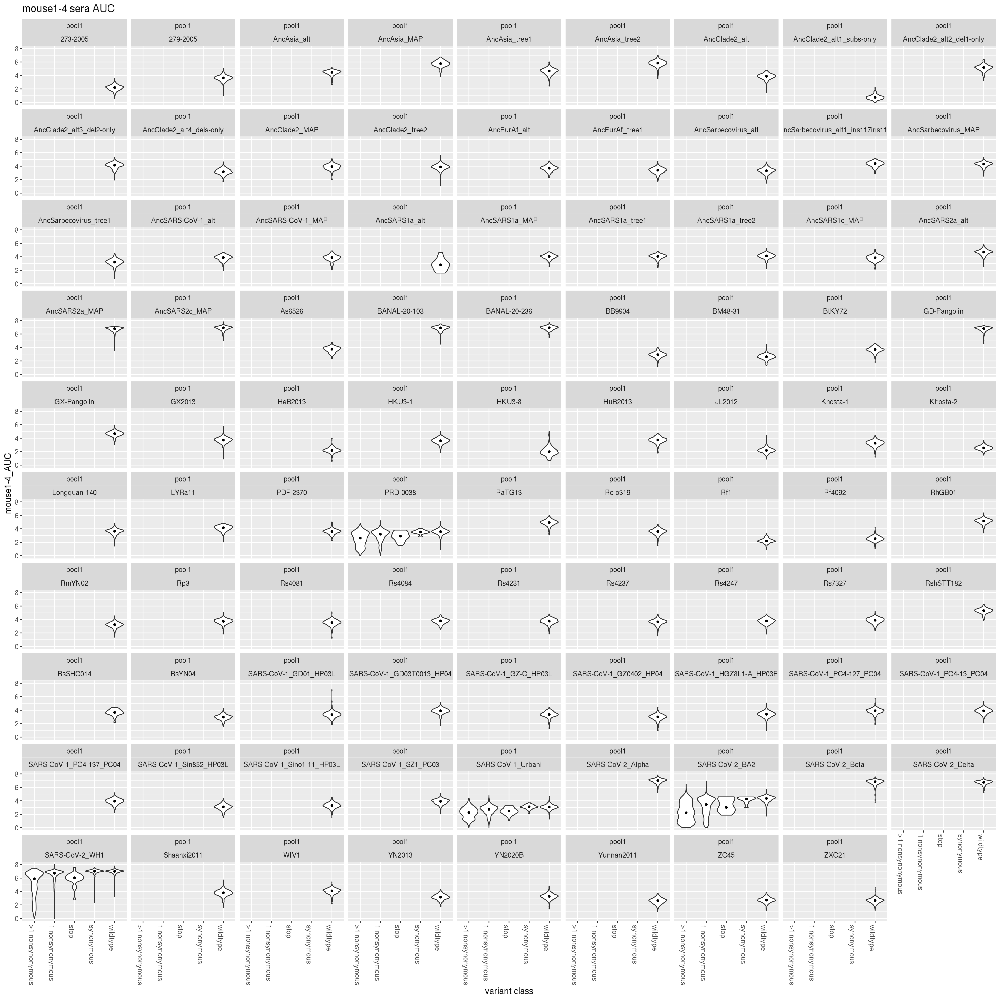
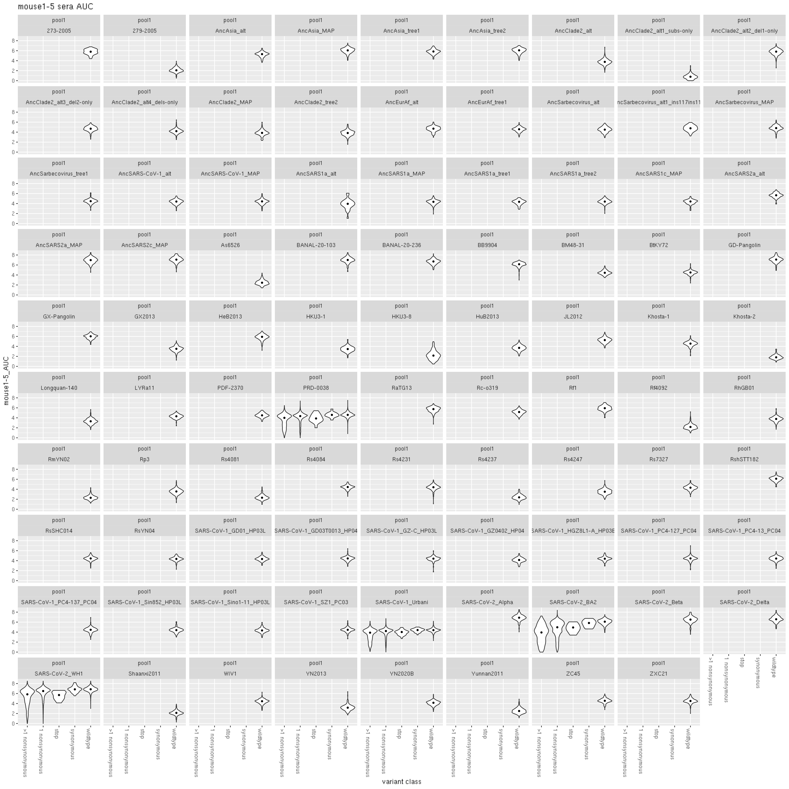
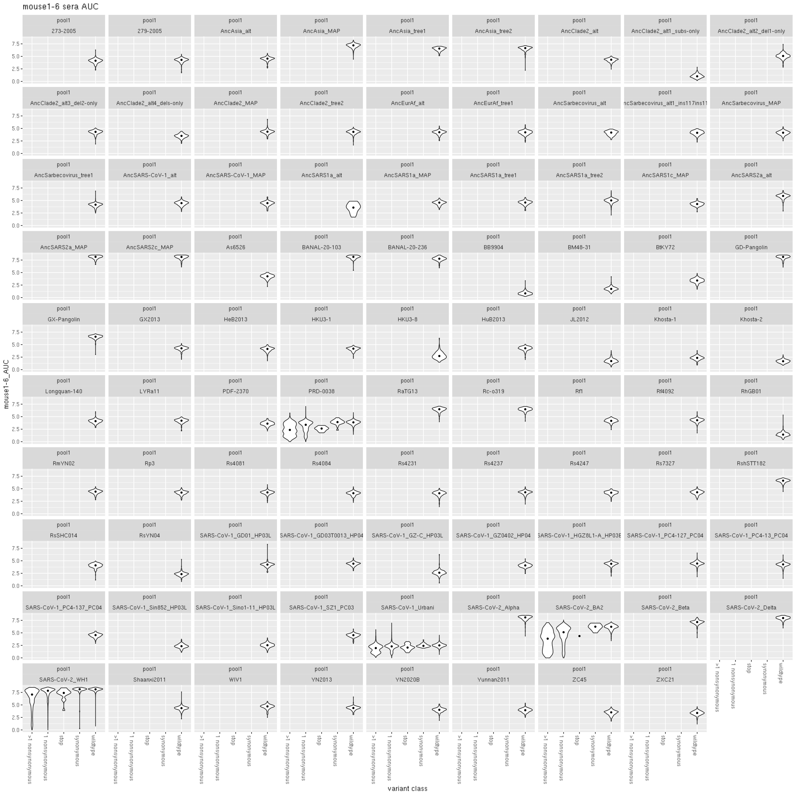
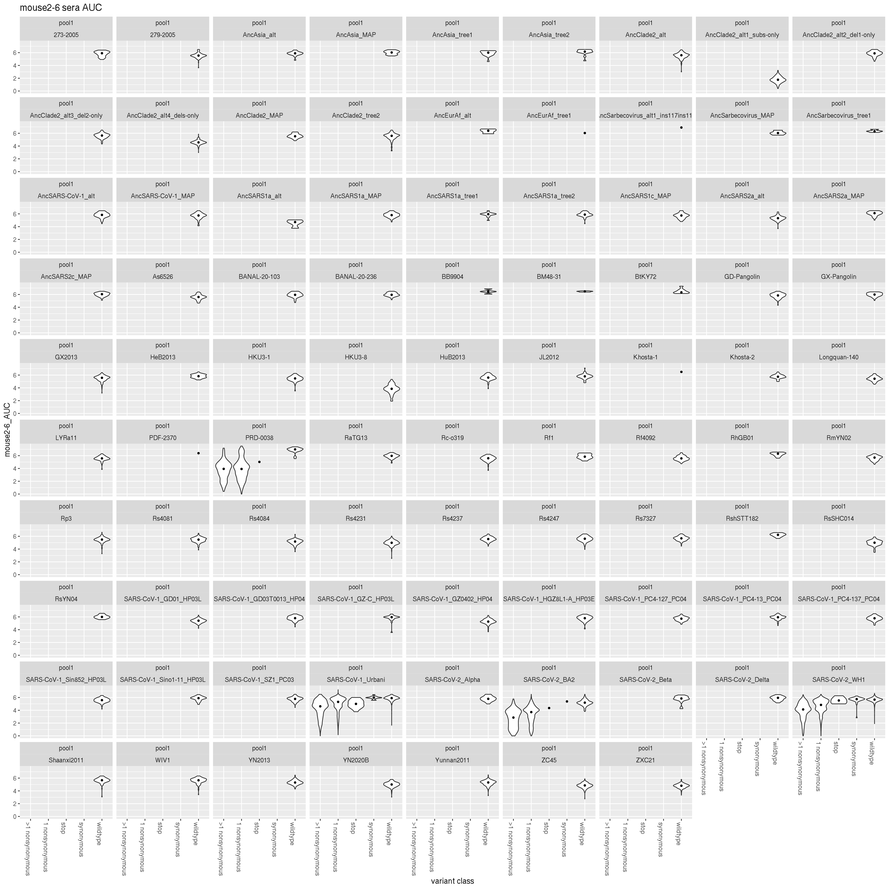

Compute per-barcode binding to vaccinated mouse sera samples
================
Tyler Starr
5/12/2022

This notebook reads in per-barcode counts from `count_variants.ipynb`
for sera-binding titration experiments, computes functional scores for
RBD binding values via delta-AUC metrics, and does some basic QC on
variant binding functional scores.

``` r
require("knitr")
knitr::opts_chunk$set(echo = T)
knitr::opts_chunk$set(dev.args = list(png = list(type = "cairo")))

#list of packages to install/load
packages = c("yaml","data.table","tidyverse","gridExtra")
#install any packages not already installed
installed_packages <- packages %in% rownames(installed.packages())
if(any(installed_packages == F)){
  install.packages(packages[!installed_packages])
}
#load packages
invisible(lapply(packages, library, character.only=T))

#read in config file
config <- read_yaml("config.yaml")

#make output directory
if(!file.exists(config$sera_delta_AUC_dir)){
  dir.create(file.path(config$sera_delta_AUC_dir))
}
```

Session info for reproducing environment:

``` r
sessionInfo()
```

    ## R version 3.6.2 (2019-12-12)
    ## Platform: x86_64-pc-linux-gnu (64-bit)
    ## Running under: Ubuntu 18.04.6 LTS
    ## 
    ## Matrix products: default
    ## BLAS/LAPACK: /app/software/OpenBLAS/0.3.7-GCC-8.3.0/lib/libopenblas_haswellp-r0.3.7.so
    ## 
    ## locale:
    ##  [1] LC_CTYPE=en_US.UTF-8       LC_NUMERIC=C              
    ##  [3] LC_TIME=en_US.UTF-8        LC_COLLATE=en_US.UTF-8    
    ##  [5] LC_MONETARY=en_US.UTF-8    LC_MESSAGES=en_US.UTF-8   
    ##  [7] LC_PAPER=en_US.UTF-8       LC_NAME=C                 
    ##  [9] LC_ADDRESS=C               LC_TELEPHONE=C            
    ## [11] LC_MEASUREMENT=en_US.UTF-8 LC_IDENTIFICATION=C       
    ## 
    ## attached base packages:
    ## [1] stats     graphics  grDevices utils     datasets  methods   base     
    ## 
    ## other attached packages:
    ##  [1] gridExtra_2.3     forcats_0.4.0     stringr_1.4.0     dplyr_0.8.3      
    ##  [5] purrr_0.3.3       readr_1.3.1       tidyr_1.0.0       tibble_3.0.2     
    ##  [9] ggplot2_3.3.0     tidyverse_1.3.0   data.table_1.12.8 yaml_2.2.0       
    ## [13] knitr_1.26       
    ## 
    ## loaded via a namespace (and not attached):
    ##  [1] Rcpp_1.0.3       cellranger_1.1.0 pillar_1.4.5     compiler_3.6.2  
    ##  [5] dbplyr_1.4.2     tools_3.6.2      digest_0.6.23    lubridate_1.7.4 
    ##  [9] jsonlite_1.6     evaluate_0.14    lifecycle_0.2.0  gtable_0.3.0    
    ## [13] pkgconfig_2.0.3  rlang_0.4.7      reprex_0.3.0     cli_2.0.0       
    ## [17] rstudioapi_0.10  DBI_1.1.0        haven_2.2.0      xfun_0.11       
    ## [21] withr_2.1.2      xml2_1.3.3       httr_1.4.1       fs_1.3.1        
    ## [25] hms_0.5.2        generics_0.0.2   vctrs_0.3.1      grid_3.6.2      
    ## [29] tidyselect_1.1.0 glue_1.3.1       R6_2.4.1         fansi_0.4.0     
    ## [33] readxl_1.3.1     rmarkdown_2.0    modelr_0.1.5     magrittr_1.5    
    ## [37] backports_1.1.5  scales_1.1.0     ellipsis_0.3.0   htmltools_0.4.0 
    ## [41] rvest_0.3.5      assertthat_0.2.1 colorspace_1.4-1 stringi_1.4.3   
    ## [45] munsell_0.5.0    broom_0.7.0      crayon_1.3.4

## Setup

First, we will read in metadata on our sort samples, the table giving
number of reads of each barcode in each of the sort bins, and the
barcode-variant lookup tables, and merge these tables together.

``` r
#read dataframe with list of barcode runs
barcode_runs <- read.csv(file=config$barcode_runs,stringsAsFactors=F); barcode_runs <- subset(barcode_runs, select=-c(R1))

#read file giving count of each barcode in each sort partition
counts <- data.table(read.csv(file=config$variant_counts_file,stringsAsFactors=F))

#read in barcode-variant lookup tables
dt <- data.table(read.csv(file=config$codon_variant_table,stringsAsFactors=F))

#rename some targets
dt[target=="BA2",target:="SARS-CoV-2_BA2"]
dt[target=="SARS-CoV-1_2693",target:="SARS-CoV-1_Urbani"]
dt[target=="SARS-CoV-1_Urbani_HP03L",target:="SARS-CoV-1_Urbani"]
dt[target=="Wuhan_Hu_1",target:="SARS-CoV-2_WH1"]

setkey(dt,barcode,library)

#eliminate duplicated barcodes
duplicates <- dt[duplicated(dt,by=c("barcode","library")),.(library,barcode)] #the data.table duplciates function annoyingly only flags the first of each duplicate so doesn't intrinsically allow removal of both of the entries of the duplicate. So, flag what are duplciates, and then remove
dt[,duplicate:=FALSE]
for(i in 1:nrow(duplicates)){
  dt[library==duplicates[i,library] & barcode==duplicates[i,barcode],duplicate:=TRUE]
}
dt <- dt[duplicate==FALSE,]; dt[,duplicate:=NULL]

dt <- merge(counts, dt, by=c("library","barcode"));rm(counts); rm(duplicates)

samples_mouse1_3 <- data.frame(sample=sort(unique(paste(rep("mouse1-3",5),formatC(barcode_runs[barcode_runs$sample_type=="mouse1-3","concentration"], width=2,flag="0"),sep="_"))),conc=c(1/100,1/1000,1/10000,1/100000,0))

samples_mouse1_4 <- data.frame(sample=sort(unique(paste(rep("mouse1-4",5),formatC(barcode_runs[barcode_runs$sample_type=="mouse1-4","concentration"], width=2,flag="0"),sep="_"))),conc=c(1/100,1/1000,1/10000,1/100000,0))

samples_mouse1_5 <- data.frame(sample=sort(unique(paste(rep("mouse1-5",5),formatC(barcode_runs[barcode_runs$sample_type=="mouse1-5","concentration"], width=2,flag="0"),sep="_"))),conc=c(1/100,1/1000,1/10000,1/100000,0))

samples_mouse1_6 <- data.frame(sample=sort(unique(paste(rep("mouse1-6",5),formatC(barcode_runs[barcode_runs$sample_type=="mouse1-6","concentration"], width=2,flag="0"),sep="_"))),conc=c(1/100,1/1000,1/10000,1/100000,0))

samples_mouse2_3 <- data.frame(sample=sort(unique(paste(rep("mouse2-3",5),formatC(barcode_runs[barcode_runs$sample_type=="mouse2-3","concentration"], width=2,flag="0"),sep="_"))),conc=c(1/100,1/1000,1/10000,1/100000,0))

samples_mouse2_6 <- data.frame(sample=sort(unique(paste(rep("mouse2-6",5),formatC(barcode_runs[barcode_runs$sample_type=="mouse2-6","concentration"], width=2,flag="0"),sep="_"))),conc=c(1/100,1/1000,1/10000,1/100000,0))
```

Convert from Illumina read counts to estimates of the number of cells
that were sorted into a bin, and add some other useful information to
our data frame.

``` r
#for each bin, normalize the read counts to the observed ratio of cell recovery among bins
for(i in 1:nrow(barcode_runs)){
  lib <- as.character(barcode_runs$library[i])
  bin <- as.character(barcode_runs$sample[i])
  ratio <- sum(dt[library==lib & sample==bin,"count"])/barcode_runs$number_cells[i]
  if(ratio<1){ #if there are fewer reads from a FACS bin than cells sorted
    dt[library==lib & sample==bin, count.norm := as.numeric(count)] #don't normalize cell counts, make count.norm the same as count
    print(paste("reads < cells for",lib,bin,", un-normalized (ratio",ratio,")")) #print to console to inform of undersampled bins
  }else{
    dt[library==lib & sample==bin, count.norm := as.numeric(count/ratio)] #normalize read counts by the average read:cell ratio, report in new "count.norm" column
    print(paste("read:cell ratio for",lib,bin,"is",ratio))
  }
}
```

    ## [1] "read:cell ratio for pool1 mouse1-3_01_bin1 is 5.54569097900991"
    ## [1] "read:cell ratio for pool1 mouse1-3_01_bin2 is 7.55248957733112"
    ## [1] "read:cell ratio for pool1 mouse1-3_01_bin3 is 3.56242155146651"
    ## [1] "read:cell ratio for pool1 mouse1-3_01_bin4 is 4.75309008733018"
    ## [1] "read:cell ratio for pool1 mouse1-3_02_bin1 is 3.57401805864439"
    ## [1] "read:cell ratio for pool1 mouse1-3_02_bin2 is 3.54177176301395"
    ## [1] "read:cell ratio for pool1 mouse1-3_02_bin3 is 4.35179270863015"
    ## [1] "read:cell ratio for pool1 mouse1-3_02_bin4 is 3.86695064712085"
    ## [1] "read:cell ratio for pool1 mouse1-3_03_bin1 is 5.27387111851731"
    ## [1] "read:cell ratio for pool1 mouse1-3_03_bin2 is 4.66165155630775"
    ## [1] "read:cell ratio for pool1 mouse1-3_03_bin3 is 3.55684210235529"
    ## [1] "read:cell ratio for pool1 mouse1-3_03_bin4 is 3.53243433845201"
    ## [1] "read:cell ratio for pool1 mouse1-3_04_bin1 is 3.83464331726279"
    ## [1] "read:cell ratio for pool1 mouse1-3_04_bin2 is 5.87365807407062"
    ## [1] "read:cell ratio for pool1 mouse1-3_04_bin3 is 4.87882645891445"
    ## [1] "read:cell ratio for pool1 mouse1-3_04_bin4 is 7.1992"
    ## [1] "read:cell ratio for pool1 mouse1-3_05_bin1 is 3.2199368154645"
    ## [1] "read:cell ratio for pool1 mouse1-3_05_bin2 is 4.36901685549176"
    ## [1] "read:cell ratio for pool1 mouse1-3_05_bin3 is 4.22857142857143"
    ## [1] "read:cell ratio for pool1 mouse1-3_05_bin4 is 16.25"
    ## [1] "read:cell ratio for pool1 mouse1-4_01_bin1 is 5.03886177964784"
    ## [1] "read:cell ratio for pool1 mouse1-4_01_bin2 is 5.46854514653289"
    ## [1] "read:cell ratio for pool1 mouse1-4_01_bin3 is 5.48561181128941"
    ## [1] "read:cell ratio for pool1 mouse1-4_01_bin4 is 4.69107806322739"
    ## [1] "read:cell ratio for pool1 mouse1-4_02_bin1 is 3.98156809643115"
    ## [1] "read:cell ratio for pool1 mouse1-4_02_bin2 is 4.89284802401264"
    ## [1] "read:cell ratio for pool1 mouse1-4_02_bin3 is 4.90858030713155"
    ## [1] "read:cell ratio for pool1 mouse1-4_02_bin4 is 3.90199841234906"
    ## [1] "read:cell ratio for pool1 mouse1-4_03_bin1 is 3.02130899342894"
    ## [1] "read:cell ratio for pool1 mouse1-4_03_bin2 is 3.01181164467754"
    ## [1] "read:cell ratio for pool1 mouse1-4_03_bin3 is 3.12590662379211"
    ## [1] "read:cell ratio for pool1 mouse1-4_03_bin4 is 14.3390647991716"
    ## [1] "read:cell ratio for pool1 mouse1-4_04_bin1 is 4.62649837324681"
    ## [1] "read:cell ratio for pool1 mouse1-4_04_bin2 is 3.06401829063621"
    ## [1] "read:cell ratio for pool1 mouse1-4_04_bin3 is 4.70209867028864"
    ## [1] "read:cell ratio for pool1 mouse1-4_04_bin4 is 14.6666666666667"
    ## [1] "read:cell ratio for pool1 mouse1-4_05_bin1 is 3.2199368154645"
    ## [1] "read:cell ratio for pool1 mouse1-4_05_bin2 is 4.36901685549176"
    ## [1] "read:cell ratio for pool1 mouse1-4_05_bin3 is 4.22857142857143"
    ## [1] "read:cell ratio for pool1 mouse1-4_05_bin4 is 16.25"
    ## [1] "read:cell ratio for pool1 mouse1-5_01_bin1 is 2.81768544049797"
    ## [1] "read:cell ratio for pool1 mouse1-5_01_bin2 is 3.92101719393431"
    ## [1] "read:cell ratio for pool1 mouse1-5_01_bin3 is 3.69856062785717"
    ## [1] "read:cell ratio for pool1 mouse1-5_01_bin4 is 2.91880270368634"
    ## [1] "read:cell ratio for pool1 mouse1-5_02_bin1 is 3.34578316037627"
    ## [1] "read:cell ratio for pool1 mouse1-5_02_bin2 is 2.66423150732729"
    ## [1] "read:cell ratio for pool1 mouse1-5_02_bin3 is 3.04110301027073"
    ## [1] "read:cell ratio for pool1 mouse1-5_02_bin4 is 3.62096698905293"
    ## [1] "read:cell ratio for pool1 mouse1-5_03_bin1 is 3.77574084847106"
    ## [1] "read:cell ratio for pool1 mouse1-5_03_bin2 is 3.26481748135012"
    ## [1] "read:cell ratio for pool1 mouse1-5_03_bin3 is 3.46332821043002"
    ## [1] "read:cell ratio for pool1 mouse1-5_03_bin4 is 3.11600724825265"
    ## [1] "read:cell ratio for pool1 mouse1-5_04_bin1 is 2.68235091372417"
    ## [1] "read:cell ratio for pool1 mouse1-5_04_bin2 is 3.83625256251654"
    ## [1] "read:cell ratio for pool1 mouse1-5_04_bin3 is 3.09298909283601"
    ## [1] "read:cell ratio for pool1 mouse1-5_04_bin4 is 2.56756756756757"
    ## [1] "read:cell ratio for pool1 mouse1-5_05_bin1 is 3.2199368154645"
    ## [1] "read:cell ratio for pool1 mouse1-5_05_bin2 is 4.36901685549176"
    ## [1] "read:cell ratio for pool1 mouse1-5_05_bin3 is 4.22857142857143"
    ## [1] "read:cell ratio for pool1 mouse1-5_05_bin4 is 16.25"
    ## [1] "read:cell ratio for pool1 mouse1-6_01_bin1 is 3.62096150303923"
    ## [1] "read:cell ratio for pool1 mouse1-6_01_bin2 is 3.8131744284216"
    ## [1] "read:cell ratio for pool1 mouse1-6_01_bin3 is 3.82173096603801"
    ## [1] "read:cell ratio for pool1 mouse1-6_01_bin4 is 3.88650078751969"
    ## [1] "read:cell ratio for pool1 mouse1-6_02_bin1 is 3.10985132154807"
    ## [1] "read:cell ratio for pool1 mouse1-6_02_bin2 is 3.51930125488512"
    ## [1] "read:cell ratio for pool1 mouse1-6_02_bin3 is 4.06506667831581"
    ## [1] "read:cell ratio for pool1 mouse1-6_02_bin4 is 3.85468756976215"
    ## [1] "read:cell ratio for pool1 mouse1-6_03_bin1 is 3.01189193390016"
    ## [1] "read:cell ratio for pool1 mouse1-6_03_bin2 is 3.08732922636189"
    ## [1] "read:cell ratio for pool1 mouse1-6_03_bin3 is 2.91741822492637"
    ## [1] "read:cell ratio for pool1 mouse1-6_03_bin4 is 3.08850430872224"
    ## [1] "read:cell ratio for pool1 mouse1-6_04_bin1 is 2.62700619986094"
    ## [1] "read:cell ratio for pool1 mouse1-6_04_bin2 is 2.75133517433624"
    ## [1] "read:cell ratio for pool1 mouse1-6_04_bin3 is 2.93860331248926"
    ## [1] "read:cell ratio for pool1 mouse1-6_04_bin4 is 3.42441860465116"
    ## [1] "read:cell ratio for pool1 mouse1-6_05_bin1 is 3.2199368154645"
    ## [1] "read:cell ratio for pool1 mouse1-6_05_bin2 is 4.36901685549176"
    ## [1] "read:cell ratio for pool1 mouse1-6_05_bin3 is 4.22857142857143"
    ## [1] "read:cell ratio for pool1 mouse1-6_05_bin4 is 16.25"
    ## [1] "read:cell ratio for pool1 mouse2-3_01_bin1 is 3.21515195639964"
    ## [1] "read:cell ratio for pool1 mouse2-3_01_bin2 is 3.5381913901547"
    ## [1] "read:cell ratio for pool1 mouse2-3_01_bin3 is 3.14680543916088"
    ## [1] "read:cell ratio for pool1 mouse2-3_01_bin4 is 3.41065142077381"
    ## [1] "read:cell ratio for pool1 mouse2-3_02_bin1 is 3.05418846337884"
    ## [1] "read:cell ratio for pool1 mouse2-3_02_bin2 is 2.90447947646799"
    ## [1] "read:cell ratio for pool1 mouse2-3_02_bin3 is 2.65446238749348"
    ## [1] "read:cell ratio for pool1 mouse2-3_02_bin4 is 2.87649955094258"
    ## [1] "read:cell ratio for pool1 mouse2-3_03_bin1 is 2.55079233847518"
    ## [1] "read:cell ratio for pool1 mouse2-3_03_bin2 is 2.43091715204729"
    ## [1] "read:cell ratio for pool1 mouse2-3_03_bin3 is 2.60568131222284"
    ## [1] "read:cell ratio for pool1 mouse2-3_03_bin4 is 2.84688002709339"
    ## [1] "read:cell ratio for pool1 mouse2-3_04_bin1 is 2.15795426881765"
    ## [1] "read:cell ratio for pool1 mouse2-3_04_bin2 is 2.49215580900616"
    ## [1] "read:cell ratio for pool1 mouse2-3_04_bin3 is 3.27835893994157"
    ## [1] "read:cell ratio for pool1 mouse2-3_04_bin4 is 3.87241798298906"
    ## [1] "read:cell ratio for pool1 mouse2-3_05_bin1 is 3.2199368154645"
    ## [1] "read:cell ratio for pool1 mouse2-3_05_bin2 is 4.36901685549176"
    ## [1] "read:cell ratio for pool1 mouse2-3_05_bin3 is 4.22857142857143"
    ## [1] "read:cell ratio for pool1 mouse2-3_05_bin4 is 16.25"
    ## [1] "read:cell ratio for pool1 mouse2-6_01_bin1 is 3.24311773724087"
    ## [1] "read:cell ratio for pool1 mouse2-6_01_bin2 is 2.95044528987074"
    ## [1] "read:cell ratio for pool1 mouse2-6_01_bin3 is 2.42451151321878"
    ## [1] "read:cell ratio for pool1 mouse2-6_01_bin4 is 2.37180702091244"
    ## [1] "read:cell ratio for pool1 mouse2-6_02_bin1 is 2.70584092875395"
    ## [1] "read:cell ratio for pool1 mouse2-6_02_bin2 is 2.73301584066068"
    ## [1] "read:cell ratio for pool1 mouse2-6_02_bin3 is 2.28016861748976"
    ## [1] "read:cell ratio for pool1 mouse2-6_02_bin4 is 4.22087098261943"
    ## [1] "read:cell ratio for pool1 mouse2-6_03_bin1 is 2.01332291054353"
    ## [1] "read:cell ratio for pool1 mouse2-6_03_bin2 is 2.91857252476559"
    ## [1] "read:cell ratio for pool1 mouse2-6_03_bin3 is 4.14442494453434"
    ## [1] "read:cell ratio for pool1 mouse2-6_03_bin4 is 3.61820112522821"
    ## [1] "read:cell ratio for pool1 mouse2-6_04_bin1 is 3.56862232526574"
    ## [1] "reads < cells for pool1 mouse2-6_04_bin2 , un-normalized (ratio 1.34429682073802e-05 )"
    ## [1] "reads < cells for pool1 mouse2-6_04_bin3 , un-normalized (ratio 2.58247388602406e-05 )"
    ## [1] "reads < cells for pool1 mouse2-6_04_bin4 , un-normalized (ratio 0.803738317757009 )"
    ## [1] "read:cell ratio for pool1 mouse2-6_05_bin1 is 3.2199368154645"
    ## [1] "read:cell ratio for pool1 mouse2-6_05_bin2 is 4.36901685549176"
    ## [1] "read:cell ratio for pool1 mouse2-6_05_bin3 is 4.22857142857143"
    ## [1] "read:cell ratio for pool1 mouse2-6_05_bin4 is 16.25"

``` r
#annotate each barcode as to whether it's a homolog variant, wildtype, synonymous muts only, stop, nonsynonymous, >1 nonsynonymous mutations
dt[,variant_class:=as.character(NA)]
dt[n_codon_substitutions==0, variant_class := "wildtype"]
dt[n_codon_substitutions > 0 & n_aa_substitutions==0, variant_class := "synonymous"]
dt[n_aa_substitutions>0 & grepl("*",aa_substitutions,fixed=T), variant_class := "stop"]
dt[n_aa_substitutions == 1 & !grepl("*",aa_substitutions,fixed=T), variant_class := "1 nonsynonymous"]
dt[n_aa_substitutions > 1 & !grepl("*",aa_substitutions,fixed=T), variant_class := ">1 nonsynonymous"]

#cast the data frame into wide format
dt <- dcast(dt, library + sublibrary + barcode + target + variant_class + aa_substitutions + n_aa_substitutions ~ sample, value.var="count.norm")
```

## Calculating mean bin for each barcode at each sample concentration

Next, for each barcode at each of the sera concentrations, calculate the
“mean bin” response variable. This is calculated as a simple mean, where
the value of each bin is the integer value of the bin (bin1=unbound,
bin4=highly bound) – because of how bins are defined, the mean
fluorescence of cells in each bin are equally spaced on a log-normal
scale, so mean bin correlates with simple mean fluorescence.

We do not use the fluorescence boundaries of the FACS bins in our
calculations here, but we provide them for posterity’s sake below.

`(-252, 146), (146, 1731), (1731, 20558), (20559, 262143)`

``` r
#function that returns mean bin and sum of counts for four bins cell counts. Includes cutoffs for bimodal sample splits to filter out
calc.meanbin <- function(vec, split13filter=0.4, split24filter=0.4, split14filter=0.2){
  total <- sum(vec)
  if(is.na(total) | (vec[1] > split13filter*total & vec[3] > split13filter*total) | (vec[2] > split24filter*total & vec[4] > split24filter*total) | (vec[1] > split14filter*total & vec[4] > split14filter*total)){
    return(list(as.numeric(NA),as.numeric(NA)))
  }else{
    return( list(as.numeric((vec[1]*1+vec[2]*2+vec[3]*3+vec[4]*4)/(vec[1]+vec[2]+vec[3]+vec[4])), as.numeric(total)) )
  }
}
  

#iterate through titration samples, compute mean_bin and total_count for each barcode variant
#mouse1_3
for(i in 1:nrow(samples_mouse1_3)){ #iterate through titeseq sample (concentration)
  meanbin_out <- paste(samples_mouse1_3[i,"sample"],"_meanbin",sep="") #define the header name for the meanbin output for the given concentration sample
  totalcount_out <- paste(samples_mouse1_3[i,"sample"],"_totalcount",sep="") #define the header name for the total cell count output for the given concentration sample
  bin1_in <- paste(samples_mouse1_3[i,"sample"],"_bin1",sep="") #define the header names for the input cell counts for bins1-4 of the given concnetration sample
  bin2_in <- paste(samples_mouse1_3[i,"sample"],"_bin2",sep="")
  bin3_in <- paste(samples_mouse1_3[i,"sample"],"_bin3",sep="")
  bin4_in <- paste(samples_mouse1_3[i,"sample"],"_bin4",sep="")
  dt[,c(meanbin_out,totalcount_out) := calc.meanbin(c(get(bin1_in),get(bin2_in),get(bin3_in),get(bin4_in))),by=c("barcode","library")]
}

#mouse1_4
for(i in 1:nrow(samples_mouse1_4)){ #iterate through titeseq sample (concentration)
  meanbin_out <- paste(samples_mouse1_4[i,"sample"],"_meanbin",sep="") #define the header name for the meanbin output for the given concentration sample
  totalcount_out <- paste(samples_mouse1_4[i,"sample"],"_totalcount",sep="") #define the header name for the total cell count output for the given concentration sample
  bin1_in <- paste(samples_mouse1_4[i,"sample"],"_bin1",sep="") #define the header names for the input cell counts for bins1-4 of the given concnetration sample
  bin2_in <- paste(samples_mouse1_4[i,"sample"],"_bin2",sep="")
  bin3_in <- paste(samples_mouse1_4[i,"sample"],"_bin3",sep="")
  bin4_in <- paste(samples_mouse1_4[i,"sample"],"_bin4",sep="")
  dt[,c(meanbin_out,totalcount_out) := calc.meanbin(c(get(bin1_in),get(bin2_in),get(bin3_in),get(bin4_in))),by=c("barcode","library")]
}

#mouse1_5
for(i in 1:nrow(samples_mouse1_5)){ #iterate through titeseq sample (concentration)
  meanbin_out <- paste(samples_mouse1_5[i,"sample"],"_meanbin",sep="") #define the header name for the meanbin output for the given concentration sample
  totalcount_out <- paste(samples_mouse1_5[i,"sample"],"_totalcount",sep="") #define the header name for the total cell count output for the given concentration sample
  bin1_in <- paste(samples_mouse1_5[i,"sample"],"_bin1",sep="") #define the header names for the input cell counts for bins1-4 of the given concnetration sample
  bin2_in <- paste(samples_mouse1_5[i,"sample"],"_bin2",sep="")
  bin3_in <- paste(samples_mouse1_5[i,"sample"],"_bin3",sep="")
  bin4_in <- paste(samples_mouse1_5[i,"sample"],"_bin4",sep="")
  dt[,c(meanbin_out,totalcount_out) := calc.meanbin(c(get(bin1_in),get(bin2_in),get(bin3_in),get(bin4_in))),by=c("barcode","library")]
}

#mouse1_6
for(i in 1:nrow(samples_mouse1_6)){ #iterate through titeseq sample (concentration)
  meanbin_out <- paste(samples_mouse1_6[i,"sample"],"_meanbin",sep="") #define the header name for the meanbin output for the given concentration sample
  totalcount_out <- paste(samples_mouse1_6[i,"sample"],"_totalcount",sep="") #define the header name for the total cell count output for the given concentration sample
  bin1_in <- paste(samples_mouse1_6[i,"sample"],"_bin1",sep="") #define the header names for the input cell counts for bins1-4 of the given concnetration sample
  bin2_in <- paste(samples_mouse1_6[i,"sample"],"_bin2",sep="")
  bin3_in <- paste(samples_mouse1_6[i,"sample"],"_bin3",sep="")
  bin4_in <- paste(samples_mouse1_6[i,"sample"],"_bin4",sep="")
  dt[,c(meanbin_out,totalcount_out) := calc.meanbin(c(get(bin1_in),get(bin2_in),get(bin3_in),get(bin4_in))),by=c("barcode","library")]
}

#mouse2_3
for(i in 1:nrow(samples_mouse2_3)){ #iterate through titeseq sample (concentration)
  meanbin_out <- paste(samples_mouse2_3[i,"sample"],"_meanbin",sep="") #define the header name for the meanbin output for the given concentration sample
  totalcount_out <- paste(samples_mouse2_3[i,"sample"],"_totalcount",sep="") #define the header name for the total cell count output for the given concentration sample
  bin1_in <- paste(samples_mouse2_3[i,"sample"],"_bin1",sep="") #define the header names for the input cell counts for bins1-4 of the given concnetration sample
  bin2_in <- paste(samples_mouse2_3[i,"sample"],"_bin2",sep="")
  bin3_in <- paste(samples_mouse2_3[i,"sample"],"_bin3",sep="")
  bin4_in <- paste(samples_mouse2_3[i,"sample"],"_bin4",sep="")
  dt[,c(meanbin_out,totalcount_out) := calc.meanbin(c(get(bin1_in),get(bin2_in),get(bin3_in),get(bin4_in))),by=c("barcode","library")]
}

#mouse2_6
for(i in 1:nrow(samples_mouse2_6)){ #iterate through titeseq sample (concentration)
  meanbin_out <- paste(samples_mouse2_6[i,"sample"],"_meanbin",sep="") #define the header name for the meanbin output for the given concentration sample
  totalcount_out <- paste(samples_mouse2_6[i,"sample"],"_totalcount",sep="") #define the header name for the total cell count output for the given concentration sample
  bin1_in <- paste(samples_mouse2_6[i,"sample"],"_bin1",sep="") #define the header names for the input cell counts for bins1-4 of the given concnetration sample
  bin2_in <- paste(samples_mouse2_6[i,"sample"],"_bin2",sep="")
  bin3_in <- paste(samples_mouse2_6[i,"sample"],"_bin3",sep="")
  bin4_in <- paste(samples_mouse2_6[i,"sample"],"_bin4",sep="")
  dt[,c(meanbin_out,totalcount_out) := calc.meanbin(c(get(bin1_in),get(bin2_in),get(bin3_in),get(bin4_in))),by=c("barcode","library")]
}
```

## Calculate per-bc AUC metrics

We will calculate a simple AUC metric across each barcode’s titration
series. We will also include a minimum cell count that is required for a
meanbin estimate to be used in the titration fit, and a minimum number
of concentrations with determined meanbin that is required for a
titration to be reported.

``` r
#For QC and filtering, output columns giving the average number of cells that were sampled for a barcode across the 9 sample concentrations, and a value for the number of meanbin estimates that were removed for being below the # of cells cutoff
cutoff <- 3

#mouse1-3
dt[,`mouse1-3_avgcount` := mean(c(`mouse1-3_01_totalcount`,`mouse1-3_02_totalcount`,`mouse1-3_03_totalcount`,
                             `mouse1-3_04_totalcount`,`mouse1-3_05_totalcount`),na.rm=T),by=c("library","barcode")]

#number of concentrations at which meanbin is calculated from < cutoff cells or is missing b/c filtered for bimodality
dt[,`mouse1-3_min_cell_filtered` := sum(c(c(`mouse1-3_01_totalcount`,`mouse1-3_02_totalcount`,`mouse1-3_03_totalcount`,
                                       `mouse1-3_04_totalcount`,`mouse1-3_05_totalcount`)<cutoff,
                                     is.na(c(`mouse1-3_01_totalcount`,`mouse1-3_02_totalcount`,`mouse1-3_03_totalcount`,
                                       `mouse1-3_04_totalcount`,`mouse1-3_05_totalcount`))),na.rm=T),by=c("library","barcode")]

#mouse1-4
dt[,`mouse1-4_avgcount` := mean(c(`mouse1-4_01_totalcount`,`mouse1-4_02_totalcount`,`mouse1-4_03_totalcount`,
                             `mouse1-4_04_totalcount`,`mouse1-4_05_totalcount`),na.rm=T),by=c("library","barcode")]

#number of concentrations at which meanbin is calculated from < cutoff cells or is missing b/c filtered for bimodality
dt[,`mouse1-4_min_cell_filtered` := sum(c(c(`mouse1-4_01_totalcount`,`mouse1-4_02_totalcount`,`mouse1-4_03_totalcount`,
                                       `mouse1-4_04_totalcount`,`mouse1-4_05_totalcount`)<cutoff,
                                     is.na(c(`mouse1-4_01_totalcount`,`mouse1-4_02_totalcount`,`mouse1-4_03_totalcount`,
                                       `mouse1-4_04_totalcount`,`mouse1-4_05_totalcount`))),na.rm=T),by=c("library","barcode")]

#mouse1-5
dt[,`mouse1-5_avgcount` := mean(c(`mouse1-5_01_totalcount`,`mouse1-5_02_totalcount`,`mouse1-5_03_totalcount`,
                             `mouse1-5_04_totalcount`,`mouse1-5_05_totalcount`),na.rm=T),by=c("library","barcode")]

#number of concentrations at which meanbin is calculated from < cutoff cells or is missing b/c filtered for bimodality
dt[,`mouse1-5_min_cell_filtered` := sum(c(c(`mouse1-5_01_totalcount`,`mouse1-5_02_totalcount`,`mouse1-5_03_totalcount`,
                                       `mouse1-5_04_totalcount`,`mouse1-5_05_totalcount`)<cutoff,
                                     is.na(c(`mouse1-5_01_totalcount`,`mouse1-5_02_totalcount`,`mouse1-5_03_totalcount`,
                                       `mouse1-5_04_totalcount`,`mouse1-5_05_totalcount`))),na.rm=T),by=c("library","barcode")]

#mouse1-6
dt[,`mouse1-6_avgcount` := mean(c(`mouse1-6_01_totalcount`,`mouse1-6_02_totalcount`,`mouse1-6_03_totalcount`,
                             `mouse1-6_04_totalcount`,`mouse1-6_05_totalcount`),na.rm=T),by=c("library","barcode")]

#number of concentrations at which meanbin is calculated from < cutoff cells or is missing b/c filtered for bimodality
dt[,`mouse1-6_min_cell_filtered` := sum(c(c(`mouse1-6_01_totalcount`,`mouse1-6_02_totalcount`,`mouse1-6_03_totalcount`,
                                       `mouse1-6_04_totalcount`,`mouse1-6_05_totalcount`)<cutoff,
                                     is.na(c(`mouse1-6_01_totalcount`,`mouse1-6_02_totalcount`,`mouse1-6_03_totalcount`,
                                       `mouse1-6_04_totalcount`,`mouse1-6_05_totalcount`))),na.rm=T),by=c("library","barcode")]

#mouse2-3
dt[,`mouse2-3_avgcount` := mean(c(`mouse2-3_01_totalcount`,`mouse2-3_02_totalcount`,`mouse2-3_03_totalcount`,
                             `mouse2-3_04_totalcount`,`mouse2-3_05_totalcount`),na.rm=T),by=c("library","barcode")]

#number of concentrations at which meanbin is calculated from < cutoff cells or is missing b/c filtered for bimodality
dt[,`mouse2-3_min_cell_filtered` := sum(c(c(`mouse2-3_01_totalcount`,`mouse2-3_02_totalcount`,`mouse2-3_03_totalcount`,
                                       `mouse2-3_04_totalcount`,`mouse2-3_05_totalcount`)<cutoff,
                                     is.na(c(`mouse2-3_01_totalcount`,`mouse2-3_02_totalcount`,`mouse2-3_03_totalcount`,
                                       `mouse2-3_04_totalcount`,`mouse2-3_05_totalcount`))),na.rm=T),by=c("library","barcode")]

#mouse2-6
dt[,`mouse2-6_avgcount` := mean(c(`mouse2-6_01_totalcount`,`mouse2-6_02_totalcount`,`mouse2-6_03_totalcount`,
                             `mouse2-6_04_totalcount`,`mouse2-6_05_totalcount`),na.rm=T),by=c("library","barcode")]

#number of concentrations at which meanbin is calculated from < cutoff cells or is missing b/c filtered for bimodality
dt[,`mouse2-6_min_cell_filtered` := sum(c(c(`mouse2-6_01_totalcount`,`mouse2-6_02_totalcount`,`mouse2-6_03_totalcount`,
                                       `mouse2-6_04_totalcount`,`mouse2-6_05_totalcount`)<cutoff,
                                     is.na(c(`mouse2-6_01_totalcount`,`mouse2-6_02_totalcount`,`mouse2-6_03_totalcount`,
                                       `mouse2-6_04_totalcount`,`mouse2-6_05_totalcount`))),na.rm=T),by=c("library","barcode")]

#function that calculates an AUC metric across four log-spaced points and a zero-point for substraction, including an option to filter below certain thresholds for average cells across all samples, and number of samples below a cutoff of cells
fit.auc <- function(x.vals,y.vals,zero.val,count.vals,zero.count.val,min.cfu=cutoff){
  if(sum(!is.na(y.vals))==4 & !is.na(zero.val)){
    if(sum(count.vals > min.cfu) == length(count.vals) & zero.count.val > min.cfu){
      y.bg <- y.vals - zero.val
      y.bg[y.bg<0] <- 0
      auc <- sum(diff(rev(x.vals)) * (head(rev(y.bg),-1)+tail(rev(y.bg),-1)))/2 #reverse order, I supply high to low but I want low to high
      return(auc)
    }else{
      return(as.numeric(NA))
    }
  }else{
    return(as.numeric(NA))
  }
}

#fit auc to mouse1-3 mouse1_3 sera data for each barcode
dt[,c("mouse1-3_AUC") := fit.auc(x.vals=log10(samples_mouse1_3$conc[1:4]),
                              y.vals=c(`mouse1-3_01_meanbin`,`mouse1-3_02_meanbin`,`mouse1-3_03_meanbin`,`mouse1-3_04_meanbin`),
                      zero.val=`mouse1-3_05_meanbin`,
                      count.vals=c(`mouse1-3_01_totalcount`,`mouse1-3_02_totalcount`,`mouse1-3_03_totalcount`,`mouse1-3_04_totalcount`),
                      zero.count.val=`mouse1-3_05_totalcount`),
   by=c("library","barcode")]

#fit auc to mouse1-4 mouse1_4 sera data for each barcode
dt[,c("mouse1-4_AUC") := fit.auc(x.vals=log10(samples_mouse1_4$conc[1:4]),
                              y.vals=c(`mouse1-4_01_meanbin`,`mouse1-4_02_meanbin`,`mouse1-4_03_meanbin`,`mouse1-4_04_meanbin`),
                      zero.val=`mouse1-4_05_meanbin`,
                      count.vals=c(`mouse1-4_01_totalcount`,`mouse1-4_02_totalcount`,`mouse1-4_03_totalcount`,`mouse1-4_04_totalcount`),
                      zero.count.val=`mouse1-4_05_totalcount`),
   by=c("library","barcode")]

#fit auc to mouse1-5 mouse1_5 sera data for each barcode
dt[,c("mouse1-5_AUC") := fit.auc(x.vals=log10(samples_mouse1_5$conc[1:4]),
                              y.vals=c(`mouse1-5_01_meanbin`,`mouse1-5_02_meanbin`,`mouse1-5_03_meanbin`,`mouse1-5_04_meanbin`),
                      zero.val=`mouse1-5_05_meanbin`,
                      count.vals=c(`mouse1-5_01_totalcount`,`mouse1-5_02_totalcount`,`mouse1-5_03_totalcount`,`mouse1-5_04_totalcount`),
                      zero.count.val=`mouse1-5_05_totalcount`),
   by=c("library","barcode")]

#fit auc to mouse1-6 mouse1_6 sera data for each barcode
dt[,c("mouse1-6_AUC") := fit.auc(x.vals=log10(samples_mouse1_6$conc[1:4]),
                              y.vals=c(`mouse1-6_01_meanbin`,`mouse1-6_02_meanbin`,`mouse1-6_03_meanbin`,`mouse1-6_04_meanbin`),
                      zero.val=`mouse1-6_05_meanbin`,
                      count.vals=c(`mouse1-6_01_totalcount`,`mouse1-6_02_totalcount`,`mouse1-6_03_totalcount`,`mouse1-6_04_totalcount`),
                      zero.count.val=`mouse1-6_05_totalcount`),
   by=c("library","barcode")]

#fit auc to mouse2-3 mouse2_3 sera data for each barcode
dt[,c("mouse2-3_AUC") := fit.auc(x.vals=log10(samples_mouse2_3$conc[1:4]),
                              y.vals=c(`mouse2-3_01_meanbin`,`mouse2-3_02_meanbin`,`mouse2-3_03_meanbin`,`mouse2-3_04_meanbin`),
                      zero.val=`mouse2-3_05_meanbin`,
                      count.vals=c(`mouse2-3_01_totalcount`,`mouse2-3_02_totalcount`,`mouse2-3_03_totalcount`,`mouse2-3_04_totalcount`),
                      zero.count.val=`mouse2-3_05_totalcount`),
   by=c("library","barcode")]

#fit auc to mouse2-6 mouse2_6 sera data for each barcode
dt[,c("mouse2-6_AUC") := fit.auc(x.vals=log10(samples_mouse2_6$conc[1:4]),
                              y.vals=c(`mouse2-6_01_meanbin`,`mouse2-6_02_meanbin`,`mouse2-6_03_meanbin`,`mouse2-6_04_meanbin`),
                      zero.val=`mouse2-6_05_meanbin`,
                      count.vals=c(`mouse2-6_01_totalcount`,`mouse2-6_02_totalcount`,`mouse2-6_03_totalcount`,`mouse2-6_04_totalcount`),
                      zero.count.val=`mouse2-6_05_totalcount`),
   by=c("library","barcode")]
```

## QC and sanity checks

We will do some QC to make sure we got good titration curves for most of
our library barcodes.

Let’s visualize the AUC binding measurements as violin plots for the
different wildtype targets, for each serum metric.

``` r
p1 <- ggplot(dt[!is.na(`mouse1-3_AUC`),],aes(x=variant_class,y=`mouse1-3_AUC`))+
  geom_violin(scale="width")+stat_summary(fun=median,geom="point",size=1)+
  ggtitle("mouse1-3 sera AUC")+xlab("variant class")+theme(axis.text.x=element_text(angle=-90,hjust=0))+
  facet_wrap(~library+target,nrow=10)

grid.arrange(p1,ncol=1)
```


``` r
#save pdf
invisible(dev.print(pdf, paste(config$sera_delta_AUC_dir,"/violin-plot_AUC-by-target_mouse1-3.pdf",sep="")))
```

``` r
p1 <- ggplot(dt[!is.na(`mouse1-4_AUC`),],aes(x=variant_class,y=`mouse1-4_AUC`))+
  geom_violin(scale="width")+stat_summary(fun=median,geom="point",size=1)+
  ggtitle("mouse1-4 sera AUC")+xlab("variant class")+theme(axis.text.x=element_text(angle=-90,hjust=0))+
  facet_wrap(~library+target,nrow=10)

grid.arrange(p1,ncol=1)
```



``` r
#save pdf
invisible(dev.print(pdf, paste(config$sera_delta_AUC_dir,"/violin-plot_AUC-by-target_mouse1-4.pdf",sep="")))
```

``` r
p1 <- ggplot(dt[!is.na(`mouse1-5_AUC`),],aes(x=variant_class,y=`mouse1-5_AUC`))+
  geom_violin(scale="width")+stat_summary(fun=median,geom="point",size=1)+
  ggtitle("mouse1-5 sera AUC")+xlab("variant class")+theme(axis.text.x=element_text(angle=-90,hjust=0))+
  facet_wrap(~library+target,nrow=10)

grid.arrange(p1,ncol=1)
```



``` r
#save pdf
invisible(dev.print(pdf, paste(config$sera_delta_AUC_dir,"/violin-plot_AUC-by-target_mouse1-5.pdf",sep="")))
```

``` r
p1 <- ggplot(dt[!is.na(`mouse1-6_AUC`),],aes(x=variant_class,y=`mouse1-6_AUC`))+
  geom_violin(scale="width")+stat_summary(fun=median,geom="point",size=1)+
  ggtitle("mouse1-6 sera AUC")+xlab("variant class")+theme(axis.text.x=element_text(angle=-90,hjust=0))+
  facet_wrap(~library+target,nrow=10)

grid.arrange(p1,ncol=1)
```



``` r
#save pdf
invisible(dev.print(pdf, paste(config$sera_delta_AUC_dir,"/violin-plot_AUC-by-target_mouse1-6.pdf",sep="")))
```

``` r
p1 <- ggplot(dt[!is.na(`mouse2-3_AUC`),],aes(x=variant_class,y=`mouse2-3_AUC`))+
  geom_violin(scale="width")+stat_summary(fun=median,geom="point",size=1)+
  ggtitle("mouse2-3 sera AUC")+xlab("variant class")+theme(axis.text.x=element_text(angle=-90,hjust=0))+
  facet_wrap(~library+target,nrow=10)

grid.arrange(p1,ncol=1)
```


``` r
#save pdf
invisible(dev.print(pdf, paste(config$sera_delta_AUC_dir,"/violin-plot_AUC-by-target_mouse2-3.pdf",sep="")))
```

``` r
p1 <- ggplot(dt[!is.na(`mouse2-6_AUC`),],aes(x=variant_class,y=`mouse2-6_AUC`))+
  geom_violin(scale="width")+stat_summary(fun=median,geom="point",size=1)+
  ggtitle("mouse2-6 sera AUC")+xlab("variant class")+theme(axis.text.x=element_text(angle=-90,hjust=0))+
  facet_wrap(~library+target,nrow=10)

grid.arrange(p1,ncol=1)
```

    ## Warning: Computation failed in `stat_ydensity()`:
    ## replacement has 1 row, data has 0

    ## Warning: Computation failed in `stat_ydensity()`:
    ## replacement has 1 row, data has 0

    ## Warning: Computation failed in `stat_ydensity()`:
    ## replacement has 1 row, data has 0

    ## Warning: Computation failed in `stat_ydensity()`:
    ## replacement has 1 row, data has 0



``` r
#save pdf
invisible(dev.print(pdf, paste(config$sera_delta_AUC_dir,"/violin-plot_AUC-by-target_mouse2-6.pdf",sep="")))
```

## Save barcode-level metrics

In the next script, we will collapse bcs down to final
mutant/variant-level phenotypes, integrate things like expression
effects of variants, and visualize final phenotypes.

``` r
dt[,.(library,sublibrary,barcode,target,variant_class,aa_substitutions,n_aa_substitutions,
     `mouse1-3_avgcount`,`mouse1-3_AUC`,
     `mouse1-4_avgcount`,`mouse1-4_AUC`,
     `mouse1-5_avgcount`,`mouse1-5_AUC`,
     `mouse1-6_avgcount`,`mouse1-6_AUC`,
     `mouse2-3_avgcount`,`mouse2-3_AUC`,
     `mouse2-6_avgcount`,`mouse2-6_AUC`)] %>%
  mutate_if(is.numeric, round, digits=6) %>%
  write.csv(file=config$sera_delta_AUC_file, row.names=F)
```
