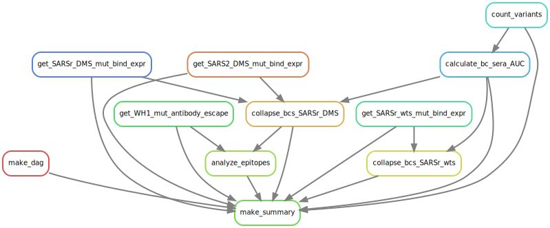

# Summary

Analysis run by [Snakefile](../../Snakefile)
using [this config file](../../config.yaml).
See the [README in the top directory](../../README.md)
for details.

Here is the DAG of the computational workflow:

Here is the Markdown output of each Jupyter notebook in the
workflow:

1. Get prior Wuhan-Hu-1 antibody escape data from the [escape map aggregator repository](https://github.com/jbloomlab/SARS2_RBD_Ab_escape_maps/blob/main/processed_data/escape_data.csv), sarbecovirus homolog wildtypes expression measurements from [this repository](https://github.com/jbloomlab/SARSr-CoV_homolog_survey), sarbecovirus DMS library mutant expression measurements from [this repository](https://github.com/jbloomlab/SARSr-CoV-RBD_DMS), and SARS-CoV-2 WH1 and BA.2 DMS library mutant expression measurements from [this repository](https://github.com/jbloomlab/SARS-CoV-2-RBD_DMS_Omicron). 

2. [Count variants by barcode](count_variants.md).
   Creates a [variant counts file](../counts/variant_counts.csv)
   giving counts of each barcoded variant in each condition.

3. [Fit AUC to sera binding curves](compute_AUC.md).
   Creates a [table](../bc_sera_binding/bc_sera_binding.csv)
   giving the AUC phenotype of each barcoded variant in each condition.

4. Collapse internal replicate barcodes of each variant to final variant phenotypes for the wildtype sarbecovirus homologs pool. Analysis [here](collapse_barcodes_SARSr-wts.md) and final output file [here](../final_variant_scores/final_variant_scores_wts.csv).

5. Collapse internal replicate barcodes of each variant to final variant phenotypes for the sarbecovirus DMS pools. Analysis [here](collapse_barcodes_SARSr-DMS.md) and final output file [here](../final_variant_scores/final_variant_scores_dms.csv).

6. [Analyze site-wise average binding values](analyze_epitopes.md) to visualize the epitopes targeted by each vaccine/SARSr background combination. Outputs pdb files that can be used to visualize structural epitopes in PyMol.